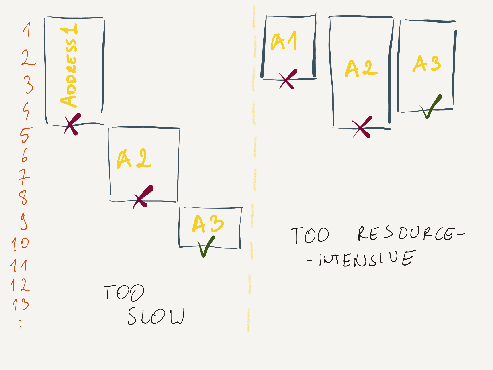

= Happy eyeball algorithm

:icons: font

icon:bookmark[] https://blog.softwaremill.com/happy-eyeballs-algorithm-using-zio-120997ba5152

icon:tags[] concurrency, algorithm

== Main idea

Problem::   How to get remote resources and not exhausting the network?
Solution::  Use the eyeball algorithm to get resources gradually.
Benefit::   Faster than getting resources one by one while not being to resource intensive.

=== How to deal with getting remote resources over network?

Let's having a problem of downloading content from a remote web.
We may have a several DNS servers to lookup. We want to get the DNS answer fast enough
but we don't want to query DNS all in parallel as it's resource intensive.

An easy solution is use of the _happy eyball algorithm_. It runs the queries
one by one with defined timeout. When the query does not finish it starts a new one
and waiting for the first response.

Ie. we try to connect to the first address. If we don’t get a response after 250ms,
we concurrently start connecting to the second one (while still waiting for the first).
If after 500ms we still don’t have a connected socket, we start connecting to the third one, etc.

=== How to program such algorithm

A good point to think about is when DNS resolution finishes then we want to use only one
resolution to process with. We may use the `BlockingQueue` bounded to 1
to not permit multiple web downloads run in parallel.

We may try to utilize `CompletionService` (https://docs.oracle.com/javase/8/docs/api/java/util/concurrent/ExecutorCompletionService.html)
for the DNS queries.

Be aware that the DNS is a networking blocking (*!*) operation and for a good
resource utilization probably the DNS query would be good to be considered to run via some
thread pool.

The last thing to think about is to know we need to be able to manage the `Thread.interrupt`
call correctly when DNS query succeeds. The other running should be canceled at that time.
