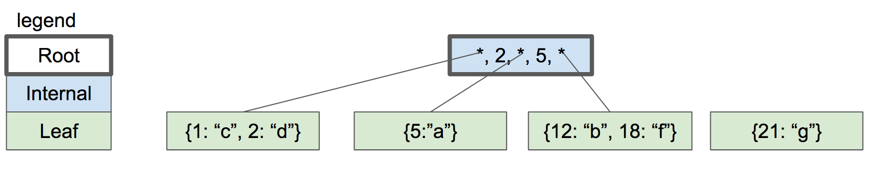

= Hash Map vs. B-Tree : why is hash map used for in memory data structures

:icons: font

icon:bookmark[] https://www.evanjones.ca/ordered-vs-unordered-indexes.html, +
                https://medium.com/@mr.anmolsehgal/java-hashmap-internal-implementation-21597e1efec3

icon:tags[] data.structures, algorithm

== Main idea

Problem::    Why the hash maps are used for in memory data structures and why trees (B-tree)
             is used for the disk usages (e.g. for databases)?
Reasoning::  When using the hash map in in memory access it's good to think if it's the best choice.
             But in general hash map has access time of the best *O(1)* while tree the worst *O(long n)*,
             but is is ordered and offers data in continuous chunks.
             Database needs access from the slow disks and benefit from the data locality.

=== Hash map : hot it works?

Basically, `HashMap` has an array where the key-value data is stored.
It calculates the index in the array where the Node can be placed and it is placed there.
Now while getting the element from `HashMap`, it again calculates the index of the element
to retrieve and goes to the array index and returns the value of the element/Node(if exists).

If we insert one more and suppose its index hits an occupied index, then what will happen in that case?
It is the _collision scenario_. Three is `LinkedList` at such array indexes -
i.e. both of these elements at the same index but in the `LinkedList`.

Index is calculated by `hashCode` function. The item is then differentiated
with `equal` function the `LinkedList`.

As the `HashMap` is backed by an array what if size of array is small and collisions
happens. Extending of the array happens and re-hashing has to be done.

=== B-Tree: how it works?

The data structure where each node may have multiple children, up to __m__
where __m__ is called as _minimum degree_ or tree's __order_.
The B-Tree is sometimes called _fat tree_ as there are multiple children at one level.
Is defined that one node has to have at least `m/2` children (rounded up).
With exceptions where leaf node has 0 children, the root node needs at least 2 children
if it's not a leaf node as well.
The keys are stored in the node and there are `count(children)-1` keys in the node,
and maximum of keys in node is `m-1`.

.B-Tree of order 3 (at least 2 children, max children is 3, max keys in node is 2); trying to add key `{21:"g"}`

.The shape of the split B-Tree after item `{21:"g"}` was added
image::../images/b-tree-2.png[]

=== Why the database uses B-tree?

B-tree is slower in access time - *O(log n)* but it's the worst time. The *O(1)* for hash map
is the average time and on hash collision it could be to *O(n)* for hash map.
Plus, in normal implementation of hash map there is time to time a need to re-hash
the whole structure when the table is growing in space (e.g. HashMap in Java).

Databases needs to use indexes to process a big amount of data. Hash map needs
a separate data structures for indexing. The tree offers the ordering
of the records by default.
The database normally loads from disks. There is benefit in possibility
to load data in continuous chunks (locality of reference)
which the B-Tree offers. The data in hash map are normally
fragmented over the whole hash map data structure.
