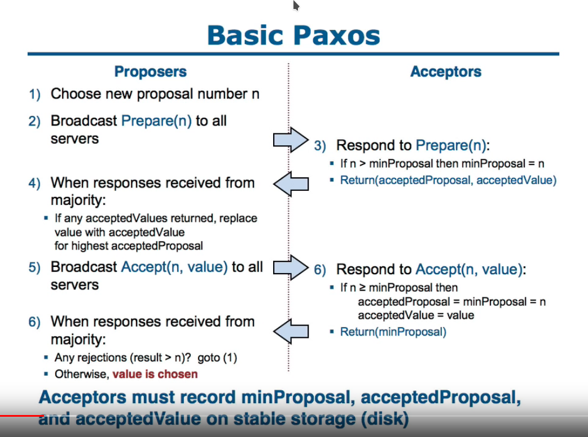

= Disk Paxos and Light-Weight Leases

:icons: font

icon:bookmark[] http://lamport.azurewebsites.net/pubs/disk-paxos-disc.pdf, https://groups.csail.mit.edu/tds/papers/Chockler/TR934.ps

icon:tags[] distributed.systems, paxos, consensus.algorithm

== Main idea (problem, solution, impact)

How to provide a safe lock on a SAN disks.
Use paxos consensus algorithm to grab lock faster, for establishing the group of paxos participants and electing leader, use the leases algorithm.
You have safe locking mechanism for shared disks where locks are stored at the data storage and no external lock provider (and external service) is needed.

== Details

=== How paxos synod works?

* expecting to have a unique sequence of monotonicaly increasing numbers (n) which are unique per each proposer (paxos paper does not explain how to get such counter)
* proposer runs prepare with a ballot number (n) and waits if acceptors acknowledge that his number (n) is the highest one they now
* if proposer owns the highest ballot number (n) he send accept message with the (n) and the proposing value to be saved
* if proposer does not own the highest ballot number (n) he adopts the highest ballot number with the value (n) and send accept message with adopted value
* acceptors return back to proposer the (n), (n) is the same the acceptor sent then the value was accepted or higher and then the value was not accepted
* when majority of acceptors return (n) then value is considered to be accepted

=== How disk paxos works in comparance to paxos synod?

* disk paxos uses shared disk to save data there, the consensus is reached when data on majority of disks is "in agreement"
* the processors (a service, a process) which access the disks write and read data and perform based on the data saved on the disks
* disk paxos has 2 phases
** phase1: choosing a value (v)
** phase2: trying to commit value (v)
* disk paxos saves the following data structure to disk, it names it as dblock[p]
** mbal: current ballot number (it's the (n) from the synod paxos)
** bal: the largest ballot number for which the p (acceptor for the synod paxos) reached the phase 2 (acceptedProposal from synod paxos)
** inp: the value p tried to commit in ballot number bal
* algorithm works

* Phase 1:
** a processor saves the dblock[p] data structure to every disk - saving data `p` to disk `d` is noted as disk[d][p]
** the processor reads from every disk data of other processes `q` - it reads all disk[d][q]
** if disk[d][q].mbal > disk[d][p].bal/dblock[p].mbal then it aborts the ballot number mbal and goes to phase 2 with the highest ballot number it read
*** In other words if the current ballot number of the processor data block dblock[p] is the highest one then we continue,
    but if during reading was found that there is a bigger ballot number then current ballot is aborted and the highest ballot number is adopted from what was read and process still continues to phase 2.

* Phase 2:
** the processor defines the inp - the value which is to be saved
** the processor saves the bal as mbal - saves the current ballot number to the largest ballot number he knows about
** process writes the dblock[p] to every disk d by writing to disk[d][p]
** process reads partitions on every disk d of other processes q and checks if disk[d][p].bal > disk[d][q].mbal - if what the process wrote is with the highest ballot number for all processors on all disks - if so then success and value is agreed

=== What is the method for implementing arbitrary distributed system?

We can use consensus algorithm for an arbitrary distributed system.

For distributed system we can use the state-machine. Then the system depends on deterministic state on each machine.
Machines have to execute commands in the same sequence.
Consensus ensures that, for each n, all processors agree on the n-th commmand.

=== What are two base properties of consensus?

* safety == consistency, all values are the same
* liveness == nonblocking, processors wil eventually output a value

== Sources in details

* E. Gafni, L. Lamport, Disk Paxos (http://lamport.azurewebsites.net/pubs/disk-paxos-disc.pdf)
* G. Chockler, D. Malkhi, Light-Weight Leases for Storage-Centric Coordination (https://groups.csail.mit.edu/tds/papers/Chockler/TR934.ps)
* Distributed Systems Meetup Brno - Vojta Juránek - https://www.meetup.com/Brno-Distributed-Systems-Meetup-Group/events/265682155/ 
* Paxos lecture (Raft user study) - https://www.youtube.com/watch?v=JEpsBg0AO6o
