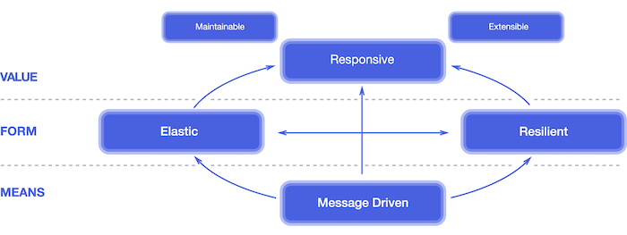
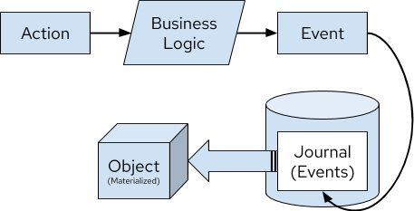
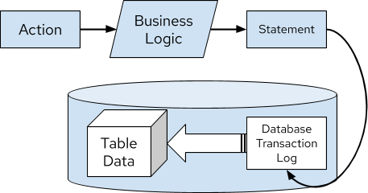

= Event Sourcing vs. Change Data Capture

:icons: font

icon:bookmark[] https://debezium.io/blog/2020/02/10/event-sourcing-vs-cdc/

icon:tags[] microservices, event.driven.architecture, design.patterns

== Main idea

Problem::   How to design a reactive system of microservices?
Solution::  Use one of the reactive design patterns.
Benefit::   The design of the system will be clear and maintainable.

== Details

=== How to define a reactive system?

When we design a distributed system &ndash; microservices then microservice
should react to an event-changing environment (ie. cloud) by being resilient and elastic.
This is what the https://www.reactivemanifesto.org/[Reactive Manifesto] talks about.

=== What the Event Sourcing pattern and the Change Data Capture try to achieve?

The patterns are based on the fact of having one global source of truth for a data set.
They provides representation of the application state as series of events - a journal or transaction log.
The events can be replayed to rebuild or refresh the state.

=== What events the pattern work with?

Each pattern works with a different event type:

Domain events::
It's an explicit event which is part of your business domain. It's generated by the application.
These events are usually represented in the past tense, such as `OrderPlaced`, or `ItemShipped`.
These events are the primary concern for Event Sourcing.

Change events::
Events that are generated from a database transaction log indicating what state transition has occurred.
These events are of concern for Change Data Capture.

=== What is Event Sourcing?

It's *a solution* that is based on maintaining state in form of *domain events*.
Events are stored in *journal* - the global, only one, source of truth for whole application.
The journal represents the entire state of application.
The benefit is that we can audit state of the application, we can replay the events
to refresh the state, we can travel back to history and reproduce errors.

These characteristics applies

* domain event is generated by application business logic
* events are immutable and are stored in the journal which is append-only log
* journal is global source of truth for the application state
* journal is re-playable
* journal groups domain events by an ID - we can capture the current state of an object (DDD talks about `Aggregate` in this case)

The implementation often has these characteristics as well:

* snapshotting for replyaing journal faster
* it's possible to remove events (compliance reasons)
* there is an API to dispatch an event
* lack of transactional guarantees
* need of backward compatibility mechanism to cope with changing event format
* a mechanism for backing-up the journal restoring it afterwards

The event sourcing kind of mimics how database works and here is the difference
of event sourcing materializing the data state and the database doing the same

.Event Sourcing materializing an Object

*vs.*

.Database Transaction materializing a Table

=== What is Change Data Capture?
