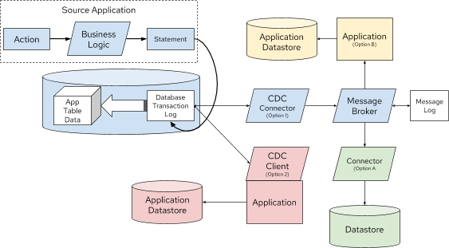

= Event Sourcing vs. Change Data Capture

:icons: font

icon:bookmark[] https://debezium.io/blog/2020/02/10/event-sourcing-vs-cdc/

icon:tags[] microservices, event.driven.architecture, design.patterns

== Main idea

Problem::   How to design a reactive system of microservices?
Solution::  Use one of the reactive design patterns.
Benefit::   The design of the system will be clear and maintainable.

== Details

=== How to define a reactive system?

When we design a distributed system &ndash; microservices then microservice
should react to an event-changing environment (ie. cloud) by being resilient and elastic.
This is what the https://www.reactivemanifesto.org/[Reactive Manifesto] talks about.

image::images/reactive-system.png[]

=== What the Event Sourcing pattern and the Change Data Capture try to achieve?

The patterns are based on the fact of having one global source of truth for a data set.
They provides representation of the application state as series of events - a journal or transaction log.
The events can be replayed to rebuild or refresh the state.

=== What events the pattern work with?

Each pattern works with a different event type:

Domain events::
It's an explicit event which is part of your business domain. It's generated by the application.
These events are usually represented in the past tense, such as `OrderPlaced`, or `ItemShipped`.
These events are the primary concern for Event Sourcing.

Change events::
Events that are generated from a database transaction log indicating what state transition has occurred.
These events are of concern for Change Data Capture.

=== What is Event Sourcing?

It's *a solution* that is based on maintaining state in form of *domain events*.
Events are stored in *journal* - the global, only one, source of truth for whole application.
The journal represents the entire state of application.
The benefit is that we can audit state of the application, we can replay the events
to refresh the state, we can travel back to history and reproduce errors.

These characteristics applies

* domain event is generated by application business logic
* events are immutable and are stored in the journal which is append-only log
* journal is global source of truth for the application state
* journal is re-playable
* journal groups domain events by an ID - we can capture the current state of an object (DDD talks about `Aggregate` in this case)

The implementation often has these characteristics as well:

* snapshotting for replyaing journal faster
* it's possible to remove events (compliance reasons)
* there is an API to dispatch an event
* lack of transactional guarantees
* need of backward compatibility mechanism to cope with changing event format
* a mechanism for backing-up the journal restoring it afterwards

The event sourcing kind of mimics how database works and here is the difference
of event sourcing materializing the data state and the database doing the same

.Event Sourcing materializing an Object
image::images/reactive-system-event-sourcing-materializing-object.png[]

*vs.*

.Database Transaction materializing a Table
image::images/reactive-system-change-data-capture-materializing-table.png[]

=== What is Change Data Capture (CDC)?

Is an solution which captures a change events from the database transaction log (redo log or equivalent)
and forwards those events to a consumer. It externalizes the transaction log of the database as a stream.

The image depicts that the transaction log change events may be consumed by a message broker or
by an embedded client library in application. Then the events may be again persisted or forwarded to a message broker again.

=== What is the Outbox pattern and how to use it with Change Data Capture?

The goal of the pattern is to ensure to publish the change events within the scope of a single database transaction.
In principle it's about to create a special table where the database collects the domain events (changes)
withing a single transaction. On the commit of the transaction from that special table
the CDC may grasp that event and publish it further.
When that database transaction is committed then the records may be removed from the table - the table is an intermittent storage
where is important only to log that the database transaction was committed.

=== What is the distinction of Outbox pattern and event sourcing?

The outbox pattern works with the business objects - on saving the database transaction
the business invariant is guaranteed and it's what the *domain event* in the event sourcing represents.

The Outbox pattern utilizes the domain event the same as event sourcing pattern.
The attributes for both (outbox and event sourcing) are the same as: _Event ID_,
_Aggregate ID_ (id of partition related events), _Aggragate type_, _Sequence/Timestamp_,
_Message payload_.

The difference is that event sourcing uses the journal which is permanent and immutable.
The outbox pattern is meant to be ephemeral and only be a landing zone for domain events
(captured inside of change events) which are forwarded to downstream consumers.

=== What is Command Query Responsibility Segregation (CQRS)?

It's a desing pattern which separates the writing and reading of data in the system.
It creates data projection which are queryable with the read-only access.
There could be existing multiple data projections for different purposes
(e.g. for the same data there could be representation for text search, user account details data accessed by ID, aggregated metrics...)
The writing side could be scaled independently to read side and they do not influence each other (in performance).

Often the CQRS is connected with event sourcing where data are passed to a journal
and there are multiple readers building a different types of the data projection.

The issue of the CQRS is that it's eventual consistent. You write data and you can't expect
the reader can see the same data on the read side. The data projection has to be updated
first and that could be done after some time.
There is another trouble which needs to be handled somehow and it's the risk of dual writes.
On a failure of the reader there is a need to restart it and to continue processing events.
It's a question which event to start with to not duplicate updates. This complexity goes to developer
who has to manage idempotent IDs etc.

=== How the Debezium and Outbox pattern plays with event sourcing and CQRS?

The CDC and Outbox pattern could be a substitution to event sourcing and CQRS.
It's capable to provide the same functionality with just a little different
properties.
The benefit of the CDC and Outbox are transnational updates which avoid the dual write flaw.
It's a simpler solution, data stays within the application, you can read and query your writes.

As a cons of the solution is mentioned mainly a longer latency as data goes first to transaction log
of database and then some message broker will be needed to process whole capability of event sourcing.
Which means one step more in the processing against the event sourcing which passes the domain events
directly to the journal store (Kafka broker).
