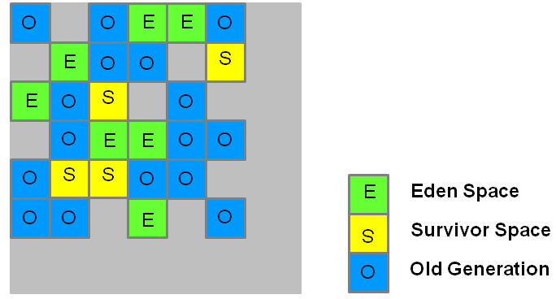

= Java garbage collector G1

:icons: font

icon:bookmark[] https://www.oracle.com/technetwork/tutorials/tutorials-1876574.html

icon:tags[] java, memory, gc

== Main idea

Problem:   Parallel and serial collectors stops the world unpredictable (and for long time) when doing GC and application threads can't handle requests.
Solution:  Run garbage collection in parallel similar to CMS garbage collector but in a clever way of using heap regions rather than only young and old generation spaces.
Benefit:   Can operate concurrently with applications threads, have predictable GC pause duration, do not require more memory for GC as CMS requires.

== Details

=== What the G1 means?

It's abbreviation from garbage-first as the garbage collector finds during the marking
phase which regions have got the most of the garbage to be clean and which will
be mostly free after GC. It starts with such regions to free the most memory possible.

=== What are GC ways how G1 works?

G1 has both concurrent (runs along with application threads, e.g., refinement, marking, cleanup)
and parallel (multi-threaded, e.g., stop the world) phases.

=== How the G1 works?

The heap is partitioned into a set of equal-sized heap regions, each a contiguous range of virtual memory.
Certain region sets are assigned the same roles (eden, survivor, old) as in the older collectors,
but there is not a fixed size for them.

The marking phase runs in parallel with application threads.
When it's known what are objects meant for GC then the stop-the-world occurs.
Then there are parallel collector threads which reclaim the memory.

During the reclamation collector uses evacuation. It copies the living objects
to a different region. The result is that the whole region is free for the next allocation.
The GC may be running the collection only on set of regions and pause time may be time-boxed
(in dependency on number of regions that are evacuated).

=== What are limitations of G1?

* G1 is not a real-time collector. Pause times are targeted only with high probability.
* Full garbage collections are still single threaded, but if tuned properly your applications should avoid full GCs.
