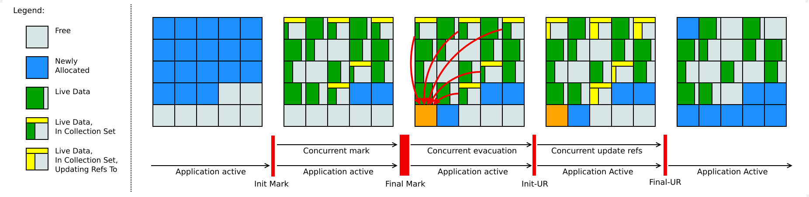

= Java garbage collector Shenandoah

:icons: font

icon:bookmark[] https://wiki.openjdk.java.net/display/shenandoah/Main

icon:tags[] java, memory, gc

== Main idea

Problem:   Parallel and serial collectors stops the world unpredictable. G1 still requires longer stop-the-world pause times.
Solution:  Having a garbage collector which is capable to run with as low pause times and being able to work on huge heaps.
Benefit:   Application may run more smoothly without worrying about GC pause times.

== Details

=== What are the properties of Shenandoah GC?

* low pause time garbage collector
* garbage collection work concurrently with the running Java program
* including the concurrent compaction
* pause times are no longer directly proportional to the size of the heap
* region based

=== How Shenandoah works?

These are the phases the Shenandoah runs in:

- *init mark* where root set is scanned (stop-the-world)
- *concurrent marking* concurrent walk through the heap and searching for reachable objects
- *final mark* draining all pending `marking/update` queues and re-scan the root set, initializes evacuation by figuring out which regions will be evacuated (*collection set*)
  starts evacuation with defining regions to be evacuated and pre-evacuates some roots (stop-the-world, the longest one from all phases)
- *concurrent cleanup* reclaims immediate clean regions where all is garbage then the are freed
- *concurrent evacuation* copies objects from *collection set* to other region(s) (concurrently)
- *init update ref* ensures all GC threads finished evacuation (shortest stop-the-world pause)
- *concurrent update references* walks the heap and update references to objects which were evacuated
- *final update refs* re-updating the references in the root set pointing to the evacuated objects,
  recycles the regions from the collection set
- *concurrent cleanup* reclaims the *collection set* regions

