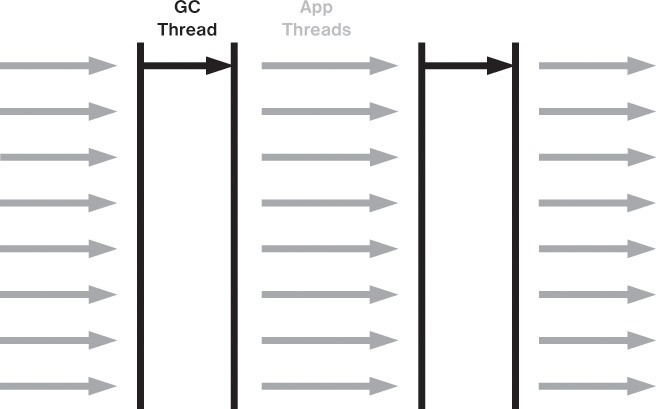
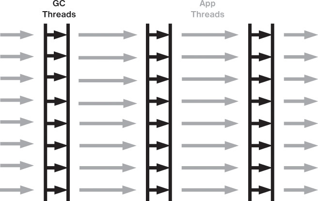
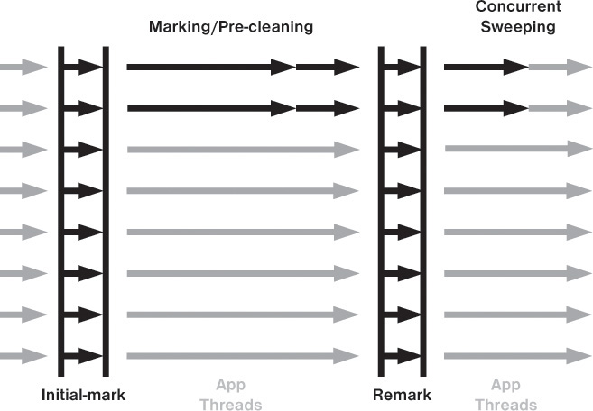

= Java garbage collection

:icons: font

icon:bookmark[] https://www.baeldung.com/jvm-garbage-collectors,
                https://docs.oracle.com/cd/E13150_01/jrockit_jvm/jrockit/geninfo/diagnos/tuning_tradeoffs.html,
                https://www.journaldev.com/2856/java-jvm-memory-model-memory-management-in-java,
                https://www.infoq.com/presentations/JVM-Performance-Tuning-twitter-QCon-London-2012,
                http://www.informit.com/articles/article.aspx?p=2496621&seqNum=2,
                http://www.informit.com/articles/article.aspx?p=2496621&seqNum=4

icon:tags[] java, memory, gc

== Main idea

Problem:   For languages like C the developer has to manage the memory allocation for his own and it's failure prone.
Solution:  Language manages the memory for the developer automatically.
Benefit:   Developer has less things to bother about and it's safer to memory related errors.

== Details

=== What is garbage collector (GC)?

JVM manages memory on heap. It automatically allocates (when developer defines a variable)
and deallocates (when it's not used anymore).
GC has to track all variables, if they are active, and it frees memory for those which are not used anymore.

Plus:

* No manual allocation/deallocation is needed
* No https://en.wikipedia.org/wiki/Dangling_pointer[dangling pointers]
* https://en.wikipedia.org/wiki/Memory_leak[Memory leak] management (though it's not a full proof solution)

Cons:

* CPU for tracking the active memory areas is needed
* Can't be that effective as proper manual memory allocation/deallocation
* Some GC may need to stop the application for a while to properly manage the garbage collection (stop the world issues)

=== How the process of garbage collection works?

In high level it uses two phases.

* *Mark* - identification of memory which is in use
* *Sweep* - removes memory for objects identified as unused in "mark" phase

The "third" phase is the memory *compation*. When the memory is just freed
it may be fragmented. Compation is to move the used memory parts to one location
to form a consistent memory area. The same is then true for the free memory space.
The allocation work is easier in non-fragmented memory (easy to search for a space big enough).

There are several implementations of the garbage collectors in Java.

Every implementation balances the trade-off of 'pause time vs throughput'.
Shorter pause time means more CPU time is needed for GC to work in parallel with the application
program and the app program has not so many CPU cycles for its work.
On the other hand the application throughput means CPU is used in application
but then there is more work for GC when necessary and the program is usually stopped for a longer time.

The other GC trade-off is the 'performance vs. memory footprint'.

image::images/java-garbage-collection-memory-diagram.png[]

=== When is the garbage collection started?

It's started in general when there is not enough space for application program to run.
The developer usually defines maximum of memory the Java is permitted to occupy.

* `-Xmx` : set maximum Java heap size

The particular implementation of GC then defines e.g. some ratio of used to unused memory
or a time schedule when the GS is run.

=== Serial Garbage Collector

A single thread for GC is used. All application threads are stopped during GC.

Started with `-XX:+UseSerialGC`

=== Parallel Collector

Called a "throughput collector" because it uses multiple CPUs to speed up the GC performance.
Uses multiple threads for scanning over the heap.
It also stops the application program threads during GC. The difference to Serial GC is that multiple GC threads are run to finish the GC faster.

Started with `-XX:+UseParallelGC`

=== Concurrent Mark Sweep Collector (CMS)

The young generation is run the similar way as Parallel GC with stopping application threads.
But running the old (tenured) generation works in parallel with the application threads
(the image below refers to garbage collection of old generation).
The application threads are stopped but just for short times when marking has to be processed.
The sweeping part is done in parallel with the application threads working concurrently.

Started with `-XX:+UseConcurrentMarkSweepGC`

