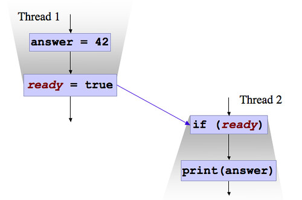

= What does mean `volatile` in Java

:icons: font

icon:bookmark[] https://stackoverflow.com/questions/19744508/volatile-vs-atomic, +
                https://stackoverflow.com/questions/1468007/atomicinteger-lazyset-vs-set/1468020#1468020, +
                http://jeremymanson.blogspot.com/2008/11/what-volatile-means-in-java.html, +
                https://jpbempel.github.io/2012/10/09/volatile.html

icon:tags[] java, performance, jvm, memory

== Main idea

Problem::   What is `volatile` good for, how does it work and what is its difference to `Atomic<...>` types.
Solution::  `Volatile` eradicates visibility problem but still approximately it could be said
            that each individual(!) read or write operation on that variable is atomic.
            `Atomic` types has specialized operations based on CAS (compare and swap instructions)
            which provides more functionality for some cases.
Benefit::   `Volatile` makes changes visible to other threads. `Atomic` variables does the same
            plus provides some more operation on top of their data structures.

== Details

=== What is the `volatile` good for?

`Volatile` eradicates the visibility problem. It's a weak form of synchronization.
It prevents the compiler from reordering instructions which involve a write and a subsequent read.
And it ensures that a change visible at one thread is visible to other threads as son as it is made.

It does not deal with atomicity. E.g. if we have variable `volatile int i` then
running operation `i++` means three instructions - 1) copy the value to a register,
2) increment the value, 3) place it back. `Volatile` keyword does not make
this atomically!

=== What about Java memory model?

It's model of memory management defined for JDK 5 for management of memory being
consistent over any platform in Java. In simple way of thinking it covers these points

* each thread in Java takes place in a separate memory space (not truly correct)
* we need to use special mechanism to guarantee that communication happens between threads
* memory write that happen in one thread can "leak through" and be seen by another thread,
  but there is no guarantee which writes can be seen by which thread or in which order

The `volatile` is than one of that special mechanisms for thread communication.
If a variable is `volatile` then the memory model ensures that when a thread
reads the `volatile` variable it can see all the changes done before the variable
was written. But not only that variable but all writes to other(!) variables done
before the `volatile` variable was written.

In the diagram below the `ready` is volatile while after it's written the
non-volatile `answer` will be available for reading at other threads as well.
In other words _all of the memory contents seen by Thread 1, before it wrote to ready, must be visible to Thread 2_.

=== What about the `Atomic` variables?

Atomic variables are specialized data types.
They ensures the visibility of the changes to other threads (as `volatility` does).
Then adds atomic operations which use the CAS (compare and swap instruction).
CAS has three operands - memory location on which to operate, the expected old value,
the new value. CAS atomically updates the memory location but only if the current
value of the memory matches the expected old value.
`AtomicInteger` or `AtomicReference` take advantage of the CAS functionality.
If it's not supported by CPU then it implements it via _spin lock_.

NOTE: Beside the `compareAndSwap` there is as well `weakCompareAndSet`.
      But it does not create any happens-before orderings, so provides no guarantees with respect
      to previous or subsequent reads and writes of any variables other
      than the target of the `weakCompareAndSet`.

=== What is `Atomic` `lazySet` method?

Eventually sets to the given value (http://bugs.sun.com/bugdatabase/view_bug.do?bug_id=6275329).

It's a niche method that could be useful for fine-tuning non-blocking data structures.
The semantics are that the write is guaranteed not to be re-ordered with any previous write,
but may be reordered with subsequent operations and might not be visible to other threads
(until some other volatile write or synchronizing aciton occurs).

One use case could be for null-ing out fields of nodes in non-blocking data structures.
If the variable field does not care if other threads sees non-null values for a while,
but we would like to ensure that structures are eventually garbage collected.

In terms of machine-level barriers then `lazySet` provides a preceding `store-store barrier`
(which is cheap on current platforms`), but not `store-load` barriers
(which is usually expensive part of volatile-write operations)
