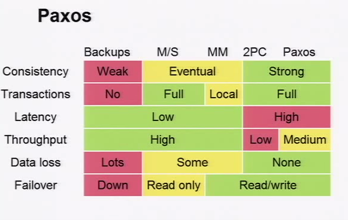
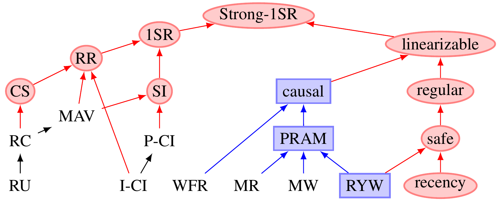

= Knowledge base

:icons: font
:toc:

Snippets from reading tech articles and books.


== difference between dtd and xml schema
icon:tags[] interview, xml +
icon:bookmark[] http://javarevisited.blogspot.cz/2014/09/10-questions-to-make-programming-interviews-cheaper.html +
DTD, or Document Type Definition, and XML Schema, which is also known as XSD, are two ways of describing the structure and content of an XML document. DTD is the older of the two, and as such, it has limitations that XML Schema has tried to improve.
icon:plus[] http://www.differencebetween.net/technology/difference-between-xml-schema-and-dtd/  +


== using batch in jdbc and java ee
icon:tags[] jdbc, java +
icon:bookmark[] http://javarevisited.blogspot.com/2012/08/top-10-jdbc-best-practices-for-java.html +

Prepared statement from db connection is possible to run in batch

[source]
----
dbConnection.setAutoCommit(false);//commit trasaction manually
...
String insertTableSQL = "INSERT INTO ..."
PreparedStatement = dbConnection.prepareStatement(insertTableSQL);
preparedStatement.setInt(1, 101);
preparedStatement.addBatch();
...
preparedStatement.setInt(1, 102);
preparedStatement.addBatch();
preparedStatement.executeBatch();
...
dbConnection.commit();
----
icon:plus[] http://www.mkyong.com/jdbc/jdbc-preparedstatement-example-batch-update/ +


== idiom for calling wait, notify
icon:tags[] java, thread +
icon:bookmark[] http://javarevisited.blogspot.cz/2013/12/inter-thread-communication-in-java-wait-notify-example.html,
  http://javarevisited.blogspot.cz/2015/07/how-to-use-wait-notify-and-notifyall-in.html +

* The object `wait` is needed to be called in cycle as there could be called notify on object spuriously without fulfilling condition.
Joshua Bloch has a very informative item on his book Effective Java, I strongly suggest reading that. In short, a waiting thread may woke up,
without any change in it's waiting condition due to spurious wake up.
* `wait` on it's call releases the lock (`sharedObject.wait();` // releases lock, and reacquires on wakeup)

[source]
----
 synchronized (object) {
         while ()
             object.wait();
         ... // Perform action appropriate to condition
 }
----


== Null in java
icon:tags[] java +
icon:bookmark[] http://javarevisited.blogspot.cz/2014/12/9-things-about-null-in-java.html

 * Some programmer makes wrong assumption that, auto boxing will take care of converting null into default values for respective primitive type e.g. 0 for int, false for boolean etc, but that's not true
 * `instanceof` operator returns false if used against any reference variable with null value or null literal itself
 * you may know that you cannot call a non-static method on a reference variable with null value, it will throw NullPointerException, but you might not know that, you can call static method with reference variables with null values.
 * Unlike in SQL, in Java `null == null` will return true


== Serializable and Externalizable
icon:tags[] java +
icon:bookmark[] http://javarevisited.blogspot.cz/2012/01/serializable-externalizable-in-java.html

* both serializable and extenalizable used to serialize or persist java objects but the way they do is little different. In case of Serializable Java Virtual machine has full control for serializing object while in case of Externalizable, application gets control for persisting objects


== EJB and transactions
icon:tags[] java, ejb, transactions +
icon:bookmark[] http://entjavastuff.blogspot.cz/2011/02/ejb-transaction-management-going-deeper.html

 * rollback is for: a runtime exception, an ejbexception, other exception marked as @ApplicationException(rollback=true)
 * according to the rules of JPA any changes we make to the entity must be automatically persisted when you either flush or commit the active transaction
 * requires_new: This is then also a source of many programming mistakes. Because you create a new transaction, any entities managed inside it will become detached again when the EJB call finishes, even if you return an instance to the outer EJB method and its transaction! You'd have to do a find() on the entity in the outer EJB call to make it managed again.
 * With the XA datasources in place, JTA is all setup to deal with you throwing multiple persistence units at it. What you shouldn't do however is to try and force two persistence units onto the same EJB. In stead, separate. (why?)
 * manual transaction management: The biggest job you have while performing manual transaction management is to manage that persistence store; you will want to keep it as small as possible to keep resource usage low and keep things as speedy as possible. JPA gives you multiple tools to do just that.

[loweralpha]
 . *EntityManager.clear()* will empty the persistence store and make all entities that were in it detached, even when a transaction is still active
 . *EntityManager.delete()* will remove the entity from the store... but also the database!
 . *EntityManager.close()* should be obvious.
 . *persist outside of a transaction* so the entities do not become managed; this will only work if you do not have entity relations of course.

Out of recent personal experience I can tell you that committing a transaction will not make entities detached and will not remove them from the persistence store; they remain cached. The best strategy that you can follow when working with large volumes of entities (say in a batched insert) is to have a dedicated entity manager for each transaction you create. So create the entity manager before starting the transaction and close the entity manager after committing or rolling back the transaction. This way you mimic closely what the container does during a container managed transaction.


== Memory tuning
icon:tags[] java, memory +
icon:bookmark[] http://developerblog.redhat.com/2014/07/15/dude-wheres-my-paas-memory-tuning-javas-footprint-in-openshift-part-1

The most important thing to do is set a heap minimum (e.g. passing -Xms40M to the java command would set it at 40Mb) since footprint management is ignored unless both a maximum and minimum are specified. Beyond that you can use a few other options to control how tightly the GC limits the growth of physical memory above the working set size.


== Java threads
icon:tags[] java, threads, concurrency +
icon:bookmark[] http://javarevisited.blogspot.cz/2014/07/top-50-java-multithreading-interview-questions-answers.html


== Thread safe in java
icon:tags[] java, threads +
icon:bookmark[] http://javarevisited.blogspot.cz/2012/01/how-to-write-thread-safe-code-in-java.html

* Immutable objects are by default thread-safe because there state can not be modified once created. Since String is immutable in Java, its inherently thread-safe.
* Example of thread-safe class in Java: Vector, Hashtable, ConcurrentHashMap, String etc.


== CountDownLatch
icon:tags[] java, concurrency +
icon:bookmark[] http://javarevisited.blogspot.cz/2012/07/countdownlatch-example-in-java.html + http://javarevisited.blogspot.cz/2012/07/cyclicbarrier-example-java-5-concurrency-tutorial.html

 * One of the disadvantage of `CountDownLatch` is that its not reusable once count reaches to zero you can not use CountDownLatch any more, but don't worry Java concurrency API has another concurrent utility called CyclicBarrier for such requirements
 * `CyclicBarrier.reset()` put Barrier on its initial state, other thread which is waiting or not yet reached barrier will terminate with java.util.concurrent.BrokenBarrierException


== HashMap
icon:tags[] java +
icon:bookmark[] http://javarevisited.blogspot.cz/2011/04/difference-between-concurrenthashmap.html +

`ConcurrentHashMap` do not allow null keys or null values while synchronized HashMap allows one null keys.


== Thread vs Runnable
icon:tags[] java, concurrency, threads +
icon:bookmark[] http://javarevisited.blogspot.cz/2012/01/difference-thread-vs-runnable-interface.html

* Runnable interface represent a Task which can be executed by either plain Thread or Executors or any other means.
  so logical separation of Task as Runnable than Thread is good design decision.


== Nested tranaction
icon:tags[] java, tranactions +
icon:bookmark[] http://jbossts.blogspot.cz/2011/10/nested-transactions-101.html

* The distinction is founded on the asymmetry of the relationship between the outer and inner transactions. For true nested transactions,
  failure of the inner tx need not impact the outcome of the outer tx, whilst failure of the outer tx will ensure the inner tx rolls back.
  For nested top-level, the situation is reversed: failure of the outer transaction won't undo the inner tx, but failure of the inner tx may prevent the outer one from committing.
  Sound familiar? The most widely deployed use case for nested top-level is ensuring that an audit log entry of the processing attempt is made, regardless of the outcome of the business activity.


== about JTA
icon:tags[] java, transactions +
icon:bookmark[] http://blog.bitronix.be/2011/02/why-we-need-jta-2-0

 * transaction context is represented by `Transaction` interface
 * `UserTransaction` is supposed to be under `java:comp/UserTransaction` jndi
 * `XAResource`: `start(xid, TM_NOFLAGS)`` - start xid , start(xid, TM_JOIN) - join xid, start(xid, TM_RESUME) - resume xid
 * transaction interleaving: that’s the capacity of executing two transactions in parallel using a single handler. With databases that means being able to execute two different transactions on a single connection and keeping them properly isolated. This feature is extremely uncommon out there as nearly all the most used databases don’t support that are their core (I, chalda, am not sure with this!)


== What jta setting should be used when defining a datasource in JBoss
icon:tags[] java, transactions, jca, jboss +
icon:question[] https://access.redhat.com/solutions/720193

=== datasource settings `jta=true`

jta=true indicates that the datasource will honor the Java Transaction API and allows better tracking of connections by the JCA implementation.

The user should be aware that the jta setting should only be changed from true for specific use cases

Setting jta=false for a data source pool of JDBC connections prevents the connections from being enlisted in a transaction. This can be perceived as a performance benefit.

Since non-JTA connections are not part of a managed transaction, jta=false should only be considered for data sources used for read-only operations.

Setting jta=false for data sources from which connections are used in write operations may result in data inconsistency. Non-JTA connections are left in auto-commit mode regardless of any existing application transaction context. Each statement executed (SQL INSERT, UPDATE or DELETE) on such connections is implicitly committed, immediately. In a case where an EJB obtains a connection in a transaction REQUIRED context and executes multiple writes, transactional integrity cannot be guaranteed by JBoss. If one or more updates succeed followed by a failure, the work performed by the "transactional" method will be non-atomic (i.e. some updates will have been committed while others have not). Application code becomes responsible for preserving data integrity in such cases.

Care must be taken to ensure there are no connection leaks present in an application using jta=false as the JCA implementation (IronJacamar) will not be able to track as it would with jta=true.

[NOTE]
====
Using jta=false to Work Around Deadlocks
We had a customer encountering frequent deadlocks in an application using Microsoft SQL Server after migrating from an older version of JBoss.

To resolve, they changed their data source configuration to use jta=false. Apparently, their application was using the equivalent prior to migration.

In auto-commit mode, write order deadlocks should not occur since no lock is held across writes.

Data integrity is, however, likely compromised for this application as the stateless session bean based logic used the default REQUIRED transaction attribute, yet JBoss is unable to guarantee atomicity for updates performed in these methods.
====


== How to detect leaked datasource connections using the cached connection manager (CCM) debug facility in JBoss EAP 6
icon:tags[] java, jca, jboss +
icon:question[] https://access.redhat.com/solutions/309913

 * How to enable the cached connection manager on JBoss EAP 6
 * How to close a connection leak automatically in JBoss EAP 6
 * I believe that my application is not closing all of its connections. Can I monitor this?
 * There is a connection leak in the application, how can I find it?
 * What can I do if a "IJ000453: Unable to get managed connection for ..." is thrown?
 * Is there a detection for leaked connections in JBoss EAP6?
 * Does JBoss EAP 6 close a connection leak automatically? If so, how can I set up the feature?
 * Application is not able to get new connection from JBoss datasource connection pool and INACTIVE session count is increasing.

=== Resolution

To enable cached connection manager (CCM) to close a connection leak automatically, you need to do the following:

* Make sure use-ccm="false" is not set in your datasource configurations. (It defaults to true if it is not specified.) Of course, you can set use-ccm="true" explicitly. For example:
[source]
----
  <subsystem xmlns="urn:jboss:domain:datasources:1.1">
     <datasources>
        <datasource ... enabled="true" use-ccm="true">
           ...
        </datasource>
     </datasources>
  </subsystem>
----

* Make sure <cached-connection-manager> exists in the jca subsystem and set debug attribute to true. (There are two attributes, both default to false, which are debug and error. ) Setting debug="true" will close a connection leak automatically and log an INFO message saying that JBoss is "Closing a connection for you. Please close them yourself" with the stacktrace for the code where the connection was first opened. And if you set error to true along with debug set to true, it will throw a RuntimeException at the end of the transaction and log an ERROR message in addition to the INFO message.
[source]
----
 <subsystem xmlns="urn:jboss:domain:jca:1.1">
    ...
    <cached-connection-manager debug="true" error="true"/>
    ...
 </subsystem>
----

Example with just setting debug="true" without error="true" (i.e. <cached-connection-manager debug="true" /> or <cached-connection-manager debug="true" error="false" />) it will log the message below:
[source]
----
 INFO  [org.jboss.jca.core.api.connectionmanager.ccm.CachedConnectionManager] (http-/127.0.0.1:8080-1) IJ000100: Closing a connection for you. Please close them yourself: org.jboss.jca.adapters.jdbc.jdk6.WrappedConnectionJDK6@6f1170a9: java.lang.Throwable: STACKTRACE
    at org.jboss.jca.core.connectionmanager.ccm.CachedConnectionManagerImpl.registerConnection(CachedConnectionManagerImpl.java:269)
    at org.jboss.jca.core.connectionmanager.AbstractConnectionManager.allocateConnection(AbstractConnectionManager.java:495)
    at org.jboss.jca.adapters.jdbc.WrapperDataSource.getConnection(WrapperDataSource.java:139)
        ...
----

Example with setting debug="true" along with error="true" (i.e. <cached-connection-manager debug="true" error="true"/>) it will log the message below:
[source]
----
INFO  [org.jboss.jca.core.api.connectionmanager.ccm.CachedConnectionManager] (http-/127.0.0.1:8080-1) IJ000100: Closing a connection for you. Please close them yourself: org.jboss.jca.adapters.jdbc.jdk6.WrappedConnectionJDK6@27c94e11: java.lang.Throwable: STACKTRACE
    at org.jboss.jca.core.connectionmanager.ccm.CachedConnectionManagerImpl.registerConnection(CachedConnectionManagerImpl.java:269)
    at org.jboss.jca.core.connectionmanager.AbstractConnectionManager.allocateConnection(AbstractConnectionManager.java:495)
    at org.jboss.jca.adapters.jdbc.WrapperDataSource.getConnection(WrapperDataSource.java:139)
        ...
ERROR [org.apache.catalina.connector.CoyoteAdapter] (http-/127.0.0.1:8080-1) An exception or error occurred in the container during the request processing: java.lang.RuntimeException: java.lang.RuntimeException: javax.resource.ResourceException: IJ000151: Some connections were not closed, see the log for the allocation stacktraces
    at org.jboss.as.web.ThreadSetupBindingListener.unbind(ThreadSetupBindingListener.java:67) [jboss-as-web-7.1.3.Final-redhat-4.jar:7.1.3.Final-redhat-4]
        ...
Caused by: java.lang.RuntimeException: javax.resource.ResourceException: IJ000151: Some connections were not closed, see the log for the allocation stacktraces
    at org.jboss.as.connector.deployers.ra.processors.CachedConnectionManagerSetupProcessor$CachedConnectionManagerSetupAction.teardown(CachedConnectionManagerSetupProcessor.java:85)
    at org.jboss.as.web.ThreadSetupBindingListener.unbind(ThreadSetupBindingListener.java:61) [jboss-as-web-7.1.3.Final-redhat-4.jar:7.1.3.Final-redhat-4]
    ... 8 more
Caused by: javax.resource.ResourceException: IJ000151: Some connections were not closed, see the log for the allocation stacktraces
    at org.jboss.jca.core.connectionmanager.ccm.CachedConnectionManagerImpl.popMetaAwareObject(CachedConnectionManagerImpl.java:249)
    at org.jboss.as.connector.deployers.ra.processors.CachedConnectionManagerSetupProcessor$CachedConnectionManagerSetupAction.teardown(CachedConnectionManagerSetupProcessor.java:83)
    ... 9 more
----

[NOTE]
====
    For the above to work, the minimum logging level has to be set to INFO for org.jboss.jca
    CCM will not work if jta=false.

    Activating the connection tracking will have a small performance drawback and it is recommended to use only during development or test to detect possible leaks. This feature should not be used permanently to handle unclosed connections in the application code, but it can be used to identify the location in the application to be able to fix it.
    e.g : If there is a case where it is tough to track the connection which is not closed, then the <cached-connection-manager debug="true"/> can be used to find out which connection is not closed (leaked). It will give the stack trace from which it is easy to find the connection which has not been closed properly and then close it. After the code has been corrected, switch to production with <cached-connection-manager debug="false"/>. With this approach it is easy to find out and close all connections through the application, which is recommended.

    Setting error to true will cause a RuntimeException to be thrown up to the application. This is not recommended for customers to use in production. For production scenarios, setting only debug to true will generate a stacktrace that provides enough information to diagnose the issue.

    This feature only works in a Non-XA Datasource if the jta attribute is defined as true (jta="true"). See this article about what jta value should be applied in your datasources.

    To track the usage of datasource connections you can enable datasource logging and also reference "What causes 'Closing a connection for you... in EAP 6
====


== Is double JDBC connection pool to Oracle (no-tx-separate-pools) required in JBoss EAP
icon:tags[] jboss, oracle, jca, jdbc +
icon:question[] https://access.redhat.com/solutions/67810

Is double JDBC connection pool to Oracle (no-tx-separate-pools) required in JBoss EAP

We are upgrading our environment to Oracle JDBC driver 11.2.0.3 and would like to know if we have to use the `<no-tx-separate-pools/>` attribute for that version as well. In which situations do we have to use the "<no-tx-separate-pools />" parameter when setting up xa-datasources? We would like to remove the parameter due to the double connection pool it creates. Configuration example:
[source]
----
  <xa-datasource>
       ...
       <no-tx-separate-pools />
       <track-connection-by-tx>true</track-connection-by-tx>
       <isSameRM-override-value>false</isSameRM-override-value>
        <xa-datasource-class>oracle.jdbc.xa.client.OracleXADataSource</xa-datasource-class>
       <metadata>
            <type-mapping>Oracle9i</type-mapping>
       </metadata>
       ...
  </xa-datasource>
----

=== Resolution:

The issue was in Oracle 9, and was improved in the >= Oracle 10 JDBC driver according to the Oracle documentation1 for 10g. It suggest that you can mix global, local and no transactions on the same connection:

Each connection switches automatically between these modes depending on the operations executed on the connection. A connection is always in NO_TXN mode when it is instantiated.".

Certain scenarios still prove to be problematic when mixing connections for use with and without JTA transactions. As such, if your application will be using JTA transactions alongside non JTA transactions, it is recommended to continue to use the no-tx-separate-pools setting. For a valid xa-datasource sample, refer to the following section of the the JBoss EAP Administration_and_Configuration_Guide.

Oracle Database JDBC Developer's Guide - 29 Distributed Transactions - Switching Between Global and Local Transactions

See http://docs.oracle.com/cd/E11882_01/java.112/e16548/xadistra.htm

=== Root Cause

no-tx-separate-pools: The presence of this element indicates that two connection pools are required to isolate connections used with JTA transaction from those used without a JTA transaction. The pools are lazily constructed on first use. Its use case is for Oracle (and possibly other vendors) XA implementations that don't like using an XA connection with and without a JTA transaction. The monitoring of these two pools is not transparent.

no-tx-separate-pools was added in order to isolate the JCA connections within a JTA transaction from those outside of a JTA transaction. Without it you end up with connections that are not committed with the transaction. You still need the setting because Oracle will use the same connection inside the transaction and outside the transaction. Using track-connection-by-tx1 works together with no-tx-separate-pools in order to isolate a connection to a particular transaction. If they are not used, then Oracle will use the physical connection in a transaction and outside of a transaction. The issue is an Oracle issue in how they handle their native connections and how they reuse them.

in EAP 5 and 6, please refer to Status of <track-connection-by-tx> in <xa-datasource> for JBoss EAP 5 and EAP 6 ↩


== Status of <track-connection-by-tx> in <xa-datasource> for JBoss EAP 5 and EAP 6
icon:tags[] jboss, jca, transactions +
icon:question[] https://access.redhat.com/solutions/66582

Status of `<track-connection-by-tx>` in `<xa-datasource>` for JBoss EAP 5 and EAP 6

What is the default value for `<track-connection-by-tx>` property?

=== Resolution:

In EAP 5.x, note that <track-connection-by-tx> is deprecated and replaced to <interleaving> which has the opposite semantics. hence, <track-connection-by-tx> defaults to "true" but <interleaving> defaults to "false".

In EAP 6.x, <track-connection-by-tx> no longer exists. Please use <interleaving> instead. (It defaults to "false", which is same to EAP 5.)

Also note that <track-connection-by-tx> and <interleaving> are effective only for <xa-datasource>. It's always <track-connection-by-tx>true</track-connection-by-tx> and <interleaving>false</interleaving> in non-xa datasource


== What is the session timeout hierarchy in JBoss EAP?
icon:tags[] jboss, ejb +
icon:question[] https://access.redhat.com/solutions/31400

=== What is the session timeout hierarchy in JBoss EAP

 * Where can we check for the default idle session time out parameter in the jboss configuration files?
 * In what order does JBoss timeout sessions?
 * How to set global Session timeout for all the web application deployed in jboss EAP 6?
 * Is there any way to increase the sessions time of the applications in the jboss side ?

=== Resolution

The session timeout hierarchy in JBoss EAP is (from lowest to highest precedence)

* org.apache.catalina.session.Manager.maxInactiveInterval (default 60 seconds)
** Set globally in JBossWeb's web.xml (default 30 minutes):
*** For EAP 4.x, $JBOSS_HOME/server/$PROFILE/deploy/jboss-web.deployer/conf/web.xml
*** For EAP 5.x, $JBOSS_HOME/server/$PROFILE/deployers/jbossweb.deployer/web.xml

Set in the web application's web.xml: WEB-INF/web.xml

Dynamically set in code by javax.servlet.http.HttpSession#setMaxInactiveInterval(int)

In other words, if the session timeout is set programmatically in the web application via javax.servlet.http.HttpSession#setMaxInactiveInterval(int). This takes precedence over the timeout set in the webapps web.xml, which takes precedence over configured timeout in JBossWeb's gloabl web.xml.

In web.xml, the configuration format is:

[source]
----
  <session-config>
    <session-timeout>30</session-timeout>
  </session-config>
----

=== EAP 6

For EAP 6 It is not possible to set session timeout globally because there is no global web.xml and there is no setting in the web subsystem currently.

The default Http session timeout in EAP 6 is 30 minutes and it is hard-coded at the container level.

If there is a need to set the session timeout, this should be done in the web application's web.xml.

There is an open feature request to provide global session timeout setting in the web subsystem for all the web application deployed in JBoss EAP 6.x. If you are interested in the status of this feature request , please raise a support case.

Private Notes:
[NOTE]
====
 RFE for EAP 6.x https://issues.jboss.org/browse/PRODMGT-789 which will be included in EAP 6.4 onwards. You will be able to modify default session timeout by chaning default-session-timeout attribute of web subsystem.
====


== Transaction not rolled back correctly when forcing PersistenceException
icon:tags[] jboss, transactions, jca
icon:question[] https://access.redhat.com/solutions/876653

Transaction not rolled back correctly when forcing PersistenceException

Within an EJB3 stateless bean, I first call persist on a simple EntityBean which is successful. Next, I call persist on another EntityBean. The second one, however, will cause a PersistenceException. This is triggered when the method ends, and should roll back the first persist. However, the first EntityBean is persisted to the database putting it in an inconsistent state.

Resolution
[NOTE]
====
The attribute jta was set to false in datasource hence transaction was not roll backed.
====


== Transaction abort and timeout messages in JBoss EAP
icon:tags[] jboss, transactions +
icon:question[] https://access.redhat.com/solutions/18425

The following warnings are reported during transaction processing:

EAP 4.x/5.x:
[source]
----
    WARN  [com.arjuna.ats.arjuna.logging.arjLoggerI18N] (Thread-9) [com.arjuna.ats.arjuna.coordinator.TransactionReaper_18] - TransactionReaper::check timeout for TX <xid> in state  RUN
    WARN  [com.arjuna.ats.arjuna.logging.arjLoggerI18N] (Thread-10) [com.arjuna.ats.arjuna.coordinator.BasicAction_58] - Abort of action id <xid> invoked while multiple threads active within it.
    WARN  [com.arjuna.ats.arjuna.logging.arjLoggerI18N] (Thread-10) [com.arjuna.ats.arjuna.coordinator.CheckedAction_2] - CheckedAction::check - atomic action <xid> aborting with 1 threads active!
    WARN  [com.arjuna.ats.arjuna.logging.arjLoggerI18N] (Thread-10) [com.arjuna.ats.arjuna.coordinator.TransactionReaper_7] - TransactionReaper::doCancellations worker Thread[Thread-10,5,jboss] successfully canceled TX <xid>
----

EAP 6.x:
[source]
----
    WARN  [com.arjuna.ats.arjuna.logging.arjLoggerI18N] (Thread-7) [com.arjuna.ats.arjuna.coordinator.TransactionReaper_18] - TransactionReaper::check timeout for TX <xid> in state  RUN
    WARN  [com.arjuna.ats.arjuna.logging.arjLoggerI18N] (Thread-8) [com.arjuna.ats.arjuna.coordinator.BasicAction_58] - Abort of action id <xid> invoked while multiple threads active within it.
    WARN  [com.arjuna.ats.arjuna.logging.arjLoggerI18N] (Thread-8) [com.arjuna.ats.arjuna.coordinator.CheckedAction_2] - CheckedAction::check - atomic action <xid> aborting with 1 threads active!
    WARN  [com.arjuna.ats.arjuna.logging.arjLoggerI18N] (Thread-7) [com.arjuna.ats.arjuna.coordinator.TransactionReaper_18] - TransactionReaper::check timeout for TX <xid> in state  CANCEL
----

[NOTE]
====
<xid> in the above represents the transaction id which will have the form of something like 7f000001:ece6:52ce0808:71 or 0:ffff7f000001:-1dde6ae2:52ccdf8c:b

Following or nearly concurrent with the WARN messages, application code may encounter exceptions similar to one or more of the following:

Could not enlist in transaction on entering meta-aware object!

java.lang.IllegalStateException: Transaction TransactionImple < ... status: ActionStatus.ABORTED > is not active STATUS_ROLLEDBACK
====

Resolution

[NOTE]
====
These messages indicate that a transaction is timing out. The WARN is issued by an asynchronous JBossTS transaction "reaper" thread that aborts the timed-out transaction. There are a few ways to address this issue:

Refactor transaction logic to perform less work and thereby reduce the likelihood of a time-out.

Verify integrity of the transactional resources and their environment (e.g. a database table may need an index, network connection may be slow, etc.).

Increase the default transaction timeout value. See the following articles for instructions on how to do this. This is only recommended for temporary relief of the time-out issue. Long-running transactions are an anti-pattern:
====

[NOTE]
.note
====
In case that timeout happens while a transaction is suspended (TransactionManager.suspend()), the transaction will be rolled back after resume but those two WARN messages won't be logged.

An application developer will commonly want to identify the particular thread that was running the transaction which timed-out in order to debug the actual cause of the time-out. To do this, ensure that the Log4J appender writing to the server's log is use "%t" in its ConversionPattern so that the thread name is recorded with each log entry. Once the transaction times-out and the corresponding XID is identified that XID can be used to search back up through the log to see which thread started the transaction. It might also be useful to take regular thread dumps during this process which can be correlated with the thread name to get even more detail about what the thread was during when the time-out occurred.
====


== persistence.xml different transaction-type attributes
icon:tags[] entity, persistence, jpa +
icon:bookmark[] http://stackoverflow.com/questions/17331024/persistence-xml-different-transaction-type-attributes

=== Defaults

Default to JTA in a JavaEE environment and to RESOURCE_LOCAL in a JavaSE environment.

=== RESOURCE_LOCAL

With <persistence-unit transaction-type="RESOURCE_LOCAL"> you are responsible for EntityManager (PersistenceContext/Cache) creating and tracking

* You must use the EntityManagerFactory to get an EntityManager
* The resulting EntityManager instance is a PersistenceContext/Cache An EntityManagerFactory can be injected via the @PersistenceUnit annotation only (not @PersistenceContext)
* You are not allowed to use @PersistenceContext to refer to a unit of type RESOURCE_LOCAL
* You must use the EntityTransaction API to begin/commit around every call to your EntityManger
* Calling entityManagerFactory.createEntityManager() twice results in two separate EntityManager instances and therefor two separate PersistenceContexts/Caches.
* It is almost never a good idea to have more than one instance of an EntityManager in use (don't create a second one unless you've destroyed the first)

=== JTA

With <persistence-unit transaction-type="JTA"> the container will do EntityManager (PersistenceContext/Cache) creating and tracking.

* You cannot use the EntityManagerFactory to get an EntityManager
* You can only get an EntityManager supplied by the container
* An EntityManager can be injected via the @PersistenceContext annotation only (not @PersistenceUnit)
* You are not allowed to use @PersistenceUnit to refer to a unit of type JTA
* The EntityManager given by the container is a reference to the PersistenceContext/Cache associated with a JTA Transaction.
* If no JTA transaction is in progress, the EntityManager cannot be used because there is no PersistenceContext/Cache.
* Everyone with an EntityManager reference to the same unit in the same transaction will automatically have a reference to the same PersistenceContext/Cache
* The PersistenceContext/Cache is flushed and cleared at JTA commit time


== Setting isolation level in EJB
icon:tags[] ejb, transactions +
icon:bookmark[] http://stackoverflow.com/questions/2642881/how-do-i-set-the-transaction-isolation-in-ejb

=== By EJB spec

Transactions not only make completion of a unit of work atomic, but they also isolate the units of work from each other, provided that the system allows concurrent execution of multiple units of work.

The API for managing an isolation level is resource-manager-specific. (Therefore, the EJB architecture does not define an API for managing isolation levels.)

The Bean Provider must take care when setting an isolation level. Most resource managers require that all accesses to the resource manager within a transaction are done with the same isolation level.

For session beans and message-driven beans with bean-managed transaction demarcation, the Bean Provider can specify the desirable isolation level programmatically in the enterprise bean’s methods, using the resource-manager specific API. For example, java.sql.Connection.setTransactionIsolation

The container provider should insure that suitable isolation levels are provided to guarantee data consistency for entity beans

Additional care must be taken if multiple enterprise beans access the same resource manager in the same transaction. Conflicts in the requested isolation levels must be avoided.


== How to keep a UserTransaction through many requests
icon:tags[] java.ee, transactions, cdi +
icon:question[] https://access.redhat.com/solutions/160413

*Issue*

Is it possible keep a UserTransaction through many requests in a CDI/JSF application (WAR)? Below is a simple CDI application deployed on JBoss EAP 6.

Bean class:

[source]
----
@Named
@ConversationScoped
public class TestBean implements Serializable {

  @Inject
  private UserTransaction userTransaction;

  @Inject
  Conversation conversation;

  protected Logger log = Logger.getLogger(TestBean.class);

  public void begin() throws Exception{
            conversation.begin();
            try {
                      userTransaction.begin();
            } catch (Exception e) {
                      e.printStackTrace();
            }
            logStatus();
  }

  public void doSomeAction() throws Exception{
            log.info("Doing some action...");
            logStatus();
  }

  private void logStatus() throws Exception {
            log.info("Conversation: " + conversation.getId());
            log.info("Transaction status: " + userTransaction.getStatus());
  }

}
----

XHTML page:

[source]
----
<!DOCTYPE html PUBLIC -//W3C//DTD XHTML 1.0 Transitional//EN http://www.w3.org/TR/xhtml1/DTD/xhtml1-transitional.dtd>
<html xmlns="http://www.w3.org/1999/xhtml"
      xmlns:h="http://java.sun.com/jsf/html"
      xmlns:f="http://java.sun.com/jsf/core"
      xmlns:ui="http://java.sun.com/jsf/facelets">
----

[source]
----
<h:head></h:head>
<body>
    <h:form>
              <h:commandButton action="#{testBean.begin()}" value="Begin" />
              <h:commandButton action="#{testBean.doSomeAction()}" value="Do some action!" />
    </h:form><br></body>
</html>
----

Log output:

[source]
----
Transaction status 0 => ACTIVE
Transaction status 6 => NO_TRANSACTION
----

[source]
----
16:17:16,474 INFO  [org.jboss.tools.examples.controller.TestBean] (http-localhost-127.0.0.1-8080-2) Conversation: 1
16:17:16,476 INFO  [org.jboss.tools.examples.controller.TestBean] (http-localhost-127.0.0.1-8080-2) Transaction status: 0
16:17:16,485 ERROR [org.jboss.as.txn] (http-localhost-127.0.0.1-8080-2) JBAS010152: APPLICATION ERROR: transaction still active in request with status 0
16:17:19,096 INFO  [org.jboss.tools.examples.controller.TestBean] (http-localhost-127.0.0.1-8080-2) Doing some action...
16:17:19,097 INFO  [org.jboss.tools.examples.controller.TestBean] (http-localhost-127.0.0.1-8080-2) Conversation: 1
16:17:19,098 INFO  [org.jboss.tools.examples.controller.TestBean] (http-localhost-127.0.0.1-8080-2) Transaction status: 6
----

At that point the transaction should have the status 1 instead of 6.

Resolution:

Change the Bean to become a Stateful Session Bean:

[source]
----
@Named
@Stateful
@TransactionManagement(TransactionManagementType.BEAN)
@ConversationScoped
public class TestBean implements Serializable {
----

This will produce the following output:

[source]
----
11:02:59,042 INFO  [org.jboss.tools.examples.controller.TestBean] (http-localhost-127.0.0.1-8080-3) Conversation: 1
11:02:59,042 INFO  [org.jboss.tools.examples.controller.TestBean] (http-localhost-127.0.0.1-8080-3) Transaction status: 0
11:03:00,935 INFO  [org.jboss.tools.examples.controller.TestBean] (http-localhost-127.0.0.1-8080-3) Doing some action...
11:03:00,936 INFO  [org.jboss.tools.examples.controller.TestBean] (http-localhost-127.0.0.1-8080-3) Conversation: 1
11:03:00,936 INFO  [org.jboss.tools.examples.controller.TestBean] (http-localhost-127.0.0.1-8080-3) Transaction status: 0
----

However, this will leak transactions, and this is not recommended. Our recommendation is use an Optimistic Locking mechanism to ensure data integrity.
If it is still needed, it is possible to use the TransactionManager API (see references) to suspend a transaction, save in Session, and when invoke another
EJB method to retrieve the transaction and resume the process.

Root Cause

[NOTE]
====
Section 3.6 of the CDI spec says:

A Java EE or embeddable EJB container must provide the following built-in beans, all of which have qualifier @Default:

a bean with bean type javax.transaction.UserTransaction, allowing injection of a reference to the JTA User-Transaction
====

And giving the code below:

[source]
----
@Named
@ConversationScoped
public class TestBean implements Serializable {

    @Inject
    private UserTransaction userTransaction;

    @Inject
    Conversation conversation;

    protected Logger log = Logger.getLogger(TestBean.class);

    public void begin() throws Exception{
              conversation.begin();
              userTransaction.begin();
              logStatus();
----

The CDI specification does not define any rules for transaction propagation. Other than allowing injection of the UserTransaction and transactional observer methods it does not really deal with transactions at all. The reason why this works for the EJB case is because Stateful Session beans using BMT are required to detect if a method leaks a transaction, and if so de-associate the transaction from the current thread, and hold onto it until the next method invocation.


== Jak zrychlit nacitani webu
icon:tags[] webdesign, web fast +
icon:bookmark[] https://www.youtube.com/watch?v=xz6ao2pOSi0&feature=youtu.be&t=18m28s +
Nacitani CSS a JS ze spravnych mist

* CSS patri do hlavicky
* JS patri pred uzaviraci tag body (</body>
* jedine co dava autor do hlavicky je modernizr, aby hodnoty byly hned dostupne


== Usual speed optimalizaiton techniques
icon:tags[] webdesign, front.end +
icon:bookmark[] http://www.zdrojak.cz/clanky/front-end-vyvojari-pozor-na-http2/ +

* sprites
* concatenating (preprocess, conacatenating all css and js to on file, minification)
* assets from domains without cookies (CDN77 in CZ)
* sharding


== Na co se podivat, kdyz kupujeme nemovitost - what to scan
icon:tags[] reality, nakup +
icon:bookmark[] http://realitnizumpa.blogspot.cz/2015/04/dubova-50.html +

 ...sosal ze všech možných dostupných zdrojů: O majiteli, záznamy v katastru nemovitostí včetně okolních domů, územní plán. Potom jsem si vzpomněl na čvachtání a vyhledal geologickou vrstvu mapy.


== XSLT basis and tips
icon:tags[] xslt, xml   +
icon:bookmark[] http://www.usingxml.com/Transforms/XslCodeGen +
icon:bookmark[] http://usingxml.com/Transforms/XslTechniques +
icon:bookmark[] http://www.usingxml.com/Transforms/XslPipeline +
http://www.usingxml.com/Transforms/XslIdentity +

Here is an XSL template with mixed content:

[source]
----
<!-- Template with mixed content -->
<xsl:template match="Course">
   <a>
         </xsl:attribute name="href">
               ../Course.aspx?courseID=
               <xsl:value-of select="@id"/>
         </xsl:attribute>
         <xsl:value-of select="@name"/>
   </a>
</xsl:template>
----

The problem with this template is that the mixed content on line five is going to cause the XSL processor to include all the white space from the end of line four to the xsl:value-of tag at the beginning of line six in the output. In this case, it would create and HTML href attribute that is likely invalid with tabs and new lines in the middle.

 * Use xsl:text to avoid mixed content and to control white space, especially when you’re creating a text format output from your transform.
 * Avoiding mixed content is the best guideline for controlling white space during code generation. The XSL preserve-space and strip-space elements can also be used to control white space, but they are often too coarse-grained to be useful because they are global to the style sheet. I’ve never needed to use either of them for code generation.

[source]
----
<!-- not(preceding::Grouping) -->
<xsl:for-each select="Employee[
   not(preceding::Employee/@empId = @empId)]">
----

 * It’s often overlooked that the sort select expression can include any XPath functions. Using XPath functions, you can create artificial keys for sorting. A compound key made from the first letter of the last name followed by the first digit group of an SSN could be built as follows

[source]
----
<xsl:sort select="concat( substring( LastName, 1, 1 ),
                          substring-before( SSN, ‘-‘) )" />
----

 * Debugging Tip +
   Use xsl:copy-of to put the contents of a variable containing a result tree fragment into your output. Wrap the call in xsl:comment tags to separate the output from the rest of your transform if need be.

 * In the simplest XSL transforms, a single template like the one below pulls content from an XML document into the transform output:

[source]
----
<NameTag xmlns:xsl="http://www.w3.org/1999/XSL/Transform"
   xsl:version="1.0 ">
   My name is:
   <b><xsl:value-of select="/Customer/Name" /></b>
</NameTag>
----

Any literal content items within the template, like the “My name is:” text on line three and the <b> tags on line four, are simply copied to the output. The xsl:value-of expression within the <b> tags on line four pulls content from the source XML document into the result:

[source]
----
<NameTag>
   My name is:
   <b>Sam Page</b>
</NameTag>
----

A pull approach is very straightforward, but when pull-style templates get large, they are a mess to maintain. The pull approach is not suited to handling document-style XML input at all.

 * The xsl:call-template method does not change context and is used chiefly to encapsulate code in named templates much like a subroutine. +
   The benefits of the push approach are not necessarily apparent with such a simple example, but as transformation requirements get more complex, the push approach shines. +
   With pull processing, context stands in one place and you must reach throughout the XML input document for content. With push processing, context jumps around the XML input document at your direction allowing simple, local content selection. Understanding context is the key to understanding XSL.
 * An identity transform is a push processing style sheet that reproduces its input as its output. On the face of it, that doesn’t sound like a very useful transformation. But identity transforms provide the basis of a whole class of useful transformations.

The identity transform below shows a typical recursive implementation of an identity transform using XSL’s shallow-copy method xsl:copy:

[source]
----
<?xml version="1.0" ?>
<xsl:stylesheet version="1.0"
   xmlns:xsl="http://www.w3.org/1999/XSL/Transform">

   <!-- IdentityTransform -->
   <xsl:template match="/ | @* | node()">
         <xsl:copy>
               <xsl:apply-templates select="@* | node()" />
         </xsl:copy>
   </xsl:template>

</xsl:stylesheet>
----

This identity transform makes a depth-first traversal of the entire XML document, copying elements and attributes as it goes. It’s a slick little piece of code!

Sometimes you’ll see identity transforms expressed with @*|* instead of @*|node(). Such templates drop comments and processing instructions but copy all elements and attributes. Text nodes happen to get picked up by a built-in XSL processor template for text nodes. Ever noticed how a style sheet gone astray tends to dump all the text to output? That’s the built-in text template at work.

 * During XSL processing, templates are assigned a match priority allowing only the most specific template to match. The XPath functions in the identity transform all have a relatively low match priority. If a more specific template match is found during the transform’s recursive walk of the XML document, that template is used instead of the identity template.

 * You can remove a single element or prune an entire branch from an XML document with a single-line empty template added to your style sheet:

[source]
----
<xsl:template match="header" />
----

 * Renaming is fun with an identity transform. Renaming all the para elements to p elements in an XML document can be accomplished with an identity transform and the following template:

[source]
----
<!-- Rename para to p -->
<xsl:template match="para">
   <p>
         <xsl:apply-templates select="@* | node()" />
   </p>
</xsl:template>
----


== Service disoriented architecture
icon:tags[] microservices +
icon:bookmark[] https://dzone.com/articles/service-disoriented +

 * There are a lot of motivations for microservices: anti-fragility, fault tolerance, independent deployment and scaling, architectural abstraction,
   and technology isolation. When services are loosely coupled, the system as a whole tends to be less fragile. When instances are disposable and stateless,
   services tend to be more fault tolerant because we can spin them up and down, balance traffic, and failover. When responsibility is divided across domain boundaries,
   services can be independently developed, deployed, and scaled while allowing the right tools to be used for each.


== Transactions and concurrency (Hibernate)
icon:tags[] hibernate, transactions +
icon:bookmark[] http://what-when-how.com/hibernate/transactions-and-concurrency-hibernate/ +

* a really nice article on hibernate and transactions


== Anonymous classes are Groovy’s bag
icon:tags[] groovy +
icon:bookmark[] http://www.javaworld.com/article/2072930/anonymous-classes-are-groovy-s-bag.html +

For example, in Groovy, this code returns an anonymous IResult type:

[source]
----
return [ resultData:{
   return "blah blah blah"
  },
  wasSuccessful: {
   return true
 }] as IResult;
----


== JCA 1.5
icon:tags[] jca +
icon:bookmark[] https://www.ibm.com/developerworks/library/j-jca3/ +

* Having imported the transaction into the application server, the resource adapter is then responsible for notifying the server of events pertaining to that transaction. In particular, it must notify the application server of transaction completion. It does this via the XATerminator interface shown in Listing 11, an implementation of which can be obtained from the BootstrapContext.
* Lazy association
  Rather than reassociating the connection handle with the managed connection the next time a method is called, the optimization uses lazy association. If the method doesn't use the connection, or it only calls simple methods on the connection handle that don't require access to the back end, a managed connection isn't removed from the pool unnecessarily. Instead, when the connection handle determines that it does need to be reassociated to a managed connection, it can cast the connection manager to a LazyAssociatableConnectionManager and call the associateConnection method. This method takes the connection handle as the first parameter, followed by the managed-connection factory, and requests information passed on the initial call to allocateConnection. The connection manager then finds another suitable managed connection from the pool and uses the managed connection's associateConnection method to tie it to the connection handle.
 * The isDeliveryTransacted method lets the resource adapter determine whether the associated MDB is expecting the given method to be invoked in a transaction. This returns true if the MDB is using container-managed transactions and the method in question has a transaction attribute of Required. If the transaction attribute takes the other allowed value of NotSupported, or the MDB is using bean-managed transactions, then it returns false.


== Top 12 Java Thread, Concurrency and Multithreading Interview Questions and How to Answers them
icon:tags[] java, concurrency, threads, interview +
icon:bookmark[] http://java67.blogspot.cz/2012/08/5-thread-interview-questions-answers-in.html +


== A beginner’s guide to transaction isolation levels in enterprise Java
icon:tags[] transactions, acid +
icon:bookmark[] http://vladmihalcea.com/2014/12/23/a-beginners-guide-to-transaction-isolation-levels-in-enterprise-java/ +

 * In a relational database system, atomicity and durability are strict properties, while consistency and isolation are more or less configurable.
   We cannot even separate consistency from isolation as these two properties are always related.
 * According to Amdahl’s law, to accommodate more concurrent transactions, we have to reduce the serial fraction of our data processing.
   The shorter the lock acquisition interval, the more requests a database can process.
 * Hibernate offers a transaction isolation level configuartion called hibernate.connection.isolation, so we are going to check how all
   the aforementioned connection providers behave when being given this particular setting.


== A History of Extended Transactions
icon:tags[] transactions +
icon:bookmark[] http://www.infoq.com/articles/History-of-Extended-Transactions +

 * Atomic transactions are a well-known technique for guaranteeing consistency in the presence of failures.
 * 2PC: If the coordinator fails before delivery of the second phase message these resources remain blocked until it recovers.
 * One well-known enhancement (supported by the CORBA Object Transaction Service, OTS [5]) is to permit nesting of transactions;
   furthermore, nested transactions could be concurrent. The outermost transaction of such a hierarchy is typically referred
   to as the top-level transaction.
 * The Atomic Transaction model successfully models the traditional ACID transaction protocol within Web Services. It is meant to map
   to existing transaction standards which have a well defined behavior for atomicity (well-formed and two-phase),
   isolation (no dirty reads, repeatable reads) and durability (no lost data). AT is useful only in trusted domains where transactions
   are of short duration. If such is not the case, then the other transaction protocol defined with WS-TX should be used.


== Java Interview Questions: Understanding and Extending Java ClassLoader
icon:tags[] java, class loading +
icon:bookmark[] http://www.journaldev.com/349/java-interview-questions-understanding-and-extending-java-classloader +

. Bootstrap Class Loader – It loads JDK internal classes, typically loads rt.jar and other core classes for example java.lang.* package classes
. Extensions Class Loader – It loads classes from the JDK extensions directory, usually $JAVA_HOME/lib/ext directory.
. System Class Loader – It loads classes from the current classpath that can be set while invoking a program using -cp or -classpath command line options.

[source]
----
  class loader for HashMap: null
  class loader for DNSNameService: sun.misc.Launcher$ExtClassLoader@7c354093
  class loader for this class: sun.misc.Launcher$AppClassLoader@64cbbe37
  sun.misc.Launcher$AppClassLoader@64cbbe37
----

--> As you can see that java.util.HashMap ClassLoader is coming as null that reflects Bootstrap ClassLoader whereas DNSNameService ClassLoader is ExtClassLoader. Since the class itself is in CLASSPATH, System ClassLoader loads it.

One more important point to note is that Classes loaded by a child class loader have visibility into classes loaded by its parent class loaders. So classes loaded by System ClassLoader have visibility into classes loaded by Extensions and Bootstrap ClassLoader.


== EJB In 21 Days ? ~ CopyRight Sams Teach Yourself
icon:tags[] transactions, java.ee +
icon:bookmark[] https://ejbvn.wordpress.com/category/week-3-advanced-ejb-applications/day-16-understanding-j2ee-transactions/ +

* A transaction is a set of one or more SQL statements that are executed together as a unit of work, so either all the statements are executed or
  none of the statements are executed. In addition to grouping statements together for execution as a unit, a transaction becomes the fundamental
  unit of recovery, consistency, and concurrency in reliable J2EE applications.
* Exploring the Transaction Models
  Generally, a transaction model describes the main entities that constitute a transaction, and defines when a transaction starts, when it succeeds,
  and what to do in case of failure. A transaction consists of group of statements, such as database SQL, logical operations, or messages sent
  to a queue. There are two transaction models: flat and nested.
** Flat Transactions
   In this simple model, a transaction consists of a series of operations. It can be either local or global (distributed). If all the operations succeed,
   the transaction is committed. If one operation fails, the whole transaction rolls back to the same state before it started. The EJB architecture
   supports flat transactions, which we will cover today.
** Nested Transactions
   This model allows new transactions to be spawned as children, inside another transaction. This is similar to a tree of transactions:
   The root transaction contains sub-transactions, and so on. Each sub-transaction can be rolled back individually. The whole nested transaction commits
   if and only if all the sub-transactions succeed.
* A local transaction deals with a single resource manager. Each resource manager provides access to a single external resource through a collection
  of configurations and processes (see Figure 16.1). A resource manager enforces the ACID properties for a specific external resource, such as an RDBMS
  or a JMS provider. J2EE applications access the resource manager through a resource adapter. For example, a transaction-aware JDBC API is a common resource
  adapter. A JMS API is another resource adapter that provides access to a messaging system (JMS provider). The JCA (J2EE Connector Architecture)
  is a common adapter that provides access to legacy systems (ERP or CRM systems) through a JCA adapter.
* J2EE applications access the resource manager through a resource adapter. For example, a transaction-aware JDBC API is a common resource adapter.
  A JMS API is another resource adapter that provides access to a messaging system (JMS provider). The JCA (J2EE Connector Architecture) is a common adapter
  that provides access to legacy systems (ERP or CRM systems) through a JCA adapter.
* If a JDBC Connection participates in a distributed transaction, the JTA transaction manager will ignore both the auto-commit mode and isolation level
  settings during the distributed transaction. Distributed transactions will be covered in the next section.
* JMS controls local transaction demarcation through the Session object (QueueSession in PTP mode; TopicSession in Pub/Sub mode). By default,
  a new session created from its corresponding connection is not transactional. To change this behavior, create a transacted session by setting
  the transacted parameter to true of the method createQueueSession(true) or createTopicSession(true). A transaction will be committed only
  when you use the method commit() or rollback() on the session object. In JMS, transactions are chained, which means that a new transaction
  automatically starts as soon as the current transaction is committed or rolled back.
* Three different types of resource manager are defined and supported by the J2EE architecture: JDBC-compliant databases, JCA adapters, and JMS providers.
  All three types of resource managers may be used within the scope of a single distributed transaction.
* bean managed transaction: EJBs establish transaction context from EJBContext, and not through looking up the JNDI service, as in the case of a JSP
  or servlet. The container passes the bean’s transaction context secretly to the bean’s context.


== Understanding transactions (EJB 3)
icon:tags[] transactions +
icon:bookmark[] http://what-when-how.com/enterprise-javabeans-3/understanding-transactions-ejb-3/ +

JTS vs. JTA

  * These like-sounding acronyms are both related to Java EE transaction management. JTA defines application transaction services as well as the interactions among the application server, the transaction manager, and resource managers. Java Transaction Service (JTS) deals with how a transaction manager is implemented. A JTS transaction manager supports JTA as its high-level interface and implements the Java mapping of the OMG Object Transaction Service (OTS) specification as its low-level interface.
  * As an EJB developer, there really is no need for you to deal with JTS.
  * Container-managed transactions are by far the simplest and most flexible way of managing EJB transactions. We’ll take a look at them first.


== On Eventual Consistency– Interview with Monty Widenius
icon:tags[] concurrency +
icon:bookmark[] http://www.odbms.org/blog/2012/10/on-eventual-consistency-interview-with-monty-widenius/ +

 * Werner Vogels: Eventual consistency: The storage system guarantees that if no new updates are made to the object, eventually (after the inconsistency window closes) all accesses will return the last updated value.”
You would not wish to have an “eventual consistency” update to your bank account. For which class of applications is eventual consistency a good system design choice?
 * Traditional accounting is done in an eventually-consistent way and if you send me a payment from your bank to mine then that transaction will be resolved in an eventually consistent way. That is, your bank account and mine will not have a jointly-atomic change in value, but instead yours will have a debit and mine will have a credit, each of which will be applied to our respective accounts.


== EJB interceptors do not work on EAP 6 when located in a module
icon:tags[] jboss, ejb, wildfly +
icon:bookmark[] https://access.redhat.com/solutions/152713 +

=== Issue

There is a custom EJB interceptor defined. If the interceptor is included into EAR archive directly there is no issue. Once moved to a separate global module and removed from EAR archive (proper dependency added) - there is no deployment error, so apparently it is getting recognized, but it never kicks in.

My interceptor is not getting invoked when I externalize the interceptor project into a separate jar file (module) that is in jboss/modules directory.
Environment

Red Hat JBoss Enterprise Application Platform (EAP) 6

Resolution
[NOTE]
====
this will not work for modules added via the EE subsystem's global modules feature in EAP 6.0.0 due to AS7-5651

1) Create a Jandex index for the jar

https://github.com/wildfly/jandex/blob/master/src/main/java/org/jboss/jandex/JandexAntTask.java.

If you are not building the jar yourself, or do not wish to alter the build, you can create a new "index jar" to add to the module. Use the Jandex jar to build the index, and then insert it into a new jar file, for example:

  java -jar $JBOSS_HOME/modules/org/jboss/jandex/main/jandex-1.0.3.Final-redhat-1.jar $JAR_FILE
  mkdir /tmp/META-INF
  mv $JAR_FILE.ifx /tmp/META-INF/jandex.idx
  jar cf index.jar -C /tmp META-INF/jandex.idx

Then place the jar in the module directory and edit module.xml to add it to the resource roots.

You can also modify an existing jar to embed the index:

java -jar $JBOSS_HOME/modules/org/jboss/jandex/main/jandex-1.0.3.Final-redhat-1.jar -m $JAR_FILE

2) Tell the module import to utilise the annotation index, so that annotation scanning can find the annotations.
====

If you are adding a module dependency using MANIFEST.MF, add "annotations" after the module name. For example change

`Dependencies: test.module, other.module`

to

`Dependencies: test.module annotations, other.module`

If you are adding a module dependency using `jboss-deployment-structure.xml`, add `annotations="true"` on the module dependency.

Root Cause

[NOTE]
====
JBoss's annotation scanning does not check classes from imported modules by default, for performance reasons. This means that EJB/CDI interceptors whose classes are located in modules will not work correctly, since their annotations are not visible to the scanner.
====

icon:plus[] https://issues.jboss.org/browse/AS7-944
icon:plus[] For EAP7 proposition of change: https://issues.jboss.org/browse/PRODMGT-465


== How to get the UserTransaction reference on the Client side in EAP6
icon:tags[] jboss, transactions, narayana, java.ee  +
icon:bookmark[] https://access.redhat.com/solutions/270863?sc_cid=cp +

=== Issue
* How to get the UserTransaction reference on the Client side in EAP6 ?
* Is it possible to get a UserTransaction reference for a standalone client?

=== Environment

Red Hat JBoss Enterprise Application Platform (EAP) 6.x

=== Resolution
JBoss Server side

On the JBoss Server side the lookup can be performed on the following JNDI names:

"java:comp/UserTransaction" - This will not be accessible for non EE threads, e.g. Threads your application directly creates or by non EE components.

"java:jboss/UserTransaction" - Globally accessible, use this if java:comp/UserTransaction is not available.

You can also use @Resource annotation to inject it on your EJBs as following:

[source]
----
          import javax.transaction.UserTransaction;
          import javax.ejb.TransactionManagement;
          import javax.ejb.TransactionManagementType;
          @TransactionManagement(TransactionManagementType.BEAN)
          @Stateless
          @Remote(TestRemote.class)
          public class TestBean implements TestRemote
           {
               @Resource UserTransaction tx;
               public String testing(String name)
                  {
                              try {
                                     System.out.println("Got the tx = "+tx);
                                     System.out.println("UserTransaction = "+tx.getStatus());   //    6 means no TX
                                     tx.begin();
                                     System.out.println("UserTransaction = "+tx.getStatus());   // 0 means active
                                     /*
                                      STATUS_ACTIVE               0
                                      STATUS_COMMITTED            3
                                      STATUS_COMMITTING           8
                                      STATUS_MARKED_ROLLBACK      1
                                      STATUS_NO_TRANSACTION       6
                                      STATUS_PREPARED             2
                                      STATUS_PREPARING            7
                                      STATUS_ROLLEDBACK           4
                                      STATUS_ROLLING_BACK         9
                                      STATUS_UNKNOWN              5
                                      */
----

On the Standalone Client Side

[source]
----
          import org.jboss.ejb.client.EJBClient;
          import javax.transaction.UserTransaction;
          .
          .
              Context context=null;
              UserTransaction tx=null;
              try {
                Properties props = new Properties();
                // REMEMBER: there must be a jboss-ejb-client.properties with the connection parameter
                //           in the clients classpath
                props.put(Context.URL_PKG_PREFIXES, "org.jboss.ejb.client.naming");
                context = new InitialContext(props);
                System.out.println("\n\tGot initial Context: "+context);
                tx=EJBClient.getUserTransaction("yourServerName");
                System.out.println("UserTransaction = "+tx.getStatus());
                tx.begin();
                // do some work
                ...
              }catch (Exception e) {
                e.printStackTrace();
                tx.rollback();
              }finally{
                if(context != null) {
                  context.close();
                }
              }
----

NOTE
[NOTE]
====
If you want to get the UserTransaction on the client side then start your server with the following system property "-Djboss.node.name=yourServerName" then use it on client side as following:

tx=EJBClient.getUserTransaction("yourServerName");

At the moment there is an open RFE (PRODMGT-473) to enhance the standalone client so that it is possible to get a UserTransaction reference without knowledge of the server side environment.
====

Important:

[NOTE]
====
Use of the EJBClient is only possible if the ejb.client is used, this means the use of the jboss-ejb-client.properties as shown above or direct use of the EJBClientContext API and set all programatically.

It is not possible if remote-naming is used, this is the case if the Context.PROVIDER_URL starts with remote://. The issue is that the InitialContext creates its own EJBClient instance which can not be accessed with the static EJBClient.getUserTransaction() method. The static getUserTransaction() will return a transaction from the default client context which might not be initialized. Under some special circumstances it might be possible that a UserTransaction is returned but this can not be expected!

Together with the scoped-context (introduced in EAP6.1) it is not possible at the moment as the EJBClient.getUserTransaction(...) is using the default context instead of the scoped one which may cause unexpected behaviour. But this is a known issue and might resolved soon
====


== How to configure clustered EJB load balancing policy in EAP 6 + How to implement a custom loadbalancing policy for EJB calls in EAP6
icon:tags[] jboss, clustering, ejb, remote, load.balancing +
icon:bookmark[]https://access.redhat.com/solutions/162293, https://access.redhat.com/solutions/151853 +

=== Issue

* What is the correct way of changing the EJB load balancing policy? This was using the Clustered interface's loadBalancePolicy attribute in EAP 5.
* What cluster load balancing policy is used for EJB invocations in EAP6 by default
* How the Selector decides when to open a connection with a node in the cluster if already it has not been opened? Does it do it on the basis of load?
* We have a >20 node cluster and a high amount of requests per second, would it be necessary for us to override the default implementation and have a different implementation used?
* As of now, the cluster node selector is set to "org.jboss.ejb.client.RandomClusterNodeSelector", how can I make it do a round robin node selector.

=== Environment

JBoss Enterprise Application Platform (EAP) 6.x

=== Resolution

Initially the RandomNodeSelector will be used, after receiving a cluster view from the initial connected server, an implementation of ClusterNodeSelector will handle the selection policy.

In any case the Selector itself must not open connections.

The RandomClusterNodeSelector will be the default implementation, there is no need to specify it explicitly.

This Selector will be the only provided implementation at the moment.

When should a customized NodeSelector should be implemented?

By default the policy is a random selection of nodes.

The ClusterNodeSelector should be replaced when:

  a big cluster >20 nodes is used and it is identified that long running use-cases are overwhelming the 20 nodes. The default implementation uses only a maximum of 20 connections, new connections will only be opened if a node fails.
  to implement a customized balancing policy, i.e. with a load-factor or non-symetric policy

It is not necessary to do so for a RoundRobin policy, the random policy will have the same well-balanced strategy.

=== How to implement

A class which implements the ClusterNodeSelector needs to be available on the client application side.

For the selection, the current clusterName is provided.

The String[] availableNodes contains all registered nodes which are able to handle the current EJB invocation.

connectedNodes contains all the already connected nodes and is a subset of availableNodes.

[NOTE]
====
The connections must not be opened inside the Selector implementation! This will be handled automatically.
====

[source]
----
      public class MyClusterNodeSelector implements org.jboss.ejb.client.ClusterNodeSelector {
        @Override
        public String selectNode(final String clusterName, final String[] connectedNodes, final String[] availableNodes) {
          if (availableNodes.length == 1) {
            return availableNodes[0];
          }
          final Random random = new Random();
          final int randomSelection = random.nextInt(availableNodes.length);
          // return a String with one of the node names in connected* or availableNodes
          return availableNodes[randomSelection];
      }
----

[NOTE]
====
There is only one instance of the NodeSelector for different EJB invocations in the same JVM so it might be used for different Cluster's and EJB's invocations and the implementation must be Thread-save and not store a state.
====

To activate the NodeSelector the property for the selector must be set with the fully qualified class-name of the NodeSelector implementation.

==== For a JavaEE application

The outbound connections are configured in the jboss-ejb-client.xml descriptor. The Selector needs to be added to the cluster configuration as follows:

[source]
----
      <jboss-ejb-client xmlns:xsi="urn:jboss:ejb-client:1.2">
        <client-context >
          <ejb-receivers >
            ...
          </ejb-receivers>

          <clusters>
            <cluster ... cluster-node-selector="my.package.MyClusterNodeSelector">
            </cluster>
          </clusters>
        </client-context>
      </jboss-ejb-client>
----

For a standalone client with properties

The connections are configured in the jboss-ejb-client.properties file. The Selector needs to be added like this:

[source]
----
      remote.connections=default
      remote.connection.default.host=localhost
      remote.connection....

      remote.clusters=ejb
      remote.cluster....
      remote.cluster.ejb.clusternode.selector=my.package.MyClusterNodeSelector
----

If the EJBClientContext is set programaticaly

[source]
----
      Properties p = new Properties();
      p.put("remote.connections", "default");
      p.put("remote.connection.default.host", "localhost");
      p.put(.......)  // other properties

      final String clusterName = "ejb";
      p.put("remote.clusters", clusterName);
      p.put("remote.cluster."+clusterName+".clusternode.selector", MyClusterNodeSelector.class.getName());

      EJBClientConfiguration cc = new PropertiesBasedEJBClientConfiguration(p);
      ContextSelector<EJBClientContext> selector = new ConfigBasedEJBClientContextSelector(cc);
      EJBClientContext.setSelector(selector);
For a scoped-context client
      Properties p = new Properties();
      p.put("org.jboss.ejb.client.scoped.context", true);
      p.put(Context.URL_PKG_PREFIXES, "org.jboss.ejb.client.naming");
      p.put("remote.connections", "default");
      p.put("remote.connection.default.host", "localhost");
      p.put(.......)  // other properties

      final String clusterName = "ejb";
      p.put("remote.clusters", clusterName);
      p.put("remote.cluster."+clusterName+".clusternode.selector", MyClusterNodeSelector.class.getName());
----

Root Cause

In difference to former EAP versions where the proxy is provided by the server the balancing policy will be now the responsibility of the client side API.

==== Issue

It might be desirable that servers for the application do not handle the same amount of EJB calls in general or for a time period.

==== Environment

JBoss Enterprise Application Server (EAP) 6.x

==== Resolution

A selector with any custom node selection loadbalancing can be implemented.

The implementation will receive the name jboss.node.name of all servers that can handle the given EJB request.

It must be set global for the EJBContext at client side.

As example a round-robin policy implementation is shown.

==== Implementation

[source]
----
      public class RoundRobinNodeSelector implements DeploymentNodeSelector {
        private volatile int lastServer = 0;

        @Override
        public String selectNode(String[] eligibleNodes, String appName, String moduleName, String distinctName) {
          // Just a single node available, so just return it
          if (eligibleNodes.length == 1) {
            return eligibleNodes[0];
          }
          if(lastServer >= eligibleNodes.length) {
            lastServer=0;
          }
          return eligibleNodes[lastServer++];
      }
----

Configuration with jboss-ejb-client.properties

Add the property deployment.node.selector with your full qualified DeploymentNodeSelector implementation class name.

The selector will see all configured servers which are available at the invocation time.

[source]
----
      deployment.node.selector=org.jboss.example.RoundRobinNodeSelector
      remote.connectionprovider.create.options.org.xnio.Options.SSL_ENABLED=false

      remote.connections=one,two
      remote.connection.one.host=localhost
      remote.connection.one.port = 4447
      remote.connection.one.connect.options.org.xnio.Options.SASL_POLICY_NOANONYMOUS=false
      remote.connection.one.username=user
      remote.connection.one.password=user123
      remote.connection.two.host=localhost
      remote.connection.two.port = 4547
      remote.connection.two.connect.options.org.xnio.Options.SASL_POLICY_NOANONYMOUS=false
----


== Using JBoss ejb-client API

Add the property deployment.node.selector must to the list for the PropertiesBasedEJBClientConfiguration constructor.

[source]
----
      Properties p = new Properties();
      p.put("deployment.node.selector", "org.jboss.example.RoundRobinNodeSelector");
      p.put("remote.connectionprovider.create.options.org.xnio.Options.SSL_ENABLED", "false");
      p.put("remote.connections", "one,two");
      p.put("remote.connection.one.port", "4447");
      p.put("remote.connection.one.host", "localhost");
      p.put("remote.connection.two.port", "4547");
      p.put("remote.connection.two.host", "localhost");

      EJBClientConfiguration cc = new PropertiesBasedEJBClientConfiguration(p);
      ContextSelector<EJBClientContext> selector = new ConfigBasedEJBClientContextSelector(cc);
      EJBClientContext.setSelector(selector);

      p = new Properties();
      p.put(Context.URL_PKG_PREFIXES, "org.jboss.ejb.client.naming");
      InitialContext context = new InitialContext(p);
----

Server application side configuration with jboss-ejb-client.xml

If the loadbalancing policy should be used for server-server communication the class can be packaged together with the application (or even as module) and must be configured within the ejb-client settings. The file is located in the META-INF directory of the top-level ear archive.

The ejb-client schema version 1.2 will be availabe for EAP6 Final.

[source]
----
      <jboss-ejb-client xmlns="urn:jboss:ejb-client:1.2">
          <client-context deployment-node-selector="org.jboss.example.RoundRobinNodeSelector">
              <ejb-receivers>
                  <remoting-ejb-receiver outbound-connection-ref="..."/>
              </ejb-receivers>
              ...
          </client-context>
      </jboss-ejb-client>
----

Important note regarding server names

The servers listed in the EJBContext are distinct by the name.

By default, in standalone mode, this is the name of the machine. In case of having more JBoss standalone instances at the same physical box the jboss.node.name must be set different for all that servers.

If the domain mode is used the server names are configured within the host.xml file and it is ensured that they will be unique.

=== Root Cause

As there is no proxy provided from the server, as this was in further EAP releases, the client is responsible to select the server.


== 51 Useful Lesser Known Commands for Linux Users
icon:tags[] linux, bash, command.line +
icon:bookmark[] http://www.tecmint.com/51-useful-lesser-known-commands-for-linux-users/ +

* `ctrl+x+e`  ...fires up a text editor directl from shell (using env property EDITOR)
* `curl ifconfig.me`  ...shows external ip address of me
* `<space>command`  ...command won't be added to bash history
* `<alt>. And <esc>.`  ...a tweak which put the last command argument at prompt, in the order of last entered command, appearing first
* `echo <text> | pv -qL 20`  ...text output as in holywood movie
* `mount | column -t`  ...lists mounted file system, in nice formatting with specification
* `tac`  ...catting the file but in reverse order (by lines)
* `bind -p`  ...shows all shortcuts available in bash


== Optimizing regular expressions in Java
icon:tags[] java, regexp +
icon:bookmark[] http://www.javaworld.com/article/2077757/core-java/optimizing-regular-expressions-in-java.html +

* if you will use a regular expression more than once in your program, be sure to compile the pattern using `Pattern.compile()` instead of the more direct `Pattern.matches()`. Not compiling the regular expression can be costly if `Pattern.matches()` is used over and over again with the same expression
* you can re-use the `Matcher` object for different input strings by calling the method  `reset()`
* capturing groups incur a small-time penalty each time you use them. If you don't really need to capture the text inside a group, always use non-capturing groups. For example, use _"(?:X)"_ instead of _"(X)"_
* in java on the same input string, using `"String.indexOf("abc")"` was three times faster then my improved regular expression
* So for example, say you want to optimize a sub-expression like _".*a"_. If the character a is located near the end of the input string it is better to use the greedy quantifier _"*"_. If the character is located near the beginning of the input string it would be better to use the reluctant quantifier _"*?"_ and change the sub-expression to _".*?a"_. Generally, I've noticed that the lazy quantifier is a little faster than its greedy counterpart.
* Another tip is to be specific when writing a regular expression. Use general sub-constructs like _".*"_ sparingly because they can backtrack a lot, especially when the rest of the expression can't match the input string. For example, if you want to retrieve everything between two as in an input string, instead of using _"a(.*)a"_, it's much better to use _"a([^a]*)a"_.
* Possessive quantifiers are denoted by the extra _"+"_ sign, such as in the expression _"X?+"_, _"X*+"_, _"X++"_. The notation for an independent grouping is _"(?>X)"_.  They will try to match their expression as any greedy quantifier would, but if they are able to match it, they will not give back what they have matched, even if this causes the overall regular expression to fail.
** The difference between them is subtle. You can see it best by comparing the possessive quantifier _"(X)*+"_ and the independent grouping _"(?>X)*"_. In the former case, the possessive quantifier will disable backtracking for both the X sub-expression and the _"*"_ quantifier. In the latter case, only backtracking for the X sub-expression will be disabled, while the "*" operator, being outside the group, is not affected by the independent grouping and is free to backtrack.
* If you want to write a regular expression that matches any character except some, you could easily write something like _"[^abc]*"_ which means: Match any characters except a or b or c.
* if you wanted it to match strings like "cab" or "cba", but not "abc"? For this you could use the lookaround constructs. The java.util.regex package has four of them:
** Positive lookahead: _"(?=X)"_
** Negative lookahead: _"(?!X)"_
** Positive lookbehind: _"(?<=X)"_
** Negative lookbehind: _"(?<!X)"_
** That said, you could use something like _"((?!abc).)*"_ using the negative lookahead operator _"?!"_ to match any sequence of characters but not _"abc"_ in the given order.


== Data consistency in microservice architecture
icon:tags[] transactions +
icon:bookmark[] http://www.javacodegeeks.com/2015/08/global-data-consistency-in-distributed-microservice-architectures.html+

[source]
----
mysql> XA START 'someTxId';
mysql> insert into person values (null, 'ant');
mysql> XA END 'someTxId';
mysql> XA PREPARE 'someTxId';
mysql> XA COMMIT 'someTxId';
mysql> select * from person;
| id  | name                          |
+-----+-------------------------------+
| 771 | ant                           |
----


== Java 8 something

icon:tags[]  java, functional.programming, lamda +
icon:bookmark[] https://docs.oracle.com/javase/tutorial/java/javaOO/methodreferences.html +
 https://docs.oracle.com/javase/tutorial/java/javaOO/lambdaexpressions.html +

=== ::methodName

The method reference Person::compareByAge is semantically the same as the lambda expression (a, b) -> Person.compareByAge(a, b). Each has the following characteristics:

* Its formal parameter list is copied from Comparator<Person>.compare, which is (Person, Person).
* Its body calls the method Person.compareByAge.

=== Kinds of Method References

There are four kinds of method references

Reference to a static method                                                    | ContainingClass::staticMethodName
Reference to an instance method of a particular object                          | containingObject::instanceMethodName
Reference to an instance method of an arbitrary object of a particular type     | ContainingType::methodName
Reference to a constructor                                                      | ClassName::new

=== Functional interface

A functional interface is any interface that contains only one abstract method. (A functional interface may contain one or more default methods or static methods.) Because a functional interface contains only one abstract method, you can omit the name of that method when you implement it. To do this, instead of using an anonymous class expression, you use a lambda expression, which is highlighted in the following method invocation:

[source]
----
printPersons(
    roster,
    *(Person p) -> p.getGender() == Person.Sex.MALE
        && p.getAge() >= 18
        && p.getAge() <= 25*
);
----

=== Agregate operations

The operations filter, map, and forEach are aggregate operations. Aggregate operations process elements from a stream, not directly from a collection (which is the reason why the first method invoked in this example is stream). A stream is a sequence of elements. Unlike a collection, it is not a data structure that stores elements. Instead, a stream carries values from a source, such as collection, through a pipeline. A pipeline is a sequence of stream operations, which in this example is filter- map-forEach. In addition, aggregate operations typically accept lambda expressions as parameters, enabling you to customize how they behave.

=== Syntax expression

You can omit the data type of the parameters in a lambda expression. In addition, you can omit the parentheses if there is only one parameter. For example, the following lambda expression is also valid:

[source]
----
p -> p.getGender() == Person.Sex.MALE
    && p.getAge() >= 18
    && p.getAge() <= 25
----

if you specify a single expression, then the Java runtime evaluates the expression and then returns its value. Alternatively, you can use a return statement:

[source]
----
p -> {
    return p.getGender() == Person.Sex.MALE
        && p.getAge() >= 18
        && p.getAge() <= 25;
}
----


== Object oriented programming

icon:tags[] java, oop  +
icon:bookmark[] http://literatejava.com/oo-design/oo-design-is-more-about-doing-than-being/ +

* One of the most profound insights I have learnt about OO is that software design is best informed by what processing needs to do, rather than the entities it goes between.


== WildFly Transaction timeouts

icon:tags[]  java, transactions +
icon:bookmark[] https://access.redhat.com/solutions/64124://access.redhat.com/solutions/641243 +

Red Hat JBoss Enterprise Application Platform 5, 6
JBoss Transactions
JBoss EJB3
    @TransactionTimeout() annotation
EAP 5 Datasource Parameters / EAP 6 Datasource Parameters
    set-tx-query-timeout
    query-timeout
    xa-resource-timeout
    idle-timeout-minutes
        Setting in EAP 6
EAP 5 Transaction Timeout Handling / EAP 6 Transaction Timeout Handling
    Transaction Timeouts
        com.arjuna.ats.jts.defaultTimeout
        com.arjuna.ats.arjuna.coordinator.txReaperTimeout


There is no precedence or hierarchy in timeouts relating to a transaction. The smallest value in scope will cause a timeout. Typically the smallest value would be query-timeout.

idle-timeout-minutes can affect a transaction, if the connection associated with a transaction is timed out while activity is occurring that is not utilizing the connection (ie: it is returned to the pool while business logic is being executed in a method, timed out as idle and then the connection is attempted for use in a following method within the same global transaction).

Timeouts can be caused by network latency, external systems response time, failure of external systems and broken communication channels.
Driver Level

    Statement Timeout set on the java.sql.Statement
        Called by setting the following, but result of call is dependent upon driver implementation
            If the datasource parameter set-tx-query-timeout is true then query-timeout applied

Network Level

    Firewall timeout policy
        included for reference, out of scope for discussion

Resource Manager (RM)

    TransactionTimeout set on the javax.transaction.xa.XAResource
        last invocation on the XAResource wins
        possibly out of scope due to dependency on RM settings (such as a participating database)

Transaction Service (TS)

    com.arjuna uses the following to setRollbackOnly on the javax.transaction.xa.XAResource
        com.arjuna.ats.jts.defaultTimeout
            TransactionTimeout set on the javax.transaction.xa.XAResource
                last invocation on the XAResource wins
        com.arjuna.ats.arjuna.coordinator.txReaperTimeout
            used by the com.arjuna TS in order to set a transaction to RollbackOnly
            modified in jbossts-properties.xml
    EAP 6 setting for the Transaction Reaper, default-timeout in the transactions subsystem

```
<subsystem xmlns="urn:jboss:domain:transactions:1.4">
    ...
    <coordinator-environment enable-statistics="true" default-timeout="300"/>
</subsystem>
```


== DEVOXX.PL 2016
icon:tags[]  java, devoxx +
icon:bookmark[] http://cfp.devoxx.pl/2016/agenda/ +

=== Why does Yesterday's Best Practice Become Tomorrow's Antipattern?

Main idea: we do repeat mistakes

* Djisktra wanted GOTO command as seemed to him good,
  after some time recognized it was wrong and today it's already antipattern
* we do not learn from mistakes Sometimes
** code generation failed in java - javascript transpiling (coffeescript) will fail too
* world is shifting really fast all the time
* code is more complicated than ever before
**  complexity grows (e.g. trouble with all dependencies)

=== The good monolith - bounded contexts in practice

* there could be an architecture style: good momolith style
** monolith which is not a ball of mud but has hierarchy and strategy
* why microservices suceeds? it came from monoliths which already contain good
  knowledge of the business area and could be easily split
* monolith architecture style: single deployment + multiple architectures
* base `bounded context`: rules how to create (managed) modules in code
** microservices are a way of organizing your architecture,
   while bounded contexts are a way of organizing the classes/objects you manipulate in code
** fat modules are created because of wrongly put context
** bounded context - boundary where world means something - we define a boundary where `shit`
   means `I'm happy` and other world where shit means `I'm sad`
* model is what we work with
** model is e.g. map - map could be mercator projection of the world where iceland is bigger
   than africa but the it has purpose - sailors can navigate with compass
   we have another model where sizes are correct (iceland is small) which is good for school kids
** all models are wrong but have their purpose - useful for a particular thing
** we can't try to use the same thing in all contexts - do not use swifknife
   (instead of generic user entity use several users - each type in proper situation -> specific model creation)
* architecture is not an architectural style, microservices vs. monolith are architecture styles
  we can use several architectures inside of the monolith either
* architectures types could be different e.g.
** layered style
** pipe-and-filter style
** commands and adapters arch pattern (?)
* a consistent functionality for each module is a need
* microservice creates a physical boundary - helps to have context bounded
  but we can have bounded context in monolith too
* how to start to proceed - we do not have enough knowledge in our business domain
** we can have monolith with one data store and after a time we can extract module and split to more data stores
* base microservices law: Conway's law
** Organizations which design systems are constrained to produce designs which are copies of the communication structures of these organizations.
** If you have four groups working on a compiler, you'll get a 4-pass compiler.

=== Real-world analytics with Solr Cloud and Spark

* chronix.io - based on Solr and Spark
* quite a fine introductory to a big data
* millions of records in seconds - metrics to analyze
* horizontal scalling is fine but in general has a trouble to process big data in parallel
* hadoop is nice to store data in distributed way but processing them is "slow" there
* even spark is a fast data antipattern
** for processing is needed to load data from disk to memory if we have lot of them then it's a trouble
** if we first agregate our logic has much less data to process
** search and index can reduce needed data - solr (or elastic search) does that
* NoSQL is not an index machine it can have trouble with searching
** While MongoDB has an aggregation framework that tastes like MapReduce,
   its sweet spot is as an operational database, not an analytical system (When your sentence begins, "We will use Mongo to analyze ...," stop right there)
* We need
** fast search
** process data in parallel
* spark intial paper: https://www.cs.berkeley.edu/~matei/papers/2011/tr_spark.pdf
* lucidworks does framework of solr+spark integration (https://github.com/lucidworks/spark-solr)
* Apache Spark™ - is a fast and general engine for large-scale data processing.
* Lucene - provides Java-based indexing and search technology, as well as spellchecking, hit highlighting and advanced analysis/tokenization capabilities.
* Solr™ - is a high performance search server built using Lucene Core, with XML/HTTP and JSON/Python/Ruby APIs, hit highlighting, faceted search, caching, replication, and a web admin interface.
* Apache Kafka - is publish-subscribe messaging rethought as a distributed commit log.

=== Building a full-automated Fast Data Platform

* there is a SMACK stack
** Spark
** Mesos
** Akka
** Cassandra
** Kafka
* see e.g. http://www.natalinobusa.com/2015/11/why-is-smack-stack-all-rage-lately.html

=== Building common libraries and not failing at it

* two ways:
** wunder framework
*** all in one package
*** rapid start but hard to customize
** family of libraries
*** you will need a glue-code-framework anyway
* library should have the least dependenies possible
** bit chance of dependency version clashes
** a little copying is better than big depenedency added
** shading strategy (renaming packages to copy whole dependency library into the project)
** e.g. groovy libraries are bad as you have dependency on whole groovy stack - which is plain
    when somebody does not need it
** library should have clear entry points (API design)
*** inheritance is entry point as well! (contract which api defines could be broken)
*** composition over inheritance

=== Tooling

* slf4j - the less worse of all bad logging libraries
* guava - contains reflection helpers
* okhttp client - lightweight http/2
* rxJava - pipline of consumers which passes data which is ready
* retrofit - rest lib client
* jdeffered - java based promises (starting background thread to run a task, popular in Android dev)
* mbassador - event bus (communication around components through events and subscribers to the event bus)
* lombok - hacking java compilation to get getters, builders...
* bytebuddy - AOP, bytecode manipulation
* junitparams - runner for junit to get parametrized tests
* mockito - mock testing: given, expectation, when, then
* juckito - mockito + junit + guice
* spock - groovy test framework
* awaitility - thread testing
* hamcrest - better expressing the test assertion
** vs. AssertJ - Petr Adamek
* rest assured - testing rest stuff
* okio - io/nio + http
* hikari cp - fast connection pool
* gRPC - remote calls with support of lot's of languages, faster than rest
* kryo - the fastest serialization
* MockServer - mocking REST end points

=== Understanding Microservice performance

* http://robharrop.github.io/ - beast of math
* recomended book about low level performance: Systems performance (http://www.brendangregg.com/sysperfbook.html)
* recommended way how to run software releases: Release It! (summary of good practices, e.g. performance measuring etc.)
* Perf
** Latency - how fast
** Throughput - how many per time unit
* average latency means nothing - we need to measure min, max, tail percentile
** min latency is good to know to calibrate our measuring (0 latency means wrong measurement - not feasible by physics)
** latency is not a distributed value - it's just *mess*
* are we good?: 1 - (good percentile^^nuber of requests)
** e.g. 1-(0.95^42)=0.88: we have 88% chance to get worse latency than 0.95 is
* Little's law (teorem by John Little)
** occupancy of system (average) = latency * throughput

=== Going Reactive

* reactive way of programming is stable because it's back pressure
* can be the same things being done without reactive? yes, but reactive brings all the infrastructure and it's easier so
* several libraries
** ReactiveX/RxJava: observe and observable (http://reactivex.io/documentation/observable.html)
** Pivotal one: flux & mono (https://projectreactor.io, https://spring.io/blog/2016/04/19/understanding-reactive-types)
** Akka: Scala -> Akka is a toolkit and runtime for building highly concurrent, distributed, and resilient message-driven applications on the JVM.
* for my interest - reactive with Java EE
** http://www.slideshare.net/reza_rahman/reactive-javaee
** completable futures: https://docs.oracle.com/javase/8/docs/api/java/util/concurrent/CompletableFuture.html
** Java 9: reactive streams

=== Data consistency: Analyse, understand and decide

* #ljacomet
* we have model which gives us rules -> system respects the rules
* ACID - I+C is compound
** 4 level of isolation -> 3 reads phenomenon
* Hibernate has 4 different cache strategies
** eviction and expiry
** transactional - when multiple datasources are part of the cache
** non-strict read-write - brings an inconsystency window - cache invalidation only before/after transaction commits
** read-write - ...?
* other DB consistency studies - e.g. Read skew
* CAP - consistency, availability, partition tolerance
** atomic consistency - it's hardly bound to be lineralizable
** weaker consistency - relaxing CAP
*** causal consistency - when server goes down particular client can see error but other clients can continue to work on other servers
*** eventual consistency - data is distributed to (all) servers at the end (someday)
* references
** Aphyr blog
** Peter Bailis

=== Tracking huge files with Git LFS

* special store for binary blobs
** git will contain only pointers
** implemented with hooks and filters
* git commands
** git cat-file
** git filter-branch
* bfg is project to convert standard git repo to git lfs and cleaning repo from bit binary files (https://rtyley.github.io/bfg-repo-cleaner/)
* future is diff on binary files - e.g. bsdiff
* currently bitbucket has the LFS feature in preview and GitHub works on it too

=== The Future of Generics in Java

* Java Generics FAQs - Frequently Asked Questions
** http://www.angelikalanger.com/GenericsFAQ/JavaGenericsFAQ.html
* https://github.com/oscr/generics-examples

=== Tracking huge files with Git LFS

* special store for binary blobs
** git tree contains only pointers to the blobs (blogs are not saved in git repo directly but in other specific repo)
* all the work (in background) based on hooks/filters
* git commands
** git cat-file
** git filter-branch
** bfg project - to convert standard git repo to lfs
** future: diff of binary blobs (bsdiff)

=== Use BigData to speed up your Continuous Delivery Pipeline

* workflow for them
** gerrit -> jenkins -> messos -> google app engine
* all data from the flow and tests of all microservices gos to one bucket
* normally data stored in e.g. `elastic search`
* this solution passes data to a queue -> events (RabbitMQ)
* microservices they use to manage them for integration tests
** docker + docker compose
** on production they have docker + mesos
* all data (logs etc.) of all microservices from all tests goes by
** Apache Flow to HDFS (hadoop file system)
** data analyzed/searched - kibana search, spark to aggregate

=== misc

* AdVisor - google tool for getting gui report from cgroups data
* ratpack.io - It provides just enough for writing practical, high performance, apps., It is built on Java 8, Netty and reactive principles.
* jhiccup - azul app for measures stalls of jvm
* https://github.com/chbatey/java-async-talk - examples (and talk) on java asynchronicity


== Devconfg.cz 2017
icon:tags[] java, microservices  +
icon:bookmark[] https://www.youtube.com/channel/UCmYAQDZIQGm_kPvemBc_qwg +

=== App dev state

* go fast is new developer's mantra - testing in production is the thing
* we have to be able to deploy trunk in any time - all check in to trunk
* all has to be automatized - CI rules
* check book Phoenix Project
** https://www.amazon.com/Phoenix-Project-DevOps-Helping-Business/dp/0988262592
* monolith is about to agree on one thing in team of 30 people
* when you do something 1/3 is valuable, 1/3 is negative
* you need to test - A/B testing, canary testing
* polymer will kill angular and react (https://www.polymer-project.org/1.0/)
* frameworks of fat jars -> first was Dropwizard, then Spring boot takes the idea
  make it better and popularize, now we have Swarm which uses EE standards
* AI is next thing - see TensorFlow of Google (https://www.tensorflow.org/)
  and Mozzilla has some project too

=== Infinispan

* openshift -> kubernetess -> jgroups (uses kube ping) - running OpenShift locally

=== Java OpenJDK dev tools

* `unwinder` - gdb for Java by Andrew Dinn
* `JavaPerf` by Google
* `perfbar` - on linux to see how JVM behaves
* check `flame graphs` to get info on performance (http://techblog.netflix.com/2015/07/java-in-flames.html)

=== Vertex

* reactive programming vs. reactive systems
* vert.x uses api calls directly at the language (e.g. Groovy has its binding with its usage of lists etc.)
* using event loop - no synchronization needed - one thread reading events, not permitted blocking calls
* plugable discovery service
* event bus
* vert.x has own json api
* cirtuit breaker included
* communication of vertices is over pure TCP connection
* vert.x is reactive (CK10 problem: https://en.wikipedia.org/wiki/C10k_problem)

=== Java JDK9

* presnter `sparko`
* new versioning system from `8u74` to `9.0.x+build` (major.minor.security+build)
** new jdk api `Runtime.Version`
* javadoc in HTML5 + search in browser possible
* garbage collector G1 used as default (lower throughput, lower latency)
* `@Deprecated` annotation has new value `since` and `forRemoval`
** you can use `jdeprscan` tool to see what is deprecated
* `jshell`
** it has own api (`JShell j = JShell.create`)
** jshell does not require `;` at the end of the line :)
** commands
*** `/v` - variables
*** `/m` - defined methods
*** `/edit methodname` - shows a simple editor to write code there and not in console
* project `Coin` contains all OpenJDK small languages enhancements
** `try... with...` now does not need to create autoclosable but you just pass a variable
  which is autoclosable
** jdk9 incubtator - api for http/2
** `ProcessHanlde.allProcesses()`
** map factory methods (no more Guava)
** new stream methods `dropWhile`, `takeWhile`, `iterate`
** `Optional` gets `ifPresentOrElse`
* moular system `jigsaw`
** having private modules public - `exports`
** information about module is written in `module-info.java`
** `jlink` capable to link modules, pack everything and creates a shell autorunnable shell script
  which does not need any more prerequisites (neither java installed)
** `jmod`

=== Shedonah

* region based (similar to G1)
* uses read and write barriers
* usage for large heaps where we want short stop the world periods
* see flight recorder vs. thermostat


== REST
icon:tags[]  rest, restful, rest api, rest.api +
icon:bookmark[]  http://restful-api-design.readthedocs.io/en/latest/methods.html,
  http://stackoverflow.com/questions/630453/put-vs-post-in-rest +

A resource is the fundamental concept in a RESTful API, and that each resource has its own unique URL.
Methods can be executed on resources via their URL.

GET::
retrieve a resource or collection of resources
HEAD::
retrieve a resource or collection of resources (headers only)
POST::
* means *create new*
* not _idempotent_
* POSTing twice with the same data means create two identical users with different ids
* A general advice is to use POST when you need the server to be in control of URL generation of your resources.
  Use PUT otherwise. Prefer PUT over POST.
PUT::
* means *insert, replace if already exists*
* is _idempotent_, so if you PUT an object twice, it has no effect. This is a nice property, so I would use PUT when possible.
* PUTing twice with the same data creates the user the first and updates him to the same state the second time
PATCH::
update a part of a resource
DELETE::
delete a resource
OPTIONS::
return available HTTP methods and other options


== Google I/O 2009 - Transactions Across Datacenters
icon:tags[]  transactions, googl +
icon:bookmark[] https://www.youtube.com/watch?v=srOgpXECblk +

Consistency

 * weak - e.g. caches, there is no guarantee, for data store systems it's weak/non-usable
 * eventual - e.g. email system, data will be propagated at the end (one day)
 * strong - e.g. databases, filesystem

Transaction - extended from of consistency across multiple operations

Paxos

 * fully distributed consensus protocol
 * similar to 2PC/3PC
 ** less synchronization - several paxos pipes running in parallel
 * you don't need to have a master there is majority to decide




== Transakce v Java EE - Kamil Sevecek

icon:tags[]  transactions, java.ee, czech +
icon:bookmark[] https://www.youtube.com/watch?v=6q9NIRBHd5I +

- thread local manageri nejsou thread safe (connection, em, session)
-- zde je prave otazka, jak to udelat, aby byly volani z ruznych vlaken - jak je propagovat
globalni
- TM obaluje connection do datasource, em do container managed em
- transakcni kontext je collection resource manageru
-- javax.transaction.TransactionSynchronizationRegistry (spring org.springframework.support.TransactionSynchronizationManager)
-- transakcni kontext navazan na threadu (ThreadLocal transakcnich kontextu)
-- TM resi
--- 1. propagaci kontextu (predavam connection, em atp. do metod)
--- 2. ? :)
- Java ee by nemelo sahat na entity manager factory, protoze ridi tranakce
- adresa jndi pro transaction manager
- container managed entity manager je "singleton" - vlaknove bezpecny
- read only - em pracuje v autoclose rezimu (rozdil od autocommit)
- BMT neprijima transG(do CMT prochazi)
- BMT muze zacit txn, ktera skonci v jinem http requestu (neni tedy primo vazana na urciny thread) - musi to byt BMT + Stateful!
  - BMT muze zacit txn a ta bude propagovana do CMT (to je ok), ale nemuzeme volat z BMT druhou BMT(txn kontext se propaguje) :)
- usertransaction vs. transactionmanager - stejne, ale TM je urceny jako pohled pro container, user txn je pro uzivatele - je to zbytecna matouci dualita (stejne metody)
-- @Resource UserTransaction ut; je prenositelne pres servery, TM muze mit ruzne jndi jmena a tak to muze byt v kazdem serveru jine (JTA 1.2?)
- BMT je sice application like txn, ale presto je kontrolovana containerem, je tam proxy, ktere kontroluje, zda jsme korektne txn ukoncili. Spring nic takoveho nema, kdyz je to "BMT" (tedy nic), nikdo nam nic nediktuje
-- BMT + Stateful muzou koncit bez commitu v metode
- stateful bean nemuze byt injektovany do servletu (musim pouzit jndi lookup)!
-- servlet je singleton, stateful byn nemuze byt singleton, protoze bychom porusili myslenku, ze txn bude svazany s urcitym statefulbeanem (?)
-- stateful bean musi byt schovany nekde v session (pro servlet)
-- stateful bean je casto injectovany do JSF, ktery session scope a tim je zajisteno, ze to nebude bindovane na singleton servlet class
-- a proto tu mame CDI a @Inject metodu
- volani vsech metod na statefulbeane je synchronized! (tzn. nemuze dojit k tomu, ze by dve vlakna pristupovaly k dvou metodam z SFSB in parallel - budou za sebou)
- SLSB se pooluji instance bean; Singleton ma taky synchronized, ale da se to vypnout
- vnorena transakce
-- nejde stromova struktura (jen linearni - logicky), nelze paralelni pristup jinak nez u std. connection - tedy non thread safe
-- rodic vidi to co potomek, potomek vidi, co udelal rodic
-- kdy potomek commituje, rodic to vidi
-- kdyz potomek commituje a rodic udela rollback, tak i to co udelal potomek jde pryc
-- local txn: pouze JDBC (ne JPA, ne JMS), setSafePoint - release==commit, rollback == vracime se zpet k rodicovske a potomka smazeme, zavisi jestli DB Server podporuje (jdbc driver)
-- global txn: java ee jta api nepodporuje nested, narayana jo :)
Distrubuovana XA txn - connection -> xaconnection, session -> xasession


== Java Transaction Processing - desingn and implementation: Mark Little, John Maron, Greg Pavlik

icon:tags[] transactions +
icon:bookmark[] book: Java Transaction Processing +

page 67: +
DTP commit proocol of 2PC is described with presumed rollback while some distributed systems will in fact treat it as "presumed nothing"
Put another way, a global transaction is used to describe all of the work across th system dne in the context of a single unit. That transaction may have
one or more branches, where a branch is defined as te recoverable work by a resource manager on behalf of an application in the scope of a global transaction.
In DTP, branches may not have additiona lwork done on them once the completiton protocol is initiated.
Transactions themselves are described by a unique global identifier, which is oftern reffered as TID. The XA spcec also defines a transaction identifier called
an XID that is assigned by the transaction manager and used by resource managers to map to the recoverable work done by them on behalf of a global transaction.
The XID is composed of three elements: global identifier of TID, a format identifier that describes how the TID is encoded, and a branch qualifier that uniquely
distingueishes the transaction branch


== Base vs. ACID

icon:tags[] acid, base transactions +
icon:bookmark[] https://neo4j.com/blog/acid-vs-base-consistency-models-explained/,
  http://queue.acm.org/detail.cfm?id=1394128,
  http://highscalability.com/blog/2013/5/1/myth-eric-brewer-on-why-banks-are-base-not-acid-availability.html +

* There’s no right answer to whether your application needs an ACID versus BASE consistency model.

The key *ACID* guarantee is that it provides a safe environment in which to operate on your data. The *ACID* acronym stands for:

* *Atomic* - all operations in a transaction succeed or every operation is rolled back.
* *Consistent* - on the completion of a transaction, the database is structurally sound. (This covers e.g. following foreign keys rules, uniqueness etc. defined by schema)
* *Isolated* - transactions do not contend with one another. Contentious access to data is moderated by the database so that transactions appear to run sequentially.
* *Durable* - The results of applying a transaction are permanent, even in the presence of failures.

*BASE* acronym breaks down:

* *Basic Availability* - The database appears to work most of the time.
* *Soft-state* - Stores don’t have to be write-consistent, nor do different replicas have to be mutually consistent all the time.
* *Eventual consistency* - Stores exhibit consistency at some later point (e.g., lazily at read time).


== Transactions buzzwords

icon:tags[] transaction +

* *ALPS* - Available (operations always complete successfully), Low-latency (operations complete quickly (single digit milliseconds)),
  Partition-tolerant (operates with a partition), and Scalable (just add more servers to add more capacity).
  http://highscalability.com/blog/2011/11/23/paper-dont-settle-for-eventual-scalable-causal-consistency-f.html
* *i-confluence* - The central notion in the paper, I-confluence, can now be defined:
  a set of transactions T is I-confluent with respect to invariant I if, for all I-T-reachable states Di, Dj with a common ancestor state,
  Di merged with Dj is I-valid.
  https://blog.acolyer.org/2015/03/19/coordination-avoidance-in-database-systems/
* *CRDT* - Convergent and Commutative Replicated Data Types. +
   With `CRDT`s, we are seeing the birth of distributed collections and related data types.
   https://blog.acolyer.org/2015/03/18/a-comprehensive-study-of-convergent-and-commutative-replicated-data-types/
* *Causal+ consistency*  global causal+ consistency – global as in needing to coordinate across datacenters, and the ‘+‘ to indicate that we care
  about convergence.
  intuitively, visibility latency and throughput are competing goals. If the aggregate (global) throughput limit across datacenters is exceeded
  and new versions are generated faster than they can be applied, visibility latency increases indefinitely due to the formation of unstable queues.
  The effects of this trade-off are magnified by the fact that convergent causal consistency effectively requires that all datacenters locally apply
  all writes: the global throughput limit is limited to the minimum apply-capacity across datacenters.
  https://blog.acolyer.org/2015/09/02/the-potential-dangers-of-causal-consistency-and-an-explicit-solution/
* *ACID 2.0* - Associative, Commutative, Idempotent, and Distributed.
  The goal for ACID2.0 is to succeed if the pieces of the work happen: At least once; Anywhere in the system; In any order. This defines a new KIND
  of consistency. The individual steps happen at one or more system. The application is explicitly tolerant of work happening out of order.
  It is tolerant of the work happening more than once per machine, too.
  https://blog.acolyer.org/2015/03/23/building-on-quicksand/


== STM, software transactional memory
icon:tags[] stm, transactions, acid +
icon:bookmark[] https://bartoszmilewski.com/2010/09/11/beyond-locks-software-transactional-memory/,
  https://coreos.com/blog/transactional-memory-with-etcd3.html +

. “before every read we have to access our write set…” This is in case we have already written in this location during the current transaction. The write hasn’t been
  reflected in shared memory yet — it’s still sitting in our write set. We want to read this new value, not the original. So it’s not a conflict, but rather a consistency requirement.
. “The lock and version number are sampled in one load.” Version number is combined with the lock bit in a single memory word, so it can be loaded in one instruction.
  Now we have a copy of version/lock locally and we can check it. If the test fails, we abort. If it succeeds, Traditional lock-based approach to concurrent programming is error prone,
  hard to debug, and almost impossible to scale.
* There is one particular implementation of STM that’s been most widely accepted: Transactional Locking II (TL2), which I will summarize at article of bartosz milewski.

=== Thoughts on STM

icon:book[]: http://mattias.niklewski.com/2014/04/stm.html

In terms of ACID properties, software transactional memory is only concerned with Atomicity and Isolation.
There are no tables in STM. The size of your typical transactional memory is measured in bytes, not in gigabytes.


== The CAP
icon:tags[] cap, base transactions +
icon:bookmark[] https://henryr.github.io/cap-faq/ +

The CAP Theorem (henceforth 'CAP') says that it is impossible to build an implementation of read-write storage
in an asynchronous network that satisfies all of the following three properties:

* *Availability* - will a request made to the data store always eventually complete
* *Consistency* - will all executions of reads and writes seen by all nodes be atomic or linearizably consistent?
* *Partition tolerance* - the network is allowed to drop any messages.

More informally, the CAP theorem tells us that we can't build a database that both responds to every request and returns
the results that you would expect every time. It's an impossibility result - it tells us that something we might want
to do is actually provably out of reach. It's important now because it is directly applicable to the many, many distributed systems
which have been and are being built in the last few years, but it is not a death knell: it does not mean that
we cannot build useful systems while working within these constraints.


== Distributed consensus, transaction consensus
icon:tags[] distributed, transactions +
icon:bookmark[] https://blog.acolyer.org/2015/03/04/paxos-made-simple/,
  https://blog.acolyer.org/2016/12/08/just-say-no-to-paxos-overhead-replacing-consensus-with-network-ordering/,
  http://the-paper-trail.org/blog/distributed-systems-theory-for-the-distributed-systems-engineer/,
  http://the-paper-trail.org/blog/consensus-protocols-paxos/,
  http://the-paper-trail.org/blog/consensus-protocols-two-phase-commit/,
  http://the-paper-trail.org/blog/consensus-protocols-three-phase-commit/,
  https://blog.acolyer.org/2015/03/27/scalable-atomic-visibility-with-ramp-transactions/,
  https://www.linkedin.com/pulse/best-both-worlds-rafts-joint-consensus-single-decree-paxos-rystsov +

=== Consensus algorithm

* *PAXOS* - The Paxos algorithm for implementing a fault-tolerant distributed system has been regarded as difficult to understand, perhaps because
  the original presentation was   Greek to many readers. In fact, it is among the simplest and most obvious of distributed algorithms.
  At its heart is a consensus algorithm—the “synod” algorithm of The Part-Time Parliament.
* *RAFT* - distributed consensus algorithm based on Paxos but it's easier to understand (it has epochs etc)
  http://thesecretlivesofdata.com/raft/
* *ZAB* - open source community's version of Chubby (Chubby lock manager by Google)


=== Distributed transactions

* *Percolator* - ...
* *RAMP* - The RAMP (Read Atomic Multiple Partition) transaction models show that you can have performance and scalability of transactions
  spanning multiple partitions with atomic visibility.
  RAMP algorithm solves the problem of simultaneous (atomic) update of set of items distributed between multiple servers (shards).
  http://rystsov.info/2016/04/07/ramp.html

On distributed transaction over several databases see:
http://stackoverflow.com/questions/36357429/how-to-manage-transactions-over-multiple-databases/36710510
https://www.linkedin.com/pulse/client-side-transactions-distributed-data-stores-denis-rystsov

Usually NoSQL data stores lack the atomic multi key updates and support transaction only on the document level. It means that if we use straightforward approach to transfer money from one account to another we may end up with very unexpected results.
But we can implement ACID transaction on the application level to prevent such scenarios. If a data store supports per key linearizability and compare-and-set (document level atomicity) then it's enough to implement client-side transactions, moreover we have several options to choose from:

* If you want Serializable Isolation level then you should take a look on the http://research.google.com/pubs/pub36726.html[Percolator's transactions].
The Percolator's transactions are quite known in the industry and have been used in the https://aws.amazon.com/blogs/aws/dynamodb-transaction-library/[Amazon's DynamoDB transaction library], in the https://www.cockroachlabs.com/blog/how-cockroachdb-distributes-atomic-transactions/[CockroachDB database]
  and in the Google's Pecolator system itself. http://rystsov.info/2016/03/02/cross-shard-txs.html[A step-by-step visualization] of the Percolator's transactions may help you to understand it.
* If you expect contention and can deal with Read Committed isolation level then http://www.bailis.org/papers/ramp-sigmod2014.pdf[RAMP transactions by Peter Bailis] may suit you.
  I also created http://rystsov.info/2016/04/07/ramp.html[a step-by-step RAMP visualization].
* The third approach is to use compensating transactions also known as the saga pattern. It was described in the late 80s in the http://www.cs.cornell.edu/andru/cs711/2002fa/reading/sagas.pdf[Sagas paper]
  but became more actual with the raise of distributed systems. Please see the https://www.youtube.com/watch?v=xDuwrtwYHu8[Applying the Saga Pattern] talk for inspiration.

=== Distributed transactions #2

from http://stackoverflow.com/questions/37297766/best-practices-of-distributed-transactionsjava+

This is response on StackOverflow about summary of state of distributed transactions (06-2016)
(or see the section above)

The practices of the distributed transactions are far behind its theory. Only one of the approaches to the distributed transactions (2PC)
has a large variety of libraries and frameworks to choose from; while the others you need to implement them on you own. Unfortunately 2PC
is also the least advanced algorithm so choosing it you sacrifice partition tolerance and performance for the convenience and speed of the development.

Let's take a look of the other major algorithms in the area of the distributed transactions. All of them allow you to do transactions which span
for multiple data sources.

=== Two-phase commit algorithm (2PC)

2PC is the most developed algorithm. It's the heart of the https://en.wikipedia.org/wiki/X/Open_XA[X/Open XA] standard which models a generic 2PC-based distributed transaction processing
and formalizes the interaction between clients, a coordinator and resources. XA allows vendors do not integrate their solution with all
the other solutions but just follow the standard and get the integration for free. JTA is a Java interface to the X/Open XA model.

* Some problems of 2PC comes from the fact that the coordinator is a single point of failure. If it is down then the system is unavailable,
  if there is a network partitioning and the coordinator happens to be in other partition than clients and resources then the system is also unavailable.

* Another problem of the algorithm is its blocking nature: once a resource has sent an agreement message to the coordinator,
  it will block until a commit or rollback is received. As a result the system can't use all the potential of the hardware it uses.

==== Some more points

http://www.win.tue.nl/~atif/reports/paper4ICET.pdf[Analysis and Verification of Two-Phase Commit & Three-Phase Commit Protocols]

* A commit protocol is an algorithm to ensure the atomicity in a distributed transaction with the help of synchronized locking.
  Among commit protocols, Two-Phase Commit Protocol (2PC) [3] is said to be blocking because a transaction is blocked due to the coordinator’s
  failure when the participant is in the ready-to-commit state.

https://www.microsoft.com/en-us/research/publication/consensus-on-transaction-commit[Consensus on Transaction Commit]

* The classic transaction commit protocol is Two-Phase Commit. It uses a single coordinator to reach agreement.
  The failure of that coordinator can cause the protocol to block, with no process knowing the outcome, until the coordinator is repaired.


=== Percolator's transactions

Percolator's transactions are distributed serializable optimistic transactions. They were introduced in the
http://research.google.com/pubs/pub36726.html[Large-scale Incremental Processing Using Distributed Transactions and Notifications]
paper by Google and later were implemented in the
https://aws.amazon.com/blogs/aws/dynamodb-transaction-library/[Amazon's Transaction Library for DynamoDB] and in the
https://www.cockroachlabs.com/blog/how-cockroachdb-distributes-atomic-transactions[CockroachDB] database.

Unlike 2PC Percolator's transactions:

* don't require coordinator so they work when there is a network partitioning and a client executing a transaction and the resources affected
  by the transaction happen to be in the same partition
  use technique similar to the lock-free algorithms so they are non-blocking and better utilize hardware of the cluster

* It's very handy that Percolator's transactions can be implemented on the client side. The only requirement is that the datasources must be
  linearizable and provide compare-and-set operation. The downside is that in the case of race the concurrent transactions can abort each other.

You can take a look on the http://rystsov.info/2016/03/02/cross-shard-txs.html[Visualization of the Percolator's transaction] to understand how they work.

=== RAMP transactions

RAMP transactions are Read Committed isolation level distributed transaction. They were introduced in the
http://www.bailis.org/papers/ramp-sigmod2014.pdf[Scalable Atomic Visibility with RAMP Transactions paper by Peter Bailis].
They are pretty new so they didn't get into any database yet but there are rumors that Cassandra may support them.

Also https://www.infoq.com/news/2014/06/facebook-apollo[Facebook reported that they are working on the Apollo database]
which uses Paxos for replication and CRDT & RAMP for cross shard transactions.

As well as 2PC, RAMP transactions require coordinator-like servers but unlike them there can be any number of such servers so there is no availability impact.

Just like the Percolator's transactions RAMP uses non-blocking approach and the relaxed isolation level helps it avoid the contention
issues and achieve incredible performance see the paper for the details.

RAMP also has the same requirements to the storages as Percolator's transactions: linearizability and compare-and-set operations.

You can take a look on the Visualization of the http://rystsov.info/2016/04/07/ramp.html[RAMP transaction] to understand how they work.


== Paper: Highly available transactions: Virtues and Limitations
icon:tags[] distributed.transactions, bailis +
icon:bookmark[] http://www.bailis.org/blog/hat-not-cap-introducing-highly-available-transactions, +
  http://arxiv.org/pdf/1302.0309.pdf

=== Section 1

Paper talks about CAP theorem and how to fit with notion of ACID. Defines that the
classes of availability does not match the classes of ACID isolation levels.

=== Section 2 - Why high availability?

Even Peter Deutch in Fallacies of Distributed Computing stands to provide next info
on definiton - 'latency is zero' and 'the network is reliable' the real world says differently.

Partitions happens - several examples of AWS troubles, Google and Yahoo (PNUTs) adding
handling of partitions, BGP fauls happens...

Latency could be mesured as being quite big in long distances over the earth.

=== Section 3 - ACID in the Wild

No much databases provides serializability as default options, there are some that
do not provide such options at all.

=== Section 4 - High Availability

HA informally - ensuring 'always on' operations and low latency.

Hight availability - system provides HA if every user that can contact a correct (no-failing) server eventually
  receives a response from that server, even in the presence of arbitrary, indefinitely long network
  partitions between servers.

Sticky availability - system provides 'Sticky Av.' if, whenever a client's transactions is executed
  against a copy of database state that reflects all of the client's prior operations,
  it eventually receives a response, even in the presence of indefinitely long partitions
  (client can choose to be sticky to itself as serving as a server)

Txn availability - system provides transactional availability if given replica availability
  for every data item in a transaction, the transaction eventually commits (possibly after
  multiple retries) or internally aborts.
Sticky txn availability - if, given sticky availability, a transaction eventually commits
  or internally aborts.

=== Section 5 - HA transactions

Serilizability, snapshot isolation and repeatable reads are not HAT-compliant,
because require conflict detection between concurrent updates (needed for preventing
Lost Updates or Write Skew)

Read committed, transactional atomicity and other models are achievable to be HAT
by relying on multi-versioning and limited client-side caching.
These with sticky-availability - read your writes, PRAM and casual consistency.

Adya's work the definition is based on: http://pmg.csail.mit.edu/papers/adya-phd.pdf (Weak Consistency: A Generalized Theory and Optimistic Implementations for Distributed Transactions, 1999)
Berenson et al.: https://www.microsoft.com/en-us/research/publication/a-critique-of-ansi-sql-isolation-levels/ (A Critique of ANSI SQL Isolation Levels, 1995)

Read Uncommitted as PL-1, prohibiting dirty writes G0
- writes to each object are totally ordered, corresponding to the order installed to a DB.
In distributed database different replicas can receive writes in a different times
but should handle concurrent updates in accordance of the total order.
The read uncommitted is easily achieavable by marking each of the transaction's writes
with the same timestamp (unique across transactions) and applying 'last write wins'.

Read Committed as PL-2 - standard dbs uses either long duration exclusive locks and short duration
read locks or multi-versioning.
Transaction should not access uncommitted or intermediate versions of data items.
This prohibits Dirty Writes (G0) and Dirty Reads (G1).
We can provide read committed if each client never writes uncommitted data to shared copies of data.
As naive solution client can buffer their writes until they commit, or alternatively
the server will not send uncommitted values to readers.

Repeatable Read - ANSI standard definition is achievable by HAT but properties labeled with RR
spans a bit more in other definitions.
Standar def - if txn reads the same data more than once, it sees the same value each time
(preventing Fuzzy Reads (P2)). In this paper this property is called - `cut isolation`.
If this property is hold over reads from discrete data items then it's `item cut isolation`
and prevents Phantoms P3/A3.
We can have a transactions store copy where we store all read data by the client from the
database indexed by the txn id.

Although, at least by the ACID acronym, atomicity is not an "isolation" property, atomicity
properties also restrict the updates visible to other transactions.
Isolation effect of atomicity is Monotonic Atomic View (MAV) isolation.
Once some of the effects of transaction T1 are observed by another transaction T2,
then all effects of T1 are observed by T2.
MAV + cut isolaiton prevents Read Skew anomalies (Berenson, A5A). In Adya's hierarchy
the MAV is below PL-2L but above Read Committed (PL-2). MAV disallows reading intermediate writes (G1b).
MAV in one node DB is achievable by lightweight locking and/or local concurrency control over data.
In distributed system replicas can store all versions ever written each data item. Replica can
gossip info about versions and construct a lower bound on the versions that can be found on every replica
(represented by a vector clock). Clients starts by choosing a read timestamp.

Represented MAV algorithm here - Read Committed alg: Servers will not deliver their
value to other readers until notified that the writes have been committed.
+ replicas wait to reveal new writes to readers untill alll of the replicas for the final writes
in the transaction have received their perspective writes (are pending stable).
See other details in paper (5.1.2).

For session guarantee (all of a user's transactions submitted between log in and log out forms a session).

Monotonic reads - subsequent reads in session to a given object "never return any previous value".

Monotonic writes - each sessin's writes become visible in the order they were submitted.

Writes Follow Reads - if a session observes an effect of transaction T1 and subsequently commits
  transaction T2, then another session can only observe effects of T2 if it can also observe
  effects of the T1. -> not achievable by HA but possible for sticky HA

Sticky HA permits three additionally guarantees

Read your writes - client reads a given data item after updating it, the read returns
  the updated value (or a value that overwrote the previously written value)

PRAM (pipelined random access memory) - illusion of serialization within each session
  combines monotonic reads, monotonic writes and read your writes

Casual consistency - combines PRAM with writes-follow-reads, it's Adya's PL-2L.

Casual consistency is achievable for sticky hight availability with algorithms similar to MAV
  where only revealing new writes to clients when their (respective model-specific) dependencies
  have been revealed.

===== (5.1.4) defines that other guarrantees (not isolation related) are achievable in HAT systems.

Consistency - integrity constraints (foreign keys etc.) are possible via MAV.

Convergence - establishing the final convergent value is related to determining a total order
  on transaction updates to each item, as in Read Uncommitted.

=== (5.2) Unachievable HAT

Preventing Lost Update and Write Skew - thus being at Snapshot Isolation, Repeatable Read and one-copy serializability
  is not achievable in HA.

Lost Update - when one transaction T1 reads a given data item, meanwhile a second transaction T2 updates the same
  data item and commits, then T1 modifies the data item on its original read of the data item.

Write Skew - generalization of Lost Update on multiple keys - T1 reads a given data item x (value 0),
  while T2 reads another data item y (value 0), then T1 writes to y (if x == 0 then y -> 1) and commits,
  while T2 writes to x (if y == 0 then x -> 1)  and commits.
  Now we expect there was an application integrity constraint between x and y such
  that only one of x or y has a value ( x + y <= 1).

Consistent Read, Snapshot Isolation (including Parallel Snapshot Isolation), and Cursor Stability
  guarantees are all unavailable because they require preventing Lost Update phenomena.
  Repeatable Read (defined by Gray, Berenson et al., and Adya) and One-Copy Serializability need
  to prevent both Lost Update and Write Skew.



See section 5.3:

Partial ordering of HAT, sticky available (in boxes, blue), and unavailable models (circled, red).
Directed edges represent ordering by model strength. Incomparable models can be simultaneously achieved,
and the availability of a combination of models has the availability of the least available individual model.


== Paper: Coordination Avoidance in Database Systems
icon:tags[] distributed.transactions, bailis, RAMP +
icon:bookmark[] http://www.vldb.org/pvldb/vol8/p185-bailis.pdf

=== From the abstract

The classic use of serializable transactions is sufficient to maintain correctness but is not necessary for all applications,
sacrificing potential scalability. In this paper, we develop a formal framework, invariant confluence,
that determines whether an application requires coordination for correct execution. By operating
on application-level invariants over database states (e.g., integrity constraints),
invariant confluence analysis provides a necessary and sufficient condition for safe,
coordination-free execution. When programmers specify their application invariants, this analysis
allows databases to coordinate only when anomalies that might violate invariants are possible.

=== Section 2

The work talks first about measurements when an application works over the same data and how that makes
slows down the progress in case of data conflicts.

== Section 3

Then there is definition of characteristic of when the execution could be coordination-free.
What are the rules to not get conflicts when working with data.

== Section 4

Defines I-confluence criteria and theorems with proofs.

== Section 5

Showing I-confluence with usage of simple language and examples. I-confluence is based on
describing constraints defined by database model of application. Then these constraints
are put together to define what their variations could end up in coordination-free updates.
It means mostly which what is the pair of operations which are coordination-free.
Then the application could be change to use e.g. RAMP transactions instead of full serializability
and get better throughput.

Relations that the I-confluence checks

* equality - preventing a particular value from appearing in a database
* uniqueness
* foreign keys
* materialized views
* definition of abstract data types (ADT) where I-confluence analysis works too

== Section 6

=== Related works

* one of the most popular alternatives to seralizability is to exploit commutativity
* monotonicity and convergence - The CALM Theorem shows that monotone programs exhibit deterministic outcomes despite
  reordering. CRDT objects similarly ensure convergent outcomes that reflect all updates made to each object.
* ...


== SAGA transactions
icon:tags[] distributed.transactions, compensating.transaction, saga +
icon:bookmark[] https://www.ibm.com/developerworks/cloud/library/cl-build-app-using-microservices-and-cqrs-trs, +
 https://msdn.microsoft.com/en-us/library/jj591569.aspx, +
 https://medium.com/@drozzy/long-running-processes-event-sourcing-cqrs-c87fbb2ca644#.3y2zr62i2, +
 https://www.youtube.com/watch?v=xDuwrtwYHu8 +
 https://www.cs.cornell.edu/andru/cs711/2002fa/reading/sagas.pdf +

Complex events, such as those discussed above, are managed by special components that are defined by the SAGA specification.
SAGA is often defined as a "long-lived business transaction or process." The foundational theory behind it is to avoid the use
of blocking (and locking) transactions across lots of resources.

Note that SAGA objects contain business behavior, but only in the form of process. This is a critical point: In their purest form,
SAGA objects do not contain business logic.

SAGA coordinator is called SEC - saga excecution coordinator (or saga execution component).
Individual transaction is managed by TEC (tranaction execution component).

Saga is defined as sequential set of actions (ACID atomic-transactions `T#`) where a compensating actions (undo action)
is appended to each of the atomic transaction. The saga comprises a single unit of work.
If an atomic transaction fails then it's aborted - atomically as for standard ACID is usual

For backward recovery (compensating processed actions) we needs compensating transaction,
for forward recovery (executing missing actions) we needs safe-points.
Backward-forward recovery is called process where safe-point is specified at some specific
point and in case of crash we need to compensate action to reach the latest safe-point. Let's have
saga of three transactions `T1`, `T2`, `T3`, each has compensating action `C1`, `C2`, `C3`. The SAGA runs as

```
T1 -> safe-point created -> T2 -> T3 crashes -> atomic rollback is done for T3 -> C2 -> reaches safe-point -> T2 -> T3
```

=== Somwhere from the slides I wrote

Concept of long lived transaction.

The Saga defines unit of work work that could be aborted and we relax isolation.

Standard ACID transaction is expected to be a short amount of work done in short time.
This expectation is based on the fact that ACID transaction holds resources (locks)
and prevents other concurrent transaction using the same data to proceed (mainly when the
both of them hit writing the same record, reading concurrently could be somehow solved by MVCC - Snapshot isolation).

What if we want to have long transaction spans request over network (WS, REST) combined with insertion to a database.
What if we consider popular example of reserving a flight, taxi to a hotel and the hotel,
which we would like to be a single operation in high level point of view - I mean when I book a hotel from some date,
I need to be sure that the flight for that date is booked too and having taxi on particular date being prepared
for me. Confirmation of the hotel could take "long" time and during that time I need to hold reservation
for the flight. When booking fails I need to cancel the flight reservation too. At this particular example
it's suitable to hold resources (locks) as it could block other reservation to happen.

This is really popular example in many articles and it is in fact real for many use cases.
But what is important is that pointing to the fact that
holding resources/locks (for long time) could be a bad fit which not permitting concurrent operation to proceed.
This is something with current systems have to fight with.

Trend of holding locks is represented by well-known two phase commit protocol where
each resource - each participant of the transaction (it could be a database, WS/REST call, JMS...)
starts its own local transaction and that local transaction holds resources of particular system
(it holds locks on the resource, implementation depends system - in example of DB as mentioned
there is MVCC which does not lock for concurrent reads). The resource is hold during the whole time
of processing until commit is called on the local transaction.

How to not holding lock and permit higher transaction throughput? The answer could be Saga.
Even we didn't define it so far we can say it comes with idea of splitting this big
transaction to small ones where each local transaction is finished as soon as possible
and the set of the already finished transactions defines a work of unit. This breaks
ACID isolation right at the place but Saga provides handling to grant atomicity.

=== Connecting CQRS (from M$)

The saga concept removes the need for a distributed transaction by ensuring that the transaction at each step of the business
process has a defined compensating transaction. In this way, if the business process encounters an error condition and is unable to continue,
it can execute the compensating transactions for the steps that have already completed. This undoes the work completed so far in the business
process and maintains the consistency of the system.

Typically, you would expect to see a `process manager` routing messages between _aggregates_
*within* a _bounded context_, and you would expect to see a `saga` managing a long-running
business process that spans _multiple bounded contexts_.

* Process Manager is a machine that *takes events* as input and *produces commands* as output.

=== Saga vs. Process manager

icon:book[]: http://blog.devarchive.net/2015/11/saga-vs-process-manager.html (see also <<cqrs building blocks>> )

* Saga has no state while Process Manager has.
* Process Manager is a state machine, Saga is not.

So - Saga does not have
 * state machine state
 *data state (some persisted data)

And Process Manager has
 * state machine state
 * data state (some persisted data)

(see more in the article)
* Saga class inherits Event Stream class.
* Process Manager class inherits Aggregate Root class.


== Compensating transactions
icon:tags[] distributed.transactions, compensating.transaction, saga +
icon:bookmark[] https://dzone.com/articles/transactions-in-microservices +

A more viable strategy is to see the "credit card bill payment" execute the two operations independently.
If the composite service detects a failure in credit operation after executing debit operation, it will have to reverse
the debit operation by posting an equivalent credit entry. This credit entry is a compensating transaction.

However, there are scenarios that can affect the transaction integrity with the compensation strategy. One of the scenarios
is when composite service fails after executing a debit operation before it can execute credit operation. Multiple patterns
can be used to handle failure during the transaction. We will discuss three patterns:

* *State Store* : Composite service records all the state changes in a state store. In case of failure,
  state store can be used to find and recover incomplete transactions.
* *Routing Slip* : Composite service creates a message with two request commands (a debit and a credit instruction)
  in a routing slip. This message is given to the `debitSavings` service from the routing slip. The `debitSavings` service
  executes the first command and enriches the routing slip before handing message to credit service that completes
  the credit operation. If there is a failure, the message is sent to an error queue
* *Process Manager* : listens to events generated by Debit and Credit Operations and decides on compensating
  or completing the transaction.


==  Distributed systems [for fun and profit]
icon:tags[] distributed.systems, transactions +
icon:bookmark[] http://book.mixu.net/distsys/single-page.html, +
    http://thesecretlivesofdata.com/raft/ +

* *Partitioning* - is dividing the dataset into smaller distinct independent sets;
  is mostly about defining your partitions based on what you think the primary access pattern will be,
  and dealing with the limitations that come from having independent partitions
* *Replication* - is making copies of the same data on multiple machines;
  Only one consistency model for replication - strong consistency - allows you to program as-if the underlying data was not
  replicated. Other consistency models expose some internals of the replication to the programmer. However, weaker consistency
  models can provide lower latency and higher availability

*FLP*::
  * (impossibility result) - examines the consensus problem under the asynchronous system model
    assumed that nodes can only fail by crashing; that the network is reliable, and that the typical timing assumptions
    of the asynchronous system model hold: e.g. there are no bounds on message delay
    FLP result states that "there does not exist a (deterministic) algorithm for the consensus problem in an asynchronous system
    subject to failures, even if messages can never be lost, at most one process may fail, and it can only fail
    by crashing (stopping executing)"
  *  (http://the-paper-trail.org/blog/consensus-protocols-three-phase-commit)
  ** FLP shows that distributed consensus is impossible in an async network with a single node failure
  ** Paxos, which is maybe heavyweight for your purposes, sacrifices liveness but at the same time tolerates n/2 faults
  ** in the context of FLP, you have to choose between correctness, validity and liveness. Paxos chooses correctness,
     2PC either chooses correctness (but is extremely fragile to failures) or liveness (but failures are a real risk)


*CAP*::
  states that of these three properties: Consistency (all nodes see the same data at the same time.),
  Availability (node failures do not prevent survivors from continuing to operate.), Partition tolerance
  (the system continues to operate despite message loss due to network and/or node failure)
  only two can be satisfied simultaneously.

=== CAP and algorithms

* *CA (consistency + availability)*. Examples include full strict quorum protocols, such as two-phase commit.
* *CP (consistency + partition tolerance)*. Examples include majority quorum protocols in which minority partitions
  are unavailable such as Paxos.
* *AP (availability + partition tolerance)*. Examples include protocols using conflict resolution, such as Dynamo.

The CA and CP system designs both offer the same consistency model: strong consistency. The only difference is that a CA system
 cannot tolerate any node failures; a CP system can tolerate up to f faults given 2f+1 nodes in a non-Byzantine failure model
 (in other words, it can tolerate the failure of a minority f of the nodes as long as majority f+1 stays up).

* *A CA system* does not distinguish between node failures and network failures, and hence must stop accepting writes everywhere
  to avoid introducing divergence (multiple copies). It cannot tell whether a remote node is down, or whether just the network
  connection is down: so the only safe thing is to stop accepting writes.
* *A CP system* prevents divergence (e.g. maintains single-copy consistency) by forcing asymmetric behavior on the two sides
  of the partition. It only keeps the majority partition around, and requires the minority partition to become unavailable
  (e.g. stop accepting writes), which retains a degree of availability (the majority partition)
  and still ensures single-copy consistency.

=== Consistency

[NOTE]
====
ACID consistency !=
CAP consistency !=
Oatmeal consistency
====

Consistency and availability are not really binary choices, unless you limit yourself to strong consistency.

==== Strong consistency models (capable of maintaining a single copy)

* *Linearizable consistency*: Under linearizable consistency, all operations appear to have executed atomically
  in an order that is consistent with the global real-time ordering of operations. (Herlihy & Wing, 1991)
* *Sequential consistency*: Under sequential consistency, all operations appear to have executed atomically in some
  order that is consistent with the order seen at individual nodes and that is equal at all nodes. (Lamport, 1979)


==== Weak consistency models (not strong)
* *Client-centric consistency models* - are consistency models that involve the notion of a client or session in some way.
* *Causal consistency*: strongest model available
* *Eventual consistency models* - says that if you stop changing values, then after some undefined
  amount of time all replicas will agree on the same value.

=== Replication

[NOTE]
====
The replication problem is one of many problems in distributed systems. I've chosen to focus on it over other problems such as leader election, failure detection, mutual exclusion, consensus and global snapshots because it is often the part that people are most interested in.
====

==== Strong consistency

* synchronous
* asynchronous

Replication algorithms that maintain single-copy consistency (strong consistency) include:

* 1n messages (asynchronous primary/backup)
* 2n messages (synchronous primary/backup)
* 4n messages (2-phase commit, Multi-Paxos)
* 6n messages (3-phase commit, Paxos with repeated leader election)

Replication methods with strong consistency

Some of the key characteristics of each of the algorithms:

===== Primary/Backup

* Single, static master
* Replicated log, slaves are not involved in executing operations
* No bounds on replication delay
* Not partition tolerant
* Manual/ad-hoc failover, not fault tolerant, "hot backup"

===== 2PC

* Unanimous vote: commit or abort
* Static master
* 2PC cannot survive simultaneous failure of the coordinator and a node during a commit
* Not partition tolerant, tail latency sensitive

===== Paxos

* Majority vote
* Dynamic master
* Robust to n/2-1 simultaneous failures as part of protocol
* Less sensitive to tail latency

==== Weak consistency

It is worth noting that systems enforcing weak consistency requirements have fewer generic algorithms, and more techniques that can be selectively applied.

* *Client-centric consistency* models attempt to provide more intelligible consistency guarantees while allowing for divergence.
* *CRDTs* (convergent and commutative replicated datatypes) exploit semilattice properties (associativity, commutativity,
  idempotency) of certain state and operation-based data types.
* *Confluence analysis* (as in the Bloom language, CALM (consistency as logical monotonicity)) uses information regarding the monotonicity of computations
  to maximally exploit disorder.
* *PBS* (probabilistically bounded staleness) uses simulation and information collected from a real world system
  to characterize the expected behavior of partial quorum systems.

* *Eventual consistency with probabilistic guarantees*. This type of system can detect conflicting writes at some later point,
  but does not guarantee that the results are equivalent to some correct sequential execution
* *Eventual consistency with strong guarantees*. This type of system guarantees that the results converge to a common
  value equivalent to some correct sequential execution.


=== The Log: What every software engineer should know about real-time data's unifying abstraction
icon:tags[] cqrs, kafka, distributed.log +
icon:bookmark[]: https://engineering.linkedin.com/distributed-systems/log-what-every-software-engineer-should-know-about-real-time-datas-unifying +

The distributed log can be seen as the data structure which models the problem of consensus.
A log, after all, represents a series of decisions on the "next" value to append.
You have to squint a little to see a log in the Paxos family of algorithms, though log-building
is their most common practical application. With Paxos, this is usually done using an extension
of the protocol called "multi-paxos", which models the log as a series of consensus problems,
one for each slot in the log. The log is much more prominent in other protocols such as ZAB, RAFT,
and Viewstamped Replication, which directly model the problem of maintaining a distributed, consistent log.


== Event sourcing, CQRS, stream processing

icon:tags[] cap, cqrs, kafka +
icon:bookmark[] https://utbrudd.bouvet.no/2015/06/09/a-simple-todo-application-a-comparison-on-traditional-vs-cqrs-es-architecture/, +
  http://www.confluent.io/blog/event-sourcing-cqrs-stream-processing-apache-kafka-whats-connection/, +
  http://www.confluent.io/blog/making-sense-of-stream-processing/, +
  https://msdn.microsoft.com/en-us/library/jj591559.aspx, +

Event sourcing (ES) and Command Query Responsibility Segregation (CQRS) are frequently mentioned together.
Although neither one necessarily implies the other, you will see that they do complement each other.

=== Event sourcing

Event sourcing is a way of persisting your application's state by storing the history that determines the current state of your application.
For example, a conference management system needs to track the number of completed bookings for a conference so it can check whether there are still seats
available when someone tries to make a new booking. The system could store the total number of bookings for a conference in two ways:

*It could store the total number of bookings for a particular conference and adjust this number whenever someone makes or cancels a booking. You can think of the number of bookings as being an integer value stored in a specific column of a table that has a row for each conference in the system.
*It could store all the booking and cancellation events for each conference and then calculate the current number of bookings by replaying the events associated with the conference for which you wanted to check the current total number of bookings.

=== CQRS

* The short version is that CQRS is basically a form of separation of concerns, where you deliberately split your application into one part that handles all the writing
  and one that handles all the reading. This is usually done through Command and Query messages/objects.
  EventSourcing on the other hand is a way of persisting state, however instead of just persisting the latest state (like you would in a traditional relational database)
  you instead store all state changes that has happened over time.
* Furthermore, the event sourcing and CQRS application architecture patterns are also related.
  Command Query Responsibility Segregation (CQRS) is an application architecture pattern most commonly used with event sourcing.
  CQRS involves splitting an application into two parts internally — the command side ordering the system to update state
  and the query side that gets information without changing state. CQRS provides separation of concerns –
  The command or write side is all about the business; it does not care about the queries, different materialized views over the data,
  optimal storage of the materialized views for performance and so on. On the other hand, the query or read side is all
  about the read access; its main purpose is making queries fast and efficient.

=== Event sourcing + CQRS : atomic updating state by http://http://eventuate.io/

There is a presentation on this topic by the startup and Spring from JavaOne 2016:
https://www.youtube.com/watch?v=53DVkaW5Fb0

=== CQRS and Red Hat transaction eventual consistency discussion

from discussion at `microservices` mailing list, response from Justin Holmes (jhomes@redhat.com) to Mark Little

On Fri, Mar 10, 2017 at 7:11 AM, Mark Little <mlittle@redhat.com> wrote:
    Yeah, Jonas is a nice guy but event sourcing/data streaming doesn’t necessarily have to mean eventually consistent. Plus one size doesn’t fit all :)

I guess it depends on how you define the phrase eventual consistency - is it a property of the underlying data store of a property
of the system as a whole? Many conversations seems to slide in between these two definitions.

For example, it's entirely possible to build an event sourced system with traditional messaging and RDBMS using 2PC to ensure
ACID transactions across the board. However; in this same scenario, it's likely that there are messages still on the queue
between the command and query parts of the system, and so at anyone given moment at time it's highly unlikely that both parts
of the system reflect the same state.

So if you defined eventual consistency as a property of the underlying data store, then yes it's possible to build
a CQRS system without eventual consistency.

But if you define eventual consistency as a system wide property, then no, it is fundamentally not possible to build a CQRS
system without eventual consistency. It is possible to build an event sourced system this way, but it really defeats
the point of event sourcing to begin with.

=== Messages and CQRS (from M$)

When you implement the CQRS pattern, you typically think about two types of message to exchange information within your system:
commands and events.

Commands are imperatives; they are requests for the system to perform a task or action. For example, "book two places on conference X"
or "allocate speaker Y to room Z." Commands are usually processed just once, by a single recipient.

Events are notifications; they inform interested parties that something has happened. For example, "the payment was rejected"
or "seat type X was created." Notice how they use the past tense. Events are published and may have multiple subscribers.

Typically, commands are sent within a bounded context. Events may have subscribers in the same bounded context
as where they are published, or in other bounded contexts.

[#cqrs building blocks]
=== CQRS Application Building Blocks

icon:book[]: http://blog.devarchive.net/2016/08/cqrs-application-building-blocks.html

CQRS application consists of at least several independently running processes,
There are
 * a process for making action on business domain
 * a reaction to that action through backend workflow process (hosting sagas or process managers)
 * a separate process for building a read model

=== Event drive architecture

icon:bookmark-o[] https://youtu.be/STKCRSUsyP0?t=2617 (GOTO 2017, The Many Meanings of Event-Driven Architecture, Martin Fowler)

Event driven architecture design patterns

* event notification
* event-carrier state transfer
* event sourcing
* CQRS (command query responsibility segregation)
** read model and command model are separated, where any write has to go through update model, always!
** when to use: complicated logic for doing updates, writing much more less than reading
** it's appropriate pattern for number of situations, but it's one that seems to correlate lot with people got into trouble


== The hardest part of microservices: your data, Christian Posta
icon:tags[] msa, microservices, transactions +
icon:bookmark[] http://blog.christianposta.com/microservices/the-hardest-part-about-microservices-data/ +
  https://www.slideshare.net/ceposta/the-hardest-part-of-microservices-your-data/28 +

What is it consistency?
The history of past operations we observe as a reader of the data.

CAP - consistency, availability, partition tolerance

Availability has multiple forms - CAP talks about total availability
Consistency has multiple forms - CAP talks about linearizability (strict consistency)

* CAP - C : strict consistency
* sequential consistency
* monotonic reads consistency
* eventual consistency
... see https://en.wikipedia.org/wiki/Consistency_model

In the real system you can't take off Partition tolerance (as CAP defines)


Ideally our Aggregates would use commands and domain events directly (as a first class citizen.. .that is,
any operation is implemented as commands, and any response is implemented as reacting to events)
and we could more cleanly map between the events we use internal to our bounded context and those we use between contexts.
We could just publish events (ie, NewBookingCreated) to a messaging queue and then have a listener consume this from the queue
and insert it idempotently into the database without having to use XA/2PC transactions instead of inserting
into the database ourselves. We could insert the event into an dedicated event store that acts like both a database
and a messaging publish-subscribe topic (this is probably the preferred route). Or you can just continue to use an ACID
database and stream changes to that database to a persistent, replicated log like Apache Kafka using something like Debezium
and deduce the events using some kind of event processor/steam processor. Either way, the point is we want to communicate between
boundaries with immutable point in time events.

=== Microservices
icon:tags[] microservices, software.design +

http://philcalcado.com/2017/06/11/calcados_microservices_prerequisites.html::
  * Ten or more years ago, we used to deploy our services and applications on application servers.
    These were large software layers that multiplexed a single compute unit so that many applications
    and services could use it at the same time, and this deployment architecture was the norm for many years.
    Back then, serving a few hundred requests per second was considered Internet-scale and this design allowed
    for organisations to maximise utilisation of expensive hardware across different services—sometimes even providing
    multi-tenant services where different companies share an expensive application server.


== Reactive programming
icon:tags[] reactive +
icon:bookmark[] https://www.oreilly.com/ideas/reactive-programming-vs-reactive-systems, +

Programming interface to reactive programming is

* *Callback-based* - where anonymous side-effecting callbacks are attached to event sources,
  and are being invoked when events pass through the dataflow chain.
* *Declarative* - through functional composition, usually using well-established combinators like map, filter, fold etc.

It would be reasonable to claim that reactive programming is related to dataflow programming, since the emphasis
is on the flow of data rather than the flow of control.

The main difference between a message-driven system with long-lived addressable components, and an event-driven dataflow-driven model,
is that messages are inherently directed, events are not. Messages have a clear (single) destination, while events are facts for others to observe.
Furthermore, messaging is preferably asynchronous, with the sending and the reception decoupled from the sender and receiver respectively.

=== Email on reactive space on microservices mailing list

On Fri, Apr 21, 2017 at 12:34 PM Julien Viet <jviet@redhat.com> wrote:

Hi,

I believe it is important to shed some light on the Reactor / RxJava 2 story, this is important to understand how it evolved because it explains why Spring made Flux (Reactor)
evolve this way and why they will stick to Flux.

Reactor is a project that is code generated from another project called reactive-streams-commons (RSC) that Stephane Maldini (Reactor lead) and David Karnok (researcher)
have created to reimplement a faster reactive programming solution based on Reactive-Streams.

They wanted RSC to become part of the reactive-streams initiative, but Lightbend refused. Actually they kind of abuse, the reactive-streams specification,
because this spec supposedly addresses the communication between async boundaries and is aimed at interrop between these systems (for instance Akka + Vert.x),
there are some debates about this on the reactive-streams GitHub issue repo.

Anyway Spring put a lot of R&D in RSC and creates Reactor from it. RSC is actually nothing really new, it's a rewrite of RxJava using MPMC queues borrowed
from JCTools + some optimization techniques fusion (you can find research about that). So RSC is faster than RxJava 1, but its internals are also more complex,
harder to debug, etc... I believe also that in most situations, nobody needs the extra speed of RSC anyway...

So until last summer the main benefit of Reactor over RxJava 1 was performance and Spring intended to use this as main differentiator.
However at this moment David Karnok became lead of RxJava and created RxJava2 from the RSC project and so Reactor == RxJava2.
This annoyed Pivotal, they thought a lot about it and decided to continue with Flux. Besides the performance argument no longer stands.

So today Spring says "use Flux" but when people ask about RxJava they say "we are 100% compatible" because clearly the reactive library ecosystem
has adopted RxJava already and now Spring is trying to impose Flux to replace Observable.

Julien


=== Email on asynchronous stuff on microservices mailing list

Reaction to JAX-RS spec: https://github.com/jax-rs/spec/blob/master/spec.pdf and
it's part of the Reactive Clients (see the pdf: https://github.com/jax-rs/spec/raw/master/spec.pdf)

Clement Escoffier <clement.escoffier@redhat.com>

Tue, Jan 24, 2017 at 8:37 AM, Subject: Re: JAX-RS Reactive Client API, by Clement Escoffier <clement.escoffier@redhat.com>

From what I’ve seen it’s not really “reactive” (reactive programming) but more asynchronous (and it make a lot of sense to be like that).
If you look at RxInvoker, they say "a type representing the asynchronous computation”(the param <T>).

So what’s the difference. Reactive programming is about “streams” and observation of streams
(https://en.wikipedia.org/wiki/Reactive_programming). It’s very well suited for data flow.
They also generally use a “push" approach to propagate change (notice that if you add back pressure,
and thinks like reactive streams it’s not a pure push anymore).

Asynchronous is about decoupling the action from the result (https://en.wikipedia.org/wiki/Asynchrony_(computer_programming).
Here, you emit the HTTP request and get the response once done. It’s what you have in
https://github.com/jax-rs/api/blob/master/jaxrs-api/src/main/java/javax/ws/rs/client/CompletionStageRxInvoker.java.
You do a “get” and receive a Future (CompletionStage in this example) that would let you do something when the “response”
has been received (I believe that the error management need to be done using the passed Response object).
(CompletionStage are a read-only future on which you have composition methods (whenComplete, handle, thenApply...))

So, what is proposed is an asynchronous HTTP client on steroids, and from what I see it looks not bad at all.
I would be careful about the thread pool used but this is probably my mantra speaking here ;-).
Also, when retrieving HTTP response body and sending body, this takes time and should also be managed asynchronous
if you expect huge payload. I didn’t see how this is handle yet.

The proposed approach allow you to “customised” the type of “future” you can have.
CompletableStage is given, but I believe they will also provide something for RxJava
(which despite it was initially an implementation of the Reactive Extension (reactive programming),
they extend it to mimic future too using stream of one element).


== Vert.x
icon:tags[] reactive, vertex +
icon:bookmark[] https://developers.redhat.com/promotions/building-reactive-microservices-in-java, +

On Thu, May 4, 2017 at 5:13 PM, Burr Sutter <bsutter@redhat.com> wrote:
Email in `thecore` list

First step...get the new book :-)

https://developers.redhat.com/promotions/building-reactive-microservices-in-java/

and note that the Spring universe and Vert.x universes are very different one from another but some of the capabilities you have in the Spring world are present in the Vert.x world - certainly for the most common app use case scenarios.

"Spring Data" in Vert.x
http://vertx.io/docs/#data_access

"Spring Cloud" in Vert.x
http://vertx.io/docs/#microservices
note: with OCP, we do not need Eureka nor Ribbon and Vert.x has an out-of-the-box circuit breaker

Config in vert.x
http://vertx.io/docs/#microservices

"Spring Security"
http://vertx.io/docs/#authentication_and_authorisation

I have never encountered SpringFox before but there are great JSON tools in Vert.x
http://vertx.io/docs/apidocs/io/vertx/core/json/JsonObject.html
and a very cool RxJava WebClient

io.vertx.rxjava.ext.web.client.WebClient

and if you can find the recording I made for the North American SAs - I have a side-by-side comparison of a Spring Boot app vs Vert.x - we clobber the Spring app :-)  the demo is here but you need the video to grok it
https://github.com/redhat-helloworld-msa/goodbye


== Narayana
icon:tags[] transactions, narayana +
icon:bookmark[] http://narayana.io//docs/project/index.html, +
   http://narayana.io//docs/product/index.html +

Arjuna Core that contains classes taking care of the managing transactional state
- meaning classes which are the `Narayana's state machine` are placed at `ArjunaCore/txoj`
and `ArjunaCore/arjuna`.

The root of the Arjuna class hiearchy is `com.arjuna.ats.arjuna.StateManager`.
The main focus is on managing state of the object. It contains method like `save_state`,
`restore_state` (packing and unpacking an object's state to/from a state buffer).
The state could be used as part of current transaction presented by
`com.arjuna.ats.arjuna.coordinator.BasicAction`.

`StateManager` knows to `activate`/`deactivate` that persists (reads) data from storage (object store)
It works with class `com.arjuna.ats.arjuna.objectstore.ParticipantStore` (extends `TxLog`)
which is interface of store (shadow log, hornetq, jdbc...) that is used when info about
transaction participant should be persisted (when 2PC is driven). There is
`com.arjuna.ats.arjuna.objectstore.RecoveryStore` which is used when recovery is driven.
`ParticipantStore` uses wording `write` - `committed` and `uncommited` but it's nothing to do with
2PC commit but it describes data should be persistently saved (both cases) and
the name then defines state (a flag) to be saved.
`RecoveryStore` then contains method to get all records for a particular type (`allObjUids`) .

`StateManager` object could be three flavors defined by `com.arjuna.ats.arjuna.ObjectType`.
The flavor defines if the object is persisted and what info is saved.

`StateManager` is basis of other classes entangled together. They're

* `com.arjuna.ats.arjuna.coordinator.AbastractRecord` which is a participant of txn,
  we can say and implemenations of the classes are `XAResourceRecord` or `LastResourceRecord`
* `com.arjuna.ats.arjuna.coordinator. BasicAction` which is generalization of a transaction itself.
  It's bound to a current thread. It defines methods `Begin`, `End` and `Abort`.
* `LockManager` providing concurrency control for application (?)

To briefly sum it up when taking 2PC point of view. We have an implementation `BasicAction`
which defines the transaction itself and participants which refering to implementation
of `AbstractRecord`. The state of the transaction is stored in persistent storage maintained
by implementation of `TxLog` class.

When moving further, let's examine a little bit how persistent storage works.
The single point of control for the storage from outside world is
`com.arjuna.ats.arjuna.objectstore.StoreManager`. It uses interface `ObjectStoreAPI`
(`ObjectStoreAPI` is wrapping interface of `ParticipantStore` and `RecoveryStore`).
The `ObjectStoreAPI` is interface that wraps persistent storage implementation

* `com.arjuna.ats.internal.arjuna.objectstore.ShadowingStore`
* `com.arjuna.ats.internal.arjuna.objectstore.hornetq.HornetqObjectStoreAdaptor`
* `com.arjuna.ats.internal.arjuna.objectstore.jdbc.JDBCStore`

The persistent storage saves data in structure defined by _virtual path_.
This handling probably came from the implementation of `ShadowingStorage` where
each record, each implementation of `StateManager` defines own file system path
where data are saved. The _virtual path_ of the resource (where data about it are saved)
is defined by method `type` of `StateManger`. For example for the `XAResourceRecord`
it's `/StateManager/AbstractRecord/XAResourceRecord`. If you search the directory
structure of the shadowing store you should see the persisted record (after prepare phase
happens under such directory structure).
This hierarchical structure then defines way how we can work with the `StateManager`
records.

For example for structure

```
── ShadowNoFileLockStore
   └── defaultStore
      ├── EISNAME
      │   └── 0_ffff7f000001_-5470c5b_53ba79de_25
      ├── Recovery
      │   └── FactoryContact
      │       ├── 0_ffff7f000001_837b_58ff6413_17
      │       └── 0_ffff7f000001_ac49_58ff6540_17
      ├── RecoveryCoordinator
      │   └── 0_ffff52e38d0c_c91_4140398c_0
      └── StateManager
          └── BasicAction
              └── TwoPhaseCoordinator
                  └── AtomicAction
                      └── 0_ffff7f000001_-5470c5b_53ba79de_29
```

All types available to print (to work with are):

```
StateManager, StateManager/BasicAction, StateManager/BasicAction/TwoPhaseCoordinator,
StateManager/BasicAction/TwoPhaseCoordinator/AtomicAction, EISNAME, RecoveryCoordinator,
Recovery, Recovery/FactoryContact
```

Now switch back to object state. When atomic action or record is handled by Narayana
the state is saved under `OutputBuffer`/`OutputObjectState`. It's just kind of array
where objects could be stored. The `OutputBuffer` has capability of savind `Uid` of the object.
The same thing exists for input `InputBuffer`/`InputObjectState`.
Object store works -stores/loads data in form of `InputObjectState` or `OutputObjectState`,
object state instance is identified by `Uid` and `type`.

Writing to the object store works in "two phases" - `write_uncommitted` when shadow
copy of data is created and `commit_state` when the copy replaces the real/original
content. Reading is done by `read_commited` operation.

Transaction timeout is defined by `CoordinatorEnvironmentBean.defaultTimeout`.
The special thread chekcing if txn is to be timeouted is Reaper. It can work in two modes
`DYNAMIC` - the reaper thread is invoked when timeout should be exceeded, `PERIODIC` -
reaper thread is invoked periodically and each time checks if some timeout exceeds
(periodicity is defined by `CoordinatorEnvironmentBean.txReaperTimeout`).
Information that transaction was rolled-back by reaper could be monitored by
`com.arjuna.ats.arjuna.coordinator.listener.ReaperMonitor` registered with
`TransactionReaper.addListener` method.

Failure recovery is processed by recovery manager. It runs in two modes

* `INDIRECT_MANAGEMENT` - manager runs periodically and could be issued by `scan` operation
* `DIRECT_MANAGEMENT` - manager not run periodically, just externally controlled

Recovery manager sits at port defined by `com.arjuna.ats.arjuna.recovery.recoveryPort`.
Recovery manager works with recovery modules. Recovery module is responsible for recovering
particular object in dependency on type. Recovery manager interface is
`com.arjuna.ats.arjuna.recovery.RecoveryModule`.
The classes of `StateManger` and `LockManager` is recovered by default with
`com.arjuna.ats.internal.txoj.recovery.TORecoveryModule`.
For recovery manager could restore state of objects the state has to be stored
in `ObjectStore` in its part called `ActionStore`.

Standalone recovery manager 'process' has to run for each instance of ObjectStore.
Manually could be started as `java com.arjuna.ats.arjuna.recovery.RecoveryManager -test`.

The recovery module has to implement two methods `periodicWorkFirstPass` and `periodicWorkSecondPass`.
The process runs periodically in interval defined by `com.arjuna.ats.arjuna.recovery.periodicRecoveryPeriod`.
There is defined pause between first and second pass defined by `com.arjuna.ats.arjuna.recovery.recoveryBackoffPeriod`.
Recovery manager calls all `firstPass` methods of registered recovery modules, then does the pause (`backoff`)
and then run all methods `secondPass` from all the recovery modules.

As the recovery manager is a standalone process there is an issue that can't occur which is
recovering currently running transaction. For getting info on state of an object there is
possible to check by calling through `com.arjuna.ats.arjuna.recovery.TransactionStatusManager`
which sits on a port similar to recovery manager. It uses `ActionStatusService` to get the work being done.
 Because of that handling it should not occur that in-flight transaction will be procesed
 by recovery manager (see `AtomicActionRecoveryModule` and it's call to
 `_transactionStatusConnectionMgr.getTransactionStatus( _transactionType, recoverUid )`)

NOTE: here we talked about `AtomicAction` but not about participant. If participant is prepared
there was still some chance that could be taken by recovery to be fininished even there is still
running an original transaction. That was resolved by Tom by fix https://issues.jboss.org/browse/JBTM-2583

The `TransactionStatusConnectionManager` object is used by the recovery modules to retrieve the status
of transactions and acts like a proxy for `TransactionStatusManager` objects.

User can register recovery modules by adding them under property `RecoveryEnvironmentBean.recoveryExtensions`.
Default extensions for core are `AtomicActionRecoveryModule` and `TORecoveryModule`.

Beside the recovery process there is a expiry scanner which works with records which can't be removed by
normal recovery processing - e.g. some heuristics. It's responsibility of
`com.arjuna.ats.arjuna.recovery.ExpiryScanner` which can remove some old data. The implementation of the
scanner could be added as `RecoveryEnvironmentBean.expiryScanners`, default period when scanner is run is 12h
and could be change by `RecoveryEnvironmentBean.expiryScanInterval`.

XA recovery is made by `XARecoveryModule`. For JTS it runs `replay_completion` on `REcoveryCoordinator`
to get statuses.
Then `XAResource` is instantiated by class of `com.arjuna.ats.jta.recovery.XAResourceRecovery`.
Implementations are declared in property `JTAEnvironmentBean.xaResourceRecoveryInstances`.
Alternative way to XAResourceRecovery is  `XAResourceRecoveryHelper` for the same thing,
wher the later one does not require for helper to store state. Recovery helper is instantiatd not by
the xml descriptor but in code XARecoveryModule.addXAResourceRecoveryHelper(...).

To run recovery scanning manually you can use tooling: `com.arjuna.ats.arjuna.tools.RecoveryMonitor`
or `com.arjuna.ats.arjuna.recovery.RecoveryDriver`.
Scan could be synchronous and asynchronous (ASYNC_SCAN, SYNC) but I'm not sure about functionality though.


TransactionManager is by default started enabled. We can define TM being disabled after start by
definition `CoordinatorEnvironmentBean.startDisabled` and then needed to be enabled by `TxControl.enable`.
To prevent creation new transaction you can use `TxControl.disable`.
For terminating transaction reaper `TransactionReaper.terminate`.

Configuration of Narayana could be taken at `com.arjuna.common.util.ConfigurationInfo`
and it's configured at beans defined in `EnvironmentBean` (beans corresponding to `MBean`
interface and can be linked by JMX)
Properties are defined by file `jbossts-properties.xml` (or `arjuna-properties.xml`)
and the file could be defined by property `com.arjuna.ats.arjuna.common.propertiesFile`.

Settings of environmental beans are taken in code by static factory classes like

```
jtaPropertyManager.getJTAEnvironmentBean()
arjPropertyManagergetCoordinatorEnvironmentBean()
arjPropertyManager.getCoreEnvironmentBean()
```

=== XID

Xid consist from several things (see `javax.transaction.xa.Xid`).

The format of the `Xid` is different from JTA vs. JTS [format_id, format id, formatid]

JTA xid format: _131077_ (`com.arjuna.ats.jta.xa.XATxConverter`)
JTS xid format seems to be: _131072_ (`com.arjuna.ats.jts.extensions.Arjuna`)
WSAT durable participant: _131080_ (`org.jboss.jbossts.txbridge.inbound.BridgeDurableParticipant`)
REST participant: _131081_ (`org.jboss.narayana.rest.bridge.inbound.InboundBridge`)

=== JTA

==== JTA vs. JTS settings

For `JTA`

. property `JTAEnvironmentBean.jtaTMImplementation` to value `com.arjuna.ats.internal.jta.transaction.arjunacore.TransactionManagerImple`
. property `JTAEnvironmentBean.jtaUTImplementation` to value `com.arjuna.ats.internal.jta.transaction.arjunacore.UserTransactionImple`

For `JTS`

. property `JTAEnvironmentBean.jtaTMImplementation` to value `com.arjuna.ats.internal.jta.transaction.jts.TransactionManagerImple`
. property `JTAEnvironmentBean.jtaUTImplementation` to value `com.arjuna.ats.internal.jta.transaction.jts.UserTransactionImple`

==== JTA and JDBC

Classes used for Narayana usage with JDBC are under `com.arjuna.ats.jdbc`.

==== Transaction

For `UserTransaction` usage the basic code for standalone Narayana looks like

```
//get UserTransaction
UserTransaction utx = com.arjuna.ats.jta.UserTransaction.userTransaction();
// start transaction work..
utx.begin();
// perform transactional work
utx.commit();
```
Transaction could be get by `Transaction txObj = TransactionManager.getTransaction()`

Transaction manager could be obtained by call `com.arjuna.ats.jta.TransactionManager.transactionManager()`.

=== JTS

Configuration is placed in `CosServices.cfg` and for orb `jacorb.properties`.

JTS uses classes which are part of the transaction management

* `Current`
* `Control`
* `Coordinator`
* `RecoveryCoordinator`
* `TransactionFactory` - transaction originator to begin a top-level txn
* `Terminator`
* `Resource`
* `SubtransactionAwareResource`

Programming models

* `indirect context` - usage of pseudo object `Current`
* `direct context` - usage of `Control` object

then the object (defined above) needs context being propagated explicitly

* `Explicit propagation` - passed as parameter, normally `PropagationContext`
* `Implicit propagation` - sharing client context (The context is transmitted to the objects without direct client intervention).

For EE server `com.arjuna.orbportability.ORB` provides a uniform way of using the ORB.
The `OA` classes provide a uniform way of using `Object Adapters (OA)`.
In conjunction with another ORB it is necessary to tell the JVM which ORB to use.
This happens by specifying the `org.omg.CORBA.ORBClass` and `org.omg.CORBA.ORBSingletonClass`

=== XTS

The `XTS API` supports a transactional coordination model based on the `WS-Coordination`,
`WS-Atomic Transaction`, and `WS-Business` Activity specifications.


== How to tune the ejb3 subsystem in JBoss EAP 6
icon:tags[] jboss, ejb, performance +
icon:bookmark[] https://access.redhat.com/solutions/319783 +

== Environment

Red Hat JBoss Enterprise Application Platform (EAP) 6.x

== Issue

* How to tune the ejb3 subsystem in JBoss EAP 6?
* Recommendation setting for ejb subsystem in EAP 6
* How to tune server to server EJB calls?
* I can see this error repeatedly when JBoss is under stress:
```
javax.ejb.EJBException: JBAS014516: Failed to acquire a permit within 5 MINUTES
```
* What is the recommended pool setting for ejb subsystem ?

== Resolution

=== bean-instance-pools

* These instance pools are used for Stateless Session EJBs and Message Driven Beans. For Stateful Session EJBs see [4] How to configure the Stateful EJB cache in JBoss EAP 6
* These are instance pools not thread pools. The instance pool max-pool-size is the maximum number of EJB instances that can exist in the pool.
* The default value is 20; this means that for a particular EJB there can only be 20 instances of that EJB at a time.
* If there are more than 20 threads trying to use the particular EJB, then the client will block and wait for an instance to become available. The clients will wait for instance-acquisition-timeout and then throw an exception back if an instance has not become available. That exception looks like this:

```
Caused by: javax.ejb.EJBException: JBAS014516: Failed to acquire a permit within 10 SECONDS
    at org.jboss.as.ejb3.pool.strictmax.StrictMaxPool.get(StrictMaxPool.java:109) [jboss-as-ejb3-7.1.3.Final-redhat-4.jar:7.1.3.Final-redhat-4]
    at org.jboss.as.ejb3.component.pool.PooledInstanceInterceptor.processInvocation(PooledInstanceInterceptor.java:47) [jboss-as-ejb3-7.1.3.Final-redhat-4.jar:7.1.3.Final-redhat-4]
    at org.jboss.invocation.InterceptorContext.proceed(InterceptorContext.java:288) [jboss-invocation-1.1.1.Final-redhat-2.jar:1.1.1.Final-redhat-2]
        ...
```

* EJBs can use different pool configurations to allow finer control of the total number of each EJB type, however to find the suitable value for your environment, we would recommend testing.
* The default EJB pool can be disabled and EJBs will not use a pool, instead a new EJB instance will be created when a given thread needs to invoke a method on an EJB, this is done by removing the bean-instance-pool-ref from the ejb3 subsystem as shown below:

[code]
----
<subsystem xmlns="urn:jboss:domain:ejb3:1.3">
  <session-bean>
      <stateless>
          <!-- remove this line -->
          <bean-instance-pool-ref pool-name="slsb-strict-max-pool"/>
      </stateless>
....
----

=== remote connector

* 1 thread for the WORKER_READ_THREADS & WORKER_WRITE_THREADS should typically be enough
* A good default for MAX_INBOUND_MESSAGES & MAX_OUTBOUND_MESSAGES is to set it to the same size of your max-threads in the thread pool configuration.
* If you want MAX_INBOUND_MESSAGES & MAX_OUTBOUND_MESSAGES to be larger than 80, the default value, you need to set them not only in the server side, but also in the client side as well.
* MAX_INBOUND_MESSAGE_SIZE and MAX_OUTBOUND_MESSAGE_SIZE (in byte) are used to limit the message size to avoid unexpected large messages / memory consumption.

=== EJB Thread Pool

* The EJB Thread Pools section defines the max-threads for the pool named default which by default is used for remote EJB requests, asynchronous EJB calls and EJB timers.
* When using EJB Timers, Async EJBs, you may want to define a different thread pool for the EJB Timers and Async EJBs, this is especially useful if the EJB Timers or Async EJB calls are longer running processes.
* The max-threads used by the <remote> are the maximum number of concurrent remote EJB requests that can be handled by the server. This is different from the instance pool configuration, which defines the maximum number of EJB instances than can be created for an EJB type. The EJB instances pool is used by remote EJB call threads as well as web http threads and other threads in the server.

[code]
----
<subsystem xmlns="urn:jboss:domain:ejb3:1.3">
  <session-bean>
      <stateless>
          <bean-instance-pool-ref pool-name="slsb-strict-max-pool"/>
      </stateless>
      <stateful default-access-timeout="5000" cache-ref="simple"/>
      <singleton default-access-timeout="5000"/>
  </session-bean>
  <mdb>
      <resource-adapter-ref resource-adapter-name="hornetq-ra"/>
      <bean-instance-pool-ref pool-name="mdb-strict-max-pool"/>
  </mdb>
  <pools>
      <bean-instance-pools>
          <strict-max-pool name="slsb-strict-max-pool" max-pool-size="20" instance-acquisition-timeout="5" instance-acquisition-timeout-unit="MINUTES"/>
          <strict-max-pool name="mdb-strict-max-pool" max-pool-size="20" instance-acquisition-timeout="5" instance-acquisition-timeout-unit="MINUTES"/>
      </bean-instance-pools>
  </pools>
  <caches>
      <cache name="simple" aliases="NoPassivationCache"/>
      <cache name="passivating" passivation-store-ref="file" aliases="SimpleStatefulCache"/>
  </caches>
  <passivation-stores>
      <file-passivation-store name="file"/>
  </passivation-stores>
  <async thread-pool-name="default"/>
  <timer-service thread-pool-name="default">
      <data-store path="timer-service-data" relative-to="jboss.server.data.dir"/>
  </timer-service>
  <remote connector-ref="remoting-connector" thread-pool-name="default">
      <channel-creation-options>
          <option name="WORKER_READ_THREADS" value="2" type="xnio"/>
          <option name="WORKER_WRITE_THREADS" value="2" type="xnio"/>
          <option name="MAX_INBOUND_MESSAGES" value="100" type="remoting"/>
          <option name="MAX_OUTBOUND_MESSAGES" value="100" type="remoting"/>
          <option name="MAX_INBOUND_MESSAGE_SIZE" value="100000" type="remoting"/>
          <option name="MAX_OUTBOUND_MESSAGE_SIZE" value="100000" type="remoting"/>
      </channel-creation-options>
  </remote>
  <thread-pools>
      <thread-pool name="default">
          <max-threads count="100"/>
      </thread-pool>
  </thread-pools>
  <iiop enable-by-default="false" use-qualified-name="false"/>
</subsystem>
----

=== Exceptions that indicate tuning might be required:

==== Stateless EJB Instance pool not large enough or timeout too low

```
javax.ejb.EJBException: JBAS014516: Failed to acquire a permit within 20 SECONDS
     at org.jboss.as.ejb3.pool.strictmax.StrictMaxPool.get(StrictMaxPool.java:109)
```

=== EJB thread pool not large enough or EJB is taking longer to process than invocation timeout

[NOTE]
====
If the EJB remoting thread-pool max-threads is too low, such that all threads are busy and a client tries to invoke an EJB, it will timeout with the invocation timeout if a thread does not become available.
====

```
java.util.concurrent.TimeoutException: No invocation response received in 300000 milliseconds
```

Trying to send more requests/responses over a channel and hit MAX_INBOUND_MESSAGES or MAX_OUTBOUND_MESSAGES limit. See [2].

```
org.jboss.remoting3.ChannelBusyException
```

== Related Solutions

[1] Performance issues with remote ejb client calls in JBoss EAP 6.0.x (https://access.redhat.com/knowledge/solutions/326963)
[2] How do you set MAX_INBOUND_MESSAGES and MAX_OUTBOUND_MESSAGES for a remote EJB call? (https://access.redhat.com/site/solutions/452633)
[3] Setting a timeout for synchronous EJB invocations in EAP6 (https://access.redhat.com/site/solutions/147333)
[4] How to configure the Stateful EJB cache in JBoss EAP 6 (https://access.redhat.com/solutions/466463)
[5] How to tune the EJB Stateless Session Beans (SLSB) pool size in EAP6 (https://access.redhat.com/solutions/291003)
[6] How to enable and view ejb invocation & pool statistics in JBoss EAP 6 (https://access.redhat.com/solutions/30509://access.redhat.com/solutions/305093)

== Diagnostic Steps

[NOTE]
====
When tuning the size of the EJB pools, coming up with a calculated deterministic number of threads will usually not be feasible.
====

A better option is to design a stress test that emulates a real world scenario and run it with different sizes of thread pools, measuring request and over-whole performance for each configuration.


== How to tune the datasource subsystem in JBoss EAP 6
icon:tags[] jboss, jca, datasource, performance +
icon:bookmark[] https://access.redhat.com/solutions/455993 +

=== Environment

Red Hat JBoss Enterprise Application Platform (EAP) 6.x

=== Issue

* Does it make sense to implement a JPA prepared statement cache?
* How to tune the JBoss EAP 6 datasources?
* Can you tell me what I need tune to balance jboss datasource pool size?

=== Resolution

If you are using prepared statements, then you could configure this on your datasource configuration, prepared-statement-cache-size is the setting on the datasource in the standalone.xml

* `prepared-statement-cache-size` : The number of prepared statements per connection in an LRU cache
* `share-prepared-statements` : Whether to share prepare statements, i.e. whether asking for same statement twice without closing uses the same underlying prepared statement. The default is false. e.g. <share-prepared-statements/>
* `min-pool-size` : The min-pool-size element indicates the minimum number of connections a pool should hold. These are not created until a Subject is known from a request for a connection. This default to 0. Ex: 1
* `max-pool-size` : The max-pool-size element indicates the maximum number of connections for a pool. No more connections will be created in each sub-pool. This defaults to 20.
* `prefill` : Whether to attempt to prefill the connection pool. Default is false. Empty element denotes a true value. e.g.
```
<prefill>true</prefill>
```
* `use-strict-min` : Define if the min-pool-size should be considered a strictly. Default false

* Configure the min-pool-size & max-pool-size to accommodate the number of concurrent database connections that will be needed.

* Configure the prepared-statement-cache-size if you are using prepared statements in which you the same statement would be reused, setting this will improve performance by caching a number of prepared statements.

* Configuring prefill will attempt to fill the connection pool during startup, so that when the application beings running the database connections are already established and ready for usage.

Example datasource configuration:
[code]
----
<subsystem xmlns="urn:jboss:domain:datasources:1.1">
    <datasources>
        <datasource jndi-name="java:/ExampleDS" pool-name="ExampleDS" enabled="true" use-java-context="true">
            <connection-url>jdbc:h2:mem:test;DB_CLOSE_DELAY=-1</connection-url>
            <driver>h2</driver>
            <security>
                <user-name>sa</user-name>
                <password>sa</password>
            </security>
        </datasource>

        <datasource jndi-name="java:/YourDatasourceName" pool-name="YourDatasourceName">
            <connection-url>jdbc:mysql://localhost:3306/YourApplicationURL</connection-url>
            <driver> mysql-connector-java-5.1.15.jar </driver>
            <transaction-isolation> TRANSACTION_READ_COMMITTED </transaction-isolation>
            <pool>
                <min-pool-size>100</min-pool-size>
                <max-pool-size>200</max-pool-size>
            </pool>
            <security>
                <user-name> USERID </user-name>
                <password> PASSWORD</password>
            </security>
            <statement>
                <prepared-statement-cache-size>100</prepared-statement-cache-size>
                <share-prepared-statements/>
            </statement>
        </datasource>

        <drivers>
            <driver name="h2" module="com.h2database.h2">
                <xa-datasource-class>org.h2.jdbcx.JdbcDataSource</xa-datasource-class>
            </driver>
        </drivers>
    </datasources>
</subsystem>
----


== Functional thinking, paradigm over syntax (Neal Ford)

icon:tags[]  functional+
icon:bookmark[] https://www.amazon.com/Functional-Thinking-Paradigm-Over-Syntax/dp/1449365515+

? :)


== SOFT skills

icon:tags[]  soft skills +
icon:bookmark[] +

On Tue, May 9, 2017 at 8:16 AM, Burr Sutter <bsutter@redhat.com> wrote on 'thecore':

If I shoul eveluate some new tool/product/project (in this case it was http://www.apicur.io) check if you
have a 5 minute demo video?

Like many evaluators of tech:
1) read the tweet
2) read part of a blog, if there are screenshots, scan those first
3) if still interested, might watch a 5 minute video
4) if still interested....might schedule some time to try it


== Designing Data-Intensive Applications

icon:tags[]  distributed-systems, databases, transactions +
icon:bookmark[] http://dataintensive.net +

=== CHAPTER 1: Reliable, Scalable, and Maintainable Applications

General notes about terms as Reliability, Scalability and Maintainability

* each application needs different data access patterns

* Reliability
** different types of faults: HW, SW, Human errors
* Scalability
** presented a twitter model of two modes: reading on each request, request
   means a write to a "materialized view"
   (twitter uses currently a hybrid approach)
** latency vs. response time
** perecentiles for performance measurement: High percentiles of response times,
   also known as tail latencies, are important because they directly affect
   users’ experience of the service. (check algorithms to measure/show that)
*** http://bravenewgeek.com/everything-you-know-about-latency-is-wrong
*** http://hdrhistogram.org
* Maintainability
** operability - making life easy for operations
** simplicity - managing complexity
** evolvability - making change easy
* how to cope with load
** scaling up (vertical scaling, moving to amore powerful machine)
** scaling out (horizontal scaling, distributing the load across multiple smaller machines)
** Distributing load across multiple machines is also known as a shared-nothing architecture.
** (we can still have some differences in sharing memory - on big machine,
    sharing disk - multiple machines using a shared network disk)

=== CHAPTER 2: Data Models and Query Languages

What are data models widely used: network/hierarchical - first in history,
 relational, and later on without schema (schema on read): document, graph-like
The next discussions are about - how we query data in the models.

* by historic reasons (in 1970's the typical usecase was transaction processing)
  relational was used mostly, but for object oriented programming world that
  means a mis-match and need of ORMs
* from history was first the network/hierarchcal model - big tree, it was not goot to
   represent many-to-many relations -> relational model, but then devs found
   it does not fit some of the apps -> nonrelational = document and graph
** use of more models in one app: polyglot model
* it could think the document db repeats history (back to the hierarchical model),
 but hierarchical has a defined schema
* CODASYL an implementation of network model
* `relational model layed out all the data in the open: a
  relation (table) is simply a collection of tuples (rows), and that’s it.`
* relational model is based on having no duplication - normalization in db
* `document data model are schema flexibility, better performance due to locality,
  and that for some applications it is closer to the data structures used by the application`
** data locality is not only in document dbs - e.g. Google spanner has notion on it
  - interleaved tables (nested) or oracle has multi-table index cluster tables
* about the schema - document db has schema too but taken not in DB
** schema-on-read (the structure of the data is implicit, and only interpreted when the
data is read)
** schema-on-write (the traditional approach of relational databases, where the
  schema is explicit and the database ensures all written data conforms to it,
  quite a nice schema: https://www.thomashenson.com/schema-read-vs-schema-write-explained
* querying - MapReduce: the logic of the query is expressed with snippets of code,
  which are called repeatedly by the processing framework. It is based on the `map` (also
  known as `collect`) and `reduce` (also known as `fold` or `inject`) functions that exist
  in many functional programming languages.
** are somewhat restricted in what they are allowed to do. They must be pure functions,
  they cannot perform additional database queries, and they must not have any side effects.
* for many-to-many relations in your data then check graph databases
** facebook :) TAO: Facebook's Distributed Data Store for the Social Graph
* querying the graph: Cypher
* tripple-stores - similar to graph but information is stored in the form
  of very simple thr0ee-part statements: (subject, predicate, object).
  For example, in the triple (Jim, likes, bananas), Jim is the subject,
  likes is the predicate (verb), and bananas is the object.
** it's known because of sematic web - RDF
** used in Datomic (implemented in closure, Rich Hickey)
** quering language could be:
   Datalog is subset of prolog: we define rules that tell the database about new predicates

=== CHAPTER 3: Storage and retrieval

==== Data structures

* hash indexes - simply hashing of data to get to them from hash table with some offset
** idea of writing data to segments of specified size and when size is full then
  closing the segment and creating new one. Each segment has its own memory hash table.
  We search first up to the last one (in worst case) to find the value.
  A good think is that we can make compaction of the segments by a background thread.
* sstables (sorted string table) and lsm-trees - is similar to the hash index
  but requires the data in segments are sorted by key.
* b-trees - database is broken down to fixed-sized blocks (traditionally 4KB pages),
  each page referes to the next one, the tree is balanced, changes are done directly
  at the data (in constrst to sstables which uses an append only style)
** optimalizations - ...something, something, fractal trees

Some other approaches on the index
* full-text search - having levenshtein automaton which makes possible to get word distance
* there is quite a idea to keep all data in memory

* OLTP vs. OLAP - business transactions vs. data warehouse processing - row based vs. column based dbs

=== CHAPTER 4: Encoding and Evolution

Encoding formats

* human readable - json, xml
* binary - Thrift (Facebook), Protocol Buffers (google), Avro (hadoop)
** backward and forward compatibility in mind when designing such app

Dataflows

* database
* RPC/REST (microservices)
* asynchronous message passing

=== PART 2: Distributed data

Reasons to distribute

* scalability
* fault tolerance/high availability
* latency

Architectures

* shared-memory (verical scaling/scaling up)
* shared-disk
* shared-nothing (horizontal scaling/scaling out)

=== CHAPTER 5: Replication

...


== WSO: Developer-Oriented Transactional Orchestration of Web-Services

icon:tags[] transactions, compensating, saga +
icon:bookmark[] no idea, from Mark Little +

It's about IBM offering of the compensating transactions for their cloud.
The offering consists from parts:

* transactions
* orchestration (security)
* scalability & availability

You define a function triple (I imagine it similar to how lamda works):
 - `DO`, `PROBE`, `UNDO`. The `DO` contains the business work, system monitors
 timeouts and proceeding by executing `PROBE` which returns status of the work,
 and in case of failure of `DO` it runs the `UNDO` handler.


== Designing Atomic Business Functions

icon:tags[] mark.little, saga, compensating, ws-ba +
icon:bookmark[] http://ieeexplore.ieee.org/document/7264715/ +

Idea to have a WS-BA saga transaction without a coordinator. The notion of the state
of the transaction is known to the whole system. It's based on the fact that the state transfers
of the business operation are predefined and known to all participants.

The business operations could be separated to two parts from txn point of view:
business functions and state alignment.

Quote:
...business function is built
from primitive business operations, where each operation is
between a pair of parties and involves sending of just a
single business message. Associated with the message sending
operation is a little bit of handshake synchronization for ’state
alignment’ that ensures that both the parties have a com-
mon understanding of the status of the operation termination
(whether the message has been delivered and accepted by the
receiver for processing).

The paper then defines that it's possible to have defined choreographies (taken from BPMN) how system behaves.
For order system we could create a diagram of all possible interactions between customer and the system
(buying, returning goods, canceling order...). Those are all valid choreographies
and we can have a tool that checks if system works fine.

The paper introduces the CCC (contract compliance checker)  that
is deployed by the contractual parties (a buyer and a seller
in this particular case) to monitor their B2B interactions at
run time. It's possible to define if the contract is ok and all interactions goes by the
contract and are atomic per definition.

I have feeling that being similar to what the bloom language brings for the distributed processing
by the CALM analysis: http://bloom-lang.net

== Challenges to Adopting Stronger Consistency at Scale

icon:tags[] eventual.consistency, facebook +
icon:bookmark[] www.cs.princeton.edu/~wlloyd/papers/challenges-hotos15.pdf +

Paper from facebook which says that having a strong consistency for them is
pretty hard or impossible. They define that system which wants to be strongly consistent
needs:

* integrate consistency across many stateful services
* tolerate high query amplification
* scale to handle linchpin objects
* provide a net benefit to users

What seems interesting to me is that they say that net benefit for users
is not so obvious and is hard to measure it. They oppose with google and their
spanner quote that it's easier for developers.

== Links about compensating/saga transactions by Mark Little

icon:tags[] compensation, saga +

http://citeseerx.ist.psu.edu/viewdoc/download?doi=10.1.1.66.3470&rep=rep1&type=pdf or https://books.google.co.uk/books?id=bh6qCAAAQBAJ&pg=PA197&lpg=PA197&dq=additional+structuring+mechanisms+for+the+OTS+CORBA&source=bl&ots=KNNvrsrP8Y&sig=u6CmDbazHSuvJ9pcVgNCaBtZaJ8&hl=en&sa=X&ved=0ahUKEwi526vgh-fYAhWE2qQKHakQB3UQ6AEISDAG#v=onepage&q=additional%20structuring%20mechanisms%20for%20the%20OTS%20CORBA&f=false

https://ericnewcomer.wordpress.com/2007/06/06/response-to-gregor-on-transactions/

http://www.omg.org/spec/OTS/About-OTS/

https://link.springer.com/chapter/10.1007/978-3-540-76848-7_32

http://www.360doc.com/content/07/0119/15/14716_336940.shtml

https://docs.google.com/viewer?url=https://www.cs.helsinki.fi/group/cinco/teaching/2009/advanced-businesstransactions-seminar/papers/ws-caf.pdf

https://docs.google.com/viewer?url=http://www.nik.no/2002/Strandenas.pdf

https://books.google.co.uk/books?id=LmHgK5KKrQQC&pg=PA12&lpg=PA12&dq=what+is+a+compensating+transaction+eric+newcomer&source=bl&ots=UPfe65fgbu&sig=ClMb8xtcOiKXw9x62G6BpBJbmsg&hl=en&sa=X&ved=0ahUKEwjVmYukkOfYAhXBL1AKHaNiB4YQ6AEIPzAF#v=onepage&q=what%20is%20a%20compensating%20transaction%20eric%20newcomer&f=false

http://www.theserverside.com/news/1365143/ACID-is-Good-Take-it-in-Short-Doses

http://soa.sys-con.com/node/39936

https://www.w3.org/2001/03/WSWS-popa/paper46

https://www.infoq.com/articles/History-of-Extended-Transactions

https://docs.google.com/viewer?url=http://www.vldb.org/conf/1991/P103.PDF


== TITLE

icon:tags[]  +
icon:bookmark[] +
icon:plus[] +


== TITLE

icon:tags[]  +
icon:bookmark[] +


Questions session: https://youtu.be/JEpsBg0AO6o?t=1505 - will be paxos moving forward when something was already choses? How to replace old value?
