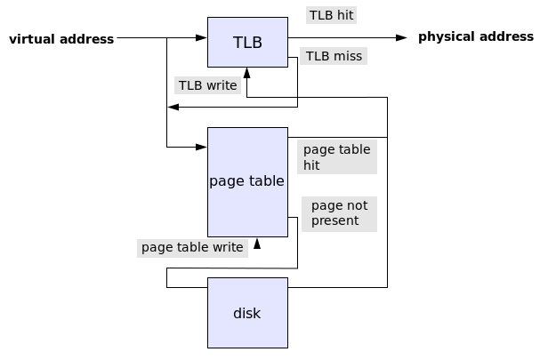

= Transparent Huge Pages

:icons: font

icon:bookmark[] https://shipilev.net/jvm/anatomy-quarks/2-transparent-huge-pages/, +
                https://en.wikipedia.org/wiki/Page_table

icon:tags[] memory, jvm

== Main idea

Problem::   Virtual memory uses 4KB pages by default. Looking through them
            when a lot memory is used is slow.
Solution::  Bigger pages may be used. The JVM provides switches to start using
            the large pages for the application.
Benefit::   Faster lookup of the page of virtual memory.

== Details

=== What is the page of the virtual memory?

A page is a data structure used by a virtual memory system in an operating system.
It stores mapping between virtual addresses and physical addresses.

image::../images/virtual-address-to-physical-address.png[]

Virtual address provides an illusion to the program that it works in its own memory
space which is continuous. The OS uses this abstraction to manage the memory
for the programs and it may offer more memory than it's the real RAM available
at the machine - e.g. part of the memory space may be swapped to the hard drive.
The real physical addresses, that is accessed by the program, may be dispersed HW memory.

When program accesses a memory the virtual addressed is translated into a physical one.
Then TLB (translation lookaside buffer) is searched first. It's an associative cache, normally
of a small size (~ 100 records). When the item is found (a TLB hit)
the program directly accesses the memory, if the item is not found (a TLB miss)
then a page table has to be searched (a page walk). If one exists, it's written
to TLB and the faulting instruction is restarted. The subsequent translation will find a TLB hit.

The page table is implemented in different ways. E.g. it could be multilevel structure (hierarchical)
for searching for the proper page. Or there is used nested page tables where
hardware virtualization is used to speed up the page table translations. And others.

==== What is the default page size?

The default page size is 4KB. If an application uses a large chunks of memory
then it needs to reserve a lot of pages of such size.
As optimization there is possible to ask the OS to use larger pages.
Usually the sizes of that larger pages is 2MB/4MB/1GB.

=== How Linux kernel implements the large pages?

The Linux provides two ways how the application may start using large pages.

* HugeLBFS (sometimes referred as HugePages)
* Transparent Huge Pages (Transparent HugePages, THP)

The _hugelbfs_ is older way of using large pages. There is defined a specific
memory area which is reserved only for to be used as pool for large memory pages.
The application has to be programmed against it. It use `mmap` to get memory
from that large page pool.

The _THP_ is newer approach. Application allocates the memory as usual and only
the OS tries to provide large pages transparently in the background.
In practice this may cause a memory overhead (large page allocated for something small)
or time overhead (sometimes _THP_ needs to defrag memory to get continuous page before
the page is returned back to application for using it).
The _THP_ provides a way, via `madvise`, for application informing the Linux kernel
when (for what application) the _THP_ is beneficial to be used.

=== How to setup large pages in Linux?

To find out the size of the standard memory page (not the HugePage): `getconf PAGE_SIZE`.

For _THP_ we define by switch in `/sys/kernel/mm/transparent_hugepage/enabled`.

[source,sh]
----
cat /sys/kernel/mm/transparent_hugepage/enabled
always [madvise] never

# to setup
 echo madvise > /sys/kernel/mm/transparent_hugepage/enabled
 # define the memory defragmentation to be considering with madvise too
 echo madvise > /sys/kernel/mm/transparent_hugepage/defrag
----

Options are `enable`, `disable`, `madvise`. `enable` makes _THP_ used for every application,
`never` for no application, `madvise` makes application to ask kernel for using
the _THP_ by system `madvise` call.

For _HugeTLBFS_ we have to define a memory space that will be allocated for it beforehand.

[source,sh]
----
# check how it's set-up
cat /proc/meminfo | grep Huge

# HugeTLBFS should allocate 1000*2M pages
# where considering the page has the size of 2MB
sudo sysctl -w vm.nr_hugepages=1000
----

NOTE: The _THP_ probably layering on top of the _HugeTLBFS_ mechanisms and makes
      their usage just transparent to the end application.

=== How to use with JVM?

The setup of the Huge Pages (and Large Pages where the JVM uses these terms interchangeably)

[source,sh]
----
java -XX:+PrintFlagsFinal 2>&1 | grep Huge
     bool UseHugeTLBFS                              = false                               {product}
     bool UseTransparentHugePages                   = false                               {product}
java -XX:+PrintFlagsFinal 2>&1 | grep LargePage
    uintx LargePageHeapSizeThreshold                = 134217728                           {product}
    uintx LargePageSizeInBytes                      = 0                                   {product}
     bool UseLargePages                             = false                               {pd product}
     bool UseLargePagesInMetaspace                  = false                               {product}
     bool UseLargePagesIndividualAllocation         = false                               {pd product}
----

The following options then makes java to use the Huge Pages.

`-XX:+UseHugeTLBFS`::
  `mmaps` Java heap into _HugeTLBFS_ (the configuration of the reserved memory has to be done beforehand)
`-XX:+UseTransparentHugePages`::
  `madvise`-s that Java heap should use _THP_. Java uses the `madvise` to tell kernel it is capable to use _THP_.
`-XX:+UseLargePages`::
  shortcut to enable anything available. On Linux, from historical reasons, it often enables _HugeTLBFS_.

NOTE: when _THP_ is used there could be cost for defragmentation of the page at time of allocating it.
      With option `-XX:+AlwaysPreTouch` we tell JVM to touch every single page in Java heap during initialization.
      The cost of defragmentation is shifted to the JVM startup time.
      When `-XX:+UseTransparentHugePages` is used the `-XX:+AlwaysPreTouch` should be enabled by default.
