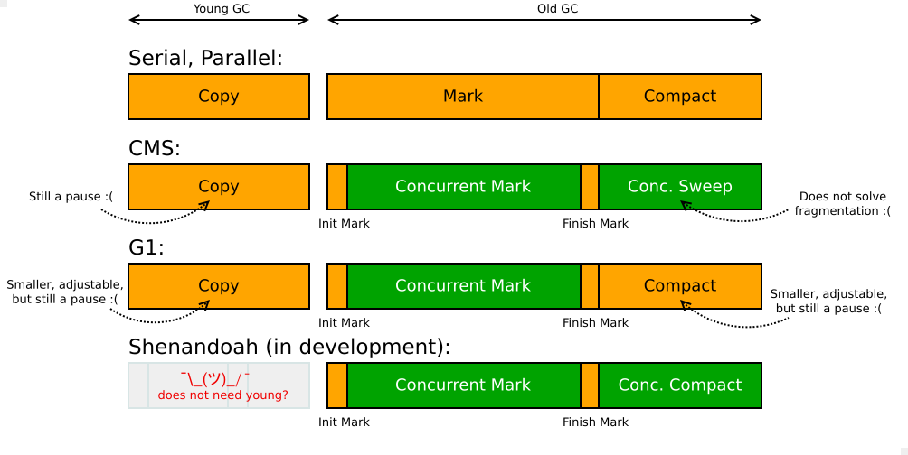

= Garbage Collector design and Pauses

:icons: font

icon:bookmark[] https://shipilev.net/jvm/anatomy-quarks/3-gc-design-and-pauses/, +
                https://stackoverflow.com/questions/1311402/what-is-the-difference-between-user-and-kernel-modes-in-operating-systems, +
                https://nipafx.dev/java-unified-logging-xlog

icon:tags[] jvm, gc

== Main idea

Problem::   Garbage collection may cause hiccups as it stops-the-world (the application) when GC is processing.
Solution::  Use appropriate GC algorithm which fits your workload.
Benefit::   When tuning the GC mechanism you can benefit with no or only short hiccups.

== Details

=== What are the stop-the-world GC design decisions?

OpenJDK GC landscape (2019-03). Yellow are stop-the-world phases,
green are concurrent phases.

NOTE: Every GC implementation balances the trade-off of 'pause time (latency) vs throughput'.
      Here we discuss the latency only.

=== How to set JVM to find GC processing?

Use `-Xlog:gc`. For older JDK `-XX:+PrintGCDetails`.

[source,sh]
----
# using default GC for the JDK version (from JDK9 it's G1)
# in prior versions there was instead of -Xlog:gc used option -XX:+PrintGCDetails
java -Xms4G -Xmx4G -Xlog:gc MyApp
----

* `-XX:+UseParallelOldGC` : parallel GC
* `-XX:+UseG1GC` : G1 GC
* `-XX:+UseShenandoahGC` : Shenandoah GC
* `-XX:+UnlockExperimentalVMOptions -XX:+UseEpsilonGC` : Epsilon GC (JDK9 as experimental VM option)
* `-XX:+UseZGC` : Oracle ZGC

=== What are the options on log output with `-Xlog`?

The `-Xlog` command came with JDK9 (probably). It unifies the way how GC logs are printed
and we may tune the GC logging output.

Define the log level to be printed: `java -Xlog:logging=debug -version`. We
print all what happens in JVM - class loading info, threading, module system, gc...

For information on gc use `java -Xlog:gc -version`. For all messages flagged with `gc`
- the gc uses different flags for different part of gc processing - ie. flag for memory
work on heap is `gc+heap`. To list all `java -Xlog:gc* -version`.

Saving the logs to a file `-Xlog:gc*:file=<PATH_TO_GC_LOG_FILE>`.

NOTE: Prior to JDK9 it was for GC `-XX:+PrintGCDetails -Xloggc:<PATH_TO_GC_LOG_FILE>`.

=== What does the `time` Linux command shows us?

It's used to determine how long a given command takes to run. It shows 3 figures.

* *real* (or *total* or *elapsed*) wall clock time is the time from start to finish of the call
* *user* is amount of CPU time spent in _user mode_
* *system* (or *sys*) is amount of CP time spent in _kernel mode_

What is _kernel mode_ : the executing code has unrestricted access to the HW
and may execute any CPU instruction. Crash halts entire PC.

What is _user mode_ : the executing code has no ability to directly access HW or reference memory.
Code delegates to system APIs. The system API call may need to switch to _kernel mode_
to provide the HW accesses.

The switch from user mode to kernel mode is not done automatically by CPU.
CPU is interrupted by interrupts (timers, keyboard, I/O).
When interrupt occurs, CPU stops executing the current running program,
switch to kernel mode, executes interrupt handler. This handler saves the state of CPU,
performs its operations, restore the state and returns to user mode.

How the real time can be lower than user time? If the work was done in parallel by several
processors then CPU will be higher as the time adds up.

=== What does the test do?

It only allocates data and never releases them. It's an artificial test
which shows some overhead of the GC processing  itself.
It does not show real processing of memory deallocation. The test only allocates
and allocates and GC scans the memory which can't be deallocated.
