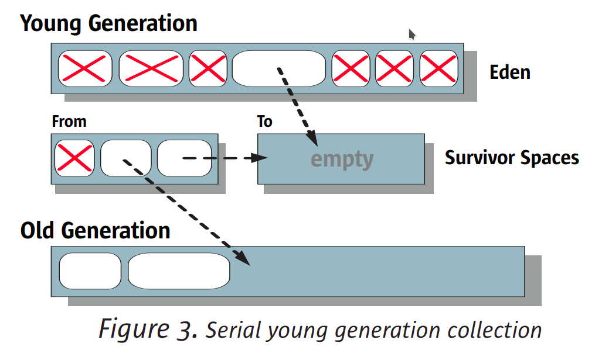

= TLAB allocation and heap parsability

:icons: font

icon:bookmark[] https://shipilev.net/jvm/anatomy-quarks/4-tlab-allocation/, +
                https://shipilev.net/jvm/anatomy-quarks/5-tlabs-and-heap-parsability/, +
                https://alidg.me/blog/2019/6/21/tlab-jvm, +
                https://www.oracle.com/technetwork/java/javase/memorymanagement-whitepaper-150215.pdf

icon:tags[] jvm, gc

== Main idea

Problem::   How Java make memory allocation fast when multiple `Thread` asks for a new memory in parallel?
Solution::  There is used TLAB pointer-bump allocation. Each thread asks for a continuous memory chunk represented by a TLAB space.
            The TLAB is reserved for the single thread and no contention happens.
Benefit::   A `Thread` gets reserved memory for allocation and does not need to fight for "a memory allocation lock" with other threads.

== Details

=== What is the TLAB and pointer-bump allocation?

When `Thread` allocates a memory for an `Object` on heap in Java
it does not need to ask the JVM for a space and does not need some synchronization
to avoid two Threads allocate an Object at the same memory space.
Instead, it asks for a TLAB. The TLAB is a continuous memory in the young generation
(in Eden) which is reserved for one particular Thread.

The Thread keeps a bump pointer which points to the last allocated Object in the TLAB.
On allocation of a new Object the memory is granted and the bump pointer is moved
to the end of the space.

The Thread tries to put a new Object to the TLAB space. If there is not enough
space it decides to ask for a new TLAB or allocates the object directly on the heap.
The asking for the new TLAB means throwing away the rest of free memory in the
current TLAB. Placing object directly on the heap means synchronization
routine from the JVM, ie. slow allocation
(see a trouble which this can cause https://dzone.com/articles/thread-local-allocation-buffers).

=== How to tune the TLAB behaviour?

Usually it's not necessary as the TLAB allocation size is determined dynamically
based on the pressure for memory allocation.

You can get information on TLAB usage with `-XX:+PrintTLAB`.
The initial TLAB size could be determined with `-XX:TLABSize=<number>` (the number is in bytes if I'm not wrong).
The minimum of TLAB can be defined with `-XX:MinTLABSize`.
And it could be defined that dynamic resizing of TLAB is not permitted with `-XX:-ResizeTLAB`.

You can print all the TLAB JVM options with something like
`java-XX:+UnlockExperimentalVMOptions -XX:+PrintFlagsFinal -version | grep TLAB`.

=== Who allocates the Object and how is the TLAB memory recollected?

The allocation is responsibility of GC. In the prior versions of Java (ie. 8)
this part of code was common (for HotSpot/OpenJDK) for most of the GC implementations.
See https://github.com/openjdk/jdk/blob/jdk8-b119/hotspot/src/share/vm/gc_interface/collectedHeap.cpp#L425
With the new Java versions and multiple GCs that was refactored and e.g. for EpsilonGC
this can be checked here http://hg.openjdk.java.net/jdk/jdk/file/6c96d42ec3e7/src/hotspot/share/gc/epsilon/epsilonHeap.cpp#l173.

The recollection of the memory is responsibility of GC as well.
For the older Garbabe Collection types (ie. serial, parallel, CMS) the heap
is divided to two parts - young generation and the old generation.
The new allocation happens in young generation - in Eden particularly.
The young generation is divided to Eden and then two survivor spaces.
On minor GC (garbage collection of the young generation)
there is copied all the live objects from the Eden to one of the survivor spaces.
After GC then Eden is clean and free for JVM to reserve continuous TLAB spaces
for `Thread`.
Ie. on GC all possible wasted space by TLAB is recollected and may be used again.

=== What is heap parsability for?

The GC needs to scan the heap somehow. The Java makes possible for GC to go through
the whole heap without complicated metadata. It can just jump from one Object to another
as the Object header contains the size of the object and the other object can be found
at the end of the current one.

How is it with TLAB when every Thread obtains a reserved memory and Objects are not allocated
in row? There is used a filler `int[]` objects which are added at place of the bump pointer
pointing to the end of the TLAB.
When new allocation happens the `int[]` header is placed after the end of the newly allocated object.

[source]
----
...........|===================!!!!!!!!!!!]............
           ^                  ^           ^
       TLAB start        TLAB used   TLAB end
----
